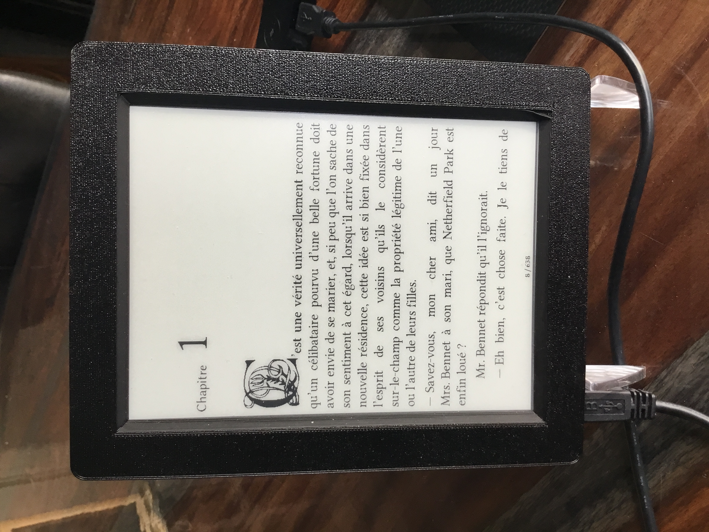
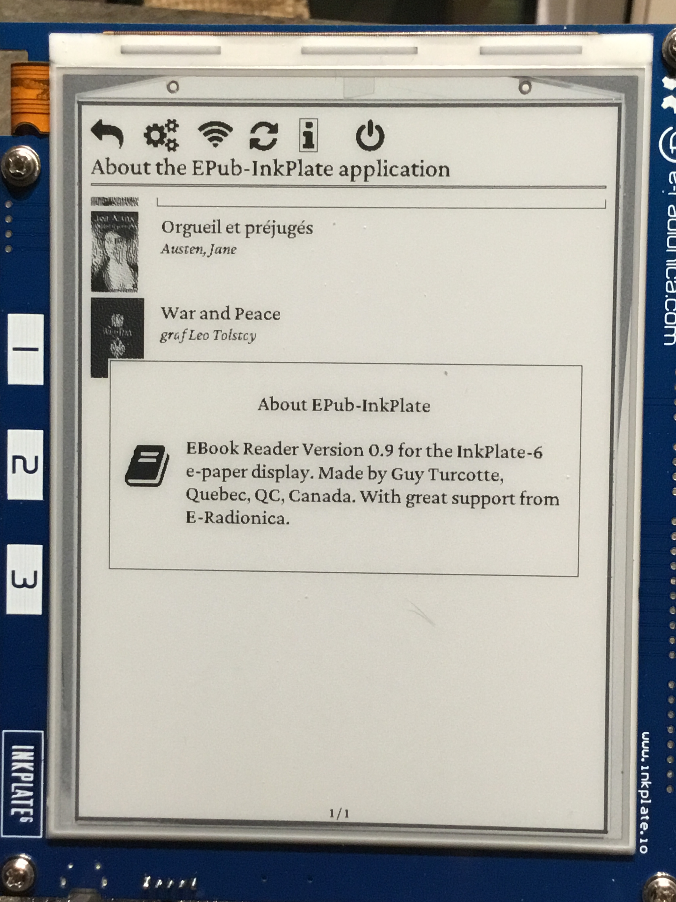
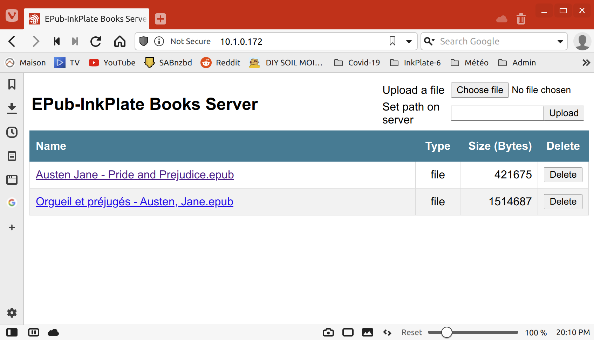

# EPub-InkPlate An EPub Reader for the InkPlate devices

## Last news

(Updated 2021.09.23)

Update to version 1.3.0

New User functionalities:

- [x] New ebook list Covers Matrix View (see pictures below).
- [x] Integration with new image streaming classes (png and jpeg).
- [x] Table of Content to select location to read inside an ebook.
- [x] Ebook deletion from the device.
- [x] Subscript/Superscript support.
- [x] Tracking of the current page location of the last 10 books read by the user.
- [x] Number of allowed ebooks changed from 100 to 200 maximum.

Internal changes:

- [x] Now using ESP-IDF version 4.3.0 through PlatformIO.
- [x] Complete redesign of the CSS Interpreter.
- [x] Integration in a single algorithm of the HTML Interpreter used by both the page location process and the screen painting process.
- [x] Correction of many small page painting issues.
- [x] Corrected an issue with the ebooks folder scanning process (simple db mgr bug).
- [x] Corrected an issue with the PowerOff menu entry.
- [x] Testing with 200 ebooks under Linux (page formatting and general functionalities).
- [x] Changes related to the new PlatformIO way of managing sdkconfig.
- [x] PNG image files transparency.
- [x] Stack usage optimization.
- [x] Web Server Enhancements (comma separated file size thousands, .epub file extension check).
- [x] Font obfuscation support (both Adobe and IDPF methods).
- [x] Non-volatile memory class to manage last books read tracking.
- [x] Testing ebooks on InkPlate-6.
- [x] Valgrind tests.
- [x] Documentation update.

Remaining steps to release:

- [x] Testing ebooks on InkPlate-10.
- [x] New version releases packaging.

---

- [ ] Support of the forecoming Inkplate 6Plus (touch screen, backlit). Debugging remains to be completed (will happen for a future release).

Linear vs Matrix View:


Update to version 1.2

- [x] Recompiled to integrate ESP-IDF-Inkplate library v0.9.4
- [x] Adjustments for the ESP-IDF v4.2 framework.
- [x] Support for the 6-buttons extended board in new specific releases.
- [x] bld_all.sh script to automatically build all releases zip files.

Update to version 1.1.1

- [x] Recompiled to integrate ESP-IDF-InkPlate library v0.9.2 (A2D attenuation correction).

v1.1.0 information:

This is in preparation for version 1.1.0 The main ongoing modifications are:

- [x] Support of the new upcoming Inkplate-10 device.
- [x] Just in time calculation of pages locations through multithreading (a **BIG** change...).
- [x] Integration with the new ESP-IDF-Inkplate library.
- [x] Trigger pages location recalculation when parameters have changed.
- [x] Stop light-sleep, deep-sleep while pages location is being calculated.
- [x] Adjust web server to only show epub files and remove params/locs files on ebook delete.
- [x] Adjust Web server to stop page-locs to free memory before launching the server.
- [x] Save computed pages location to sdcard for quick ebook load.
- [x] Repair some known bugs (some issues to be addressed later).
- [ ] Code refactoring and cleanup (tbd v1.2).
- [x] Udate documentation.
- [ ] Tests, tests, tests, ...

Added functional features:

- [x] Title showned at top of pages (as an option).
- [x] Heap Size showned at bottom of pages (as an option).
- [x] Form entry simplified (OK / Cancel param no longer there).
- [x] Parameters for each ebook specific font/pictures adjustments.
- [ ] Augmented CSS features (tbd v1.2).

Known bugs:

- [x] ebooks list geometry when screen orientation change.
- [x] recovery from too large image (memory allocation).
- [x] Page refresh on orientation/resolution changes.
- [ ] PNG image files transparency (tbd v1.2).

-----

v1.0 information:

The development is complete. The application is at version 1.0.0. Please look at the installation guide located in file `doc/INSTALL.md` and the user's guide located in `doc/USER GUIDE.md`. PDF versions of these guides are also available.

- [x] Integration of touch buttons through interrupts (not perfect. to be revisited).
- [x] Menu capability.
- [x] Options / Parameters menus.
- [x] Error dialogs.
- [x] About box.
- [x] Low-Level InkPlate Drivers refactoring.
- [x] Power management (Deep-Sleep after 15 minutes timeout, Light-Sleep between touchpad events).
- [x] Return to current book location between restarts.
- [x] Configuration management (save/load from the SD-Card).
- [x] Form tool to show / edit options / parameters.
- [x] books directory refresh dialog.
- [!] Over the Air (OTA) updates (No hope... not enough flash space).
- [x] WiFi access to update ebooks (This item only added 600KB of code!).
- [x] Performance on new book scans (80% completion to be revisited after first release).
- [x] Options / Parameters form.
- [x] Battery level display.
- [x] Screen orientation (touchpads to the left (portrait) / right (portrait) / down (landscape) modes).
- [x] User's Guide and installation manuals.
- [x] Error dialog use (100% completion).
- [x] Debugging remaining issues.

----

Some pictures from the InkPlate-6 version:




Some pictures from the Linux version:


A picture of the Web Server in a browser:



A [Video](https://www.youtube.com/watch?v=VnTLMhEgsqA) is available on YouTube that shows the first working version of the EPub-InkPlate application.

## Characteristics

The current release functionalities:

- TTF, and OTF embedded fonts support.
- Normal, Bold, Italic, Bold+Italic face types.
- Bitmap images dithering display (JPEG, PNG).
- EPub (V2, V3) book format subset.
- UTF-8 characters (supplied fonts limited to latin1).
- InkPlate tactile keys (single and double click to get six buttons).
- Screen orientation (buttons located to the left, right, down positions from the screen).
- Left, center, right, and justify text alignments.
- Indentation.
- Some basic parameters and options.
- Limited CSS formatting.
- WiFi-based documents download.
- Battery state and power management (light, deep sleep, battery level display).
- Table of content.
- Multiple fonts choices selectable by the user.
- Linear and matrix view of book list.

Some elements to consider in the future (no specific order of priority):

- External keypad integration (through i2c).
- Various views for the ebooks list.
- Hyperlinks (inside an ebook).
- Others document download method (Dropbox, Calibre, others).
- More CSS formatting.
- Footnote management.
- Kerning.
- TXT, MOBI book formats.
- `<table>` formatting.
- Page progression direction: Right then left.
- Notes.
- Bookmarks.
- Other elements proposed by users.

And potentially many more...

### Runtime environment

The EPub-InkPlate application requires that a micro-SD Card be present in the device. This micro-SD Card must be pre-formatted with a FAT32 partition. Two folders must be present in the partition: `fonts` and `books`. You must put the base fonts in the `fonts` folder and your EPub books in the `books` folder. The books must have the extension `.epub` in lowercase. 

Height font types are supplied with the application. For each type, there are four fonts supplied, to support regular, bold, oblique, and bold-italic glyphs. The application offers the user to select one of those font types as the default font. The fonts have been cleaned-up and contain only Latin-1 glyphs.

Another font is mandatory. It can be found in `SDCard/fonts/drawings.otf` and must also be located in the micro-SD Card `fonts` folder. It contains the icons presented in parameters/options menus.

The `SDCard` folder under GitHub reflects what the micro-SD Card should look like. One file is missing there is the `books_dir.db` that is managed by the application. It contains the meta-data required to display the list of available ebooks on the card and is automatically maintained by the application. It is refreshed at boot time and when the user requires it to do so through the parameters menu. The refresh process takes some time (between 5 and 10 seconds per ebook) but is required to get fast ebook directory list on screen.

### Fonts cleanup

All fonts have been subsetted to Latin-1 plus some usual characters. The `fonts/orig` folder in the GitHub project contains all original fonts that are processed using the script `fonts/subsetter.sh`. This script uses the Python **pyftsubset** tool that is part of the **fontTools** package. To install the tool, you need to execute the following command:

```bash
$ pip install fonttools brotli zopfli
```

The script takes all font from the `orig` folder and generate the new subset fonts in `subset-latin1/otf` folder. The following commands must be executed:

```bash
$ cd fonts
$ ./subsetter.sh
```

After that, all fonts in the `subset-latin1/otf` folder must be copied back in the `SDCard/fonts` folder.

## Development environment

[Visual Studio Code](https://code.visualstudio.com/) is the code editor I'm using. The [PlatformIO](https://platformio.org/) extension is used to manage application configuration for both Linux and the ESP32.

All source code is located in various folders:

- Source code used by both Linux and InkPlate is located in the `include` and `src` folders
- Source code in support of Linux only is located in the `lib_linux` folder
- Source code in support of the InkPlate device (ESP32) only are located in the `lib_esp32` folder
- The FreeType library for ESP32 is in folder `lib_freetype`

The file `platformio.ini` contains the configuration options required to compile both Linux and InkPlate applications.

Note that source code located in folders `old` and `test` is not used. It will be deleted from the project when the application development will be completed.

### Dependencies

The following are the libraries currently in use by the application:

- [GTK+3](https://www.gtk.org/) (Only for the Linux version) The development headers must be installed. This can be done with the following command (on Linux Mint):
  
  ``` bash
  $ sudo apt-get install build-essential libgtk-3-dev
  ```

The following are imported C header and source files, that implement some algorithms:

- [FreeType](https://www.freetype.org) (Parse, decode, and rasterize characters from TrueType fonts) A version of the library has been loaded in folder `freetype-2.10.4/` and compiled with specific options for the ESP32. See sub-section **FreeType library compilation for ESP32** below for further explanations.
- [PubiXML](https://pugixml.org/) (For XML parsing)
- [STB](https://github.com/nothings/stb) (For image resizing) :

  - `stb_image_resize.h` resize images larger/smaller 

- [PNGLE](https://github.com/kikuchan/pngle) (For PNG Images) The EPub-Inkplate uses a modified version that is optimized for grayscale output instead of RGBA.
- [MINIZ](https://github.com/kikuchan/pngle) (For Zip/PNG files and epub files decompress)
- [TJPGD](http://elm-chan.org/fsw/tjpgd/00index.html) (For JPeg Images)

The following libraries were used at first but replaced with counterparts:

- [ZLib](https://zlib.net/) deflating (unzip). A file deflation function is already supplied with `PNGLE`.
- [RapidXML](http://rapidxml.sourceforge.net/index.htm) (For XML parsing) Too much stack space required. Replaced with PubiXML.
- [SQLite3](https://www.sqlite.org/index.html) (The amalgamation version. For books simple database) Too many issues to get it runs on an ESP32. I built my own simple DB tool (look at `src/simple_db.cpp` and `include/simble_db.hpp`)
- [STB](https://github.com/nothings/stb) (For image extraction and unzip) Requires a lot of memory space depending on the ePub stored image resolution. Changed to use PNGLE and TJPGD combined with my own image classes to stream the image to the appropriate size without requiring to much memory space:

  - `stb_image.h` PNG and JPeg images extraction 

### FreeType library compilation for ESP32

The FreeType library is using a complex makefile structure to simplify (!) the compilation process. Here are the steps used to get a library suitable for integration in the EPub-InkPlate ESP32 application. As this process is already done, there is no need to run it again, unless a new version of the library is required or some changes to the modules selection are done.

1. The folder named `lib_freetype` is created to receive the library and its dependencies at install time:

    ``` bash
    $ mkdir lib_freetype
    ```

2. The ESP-IDF SDK must be installed in the main user folder. Usually, it is in folder ~/esp. The following location documents the installation procedure: https://docs.espressif.com/projects/esp-idf/en/latest/esp32/get-started/index.html . Look at Steps 1 to 4 (Setting Up Development Environment). This is important as the configuration setup below will access ESP32 related compilation tools.

3. The files `freetype-2.10.4/modules.cfg` and `freetype-2.10.4/include/freetype/config/ftoption.h` are modified to only keep the capabilities required to support TrueType and OpenType fonts. The original files have been saved in `*.orig` files.

4. A file named `freetype-2.10.4/myconf.sh` is created to simplify the configuration of the makefile structure. The `--prefix` option may require some modification to take into account the location where the EPub-InkPlate source code has been put. The `--prefix` must point to the `lib_freetype` folder.

5. The following commands are executed:

   ``` bash
   $ cd freetype-2.10.4
   $ bash myconf.sh
   $ make
   $ make install
   ```

   This will have created several files in the folder `lib_freetype`.

6. Edit file named `lib_freetype/lib/pkgconfig/freetype2.pc` and remove the entire line that contains `harfbuzz` reference.
7. Voilà...

### ESP-IDF configuration specifics

The EPub-InkPlate application requires some functionalities to be properly set up within the ESP-IDF. To do so, some parameters located in the `sdkconfig` file must be set accordingly. This must be done using the menuconfig application that is part of the ESP-IDF. 

The following is not required to be done as the file `sdkconfig.defaults` contains the changes that will trigger the generation of the suitable `sdkconfig.<project_name>` file related to the project being compiled.

The current release of PlatformIO allow for editing the `sdkconfig` through the PlatformIO's `Run Menuconfig` command located in the Project Tasks. 

The application will show a list of configuration aspects. 

The following elements have been done (No need to do it again as they are defined in file `sdkconfig.defaults`):
  
- **PSRAM memory management**: The PSRAM is an extension to the ESP32 memory that offers 4MB+4MB of additional RAM. The first 4MB is readily available to integrate into the dynamic memory allocation of the ESP-IDF SDK. To configure PSRAM:

  - Select `Component Config` > `ESP32-Specific` > `Support for external, SPI-Connected RAM`
  - Select `SPI RAM config` > `Initialize SPI RAM during startup`
  - Select `Run memory test on SPI RAM Initialization`
  - Select `Enable workaround for bug in SPI RAM cache for Rev 1 ESP32s`
  - Select `SPI RAM access method` > `Make RAM allocatable using malloc() as well`

  Leave the other options as they are. 

- **ESP32 processor speed**: The processor must be run at 240MHz. The following line in `platformio.ini` request this speed:

    ```
    board_build.f_cpu = 240000000L
    ```
  You can also select the speed in the sdkconfig file:

  - Select `Component config` > `ESP32-Specific` > `CPU frequency` > `240 Mhz`

- **FAT Filesystem Support**: The application requires the usage of the micro SD card. This card must be formatted on a computer (Linux or Windows) with a FAT32 partition (maybe not required as this is the default format of brand new cards). The following parameters must be adjusted in `sdkconfig`:

  - Select `Component config` > `FAT Filesystem support` > `Max Long filename length` > `255`
  - Select `Number of simultaneously open files protected  by lock function` > `5`
  - Select `Prefer external RAM when allocating FATFS buffer`
  - Depending on the language to be used (My own choice is Latin-1 (CP850)), select the appropriate Code Page for filenames. Select `Component config` > `FAT Filesystem support` > `OEM Code Page...`. DO NOT use Dynamic as it will add ~480KB to the application!!
  - Also select `Component config` > `FAT Filesystem support` > `API character encoding` > `... UTF-8 ...`

- **HTTP Server**: The application is supplying a Web server (through the use of HTTP) to the user to modify the list of books present on the SDCard. The following parameters must be adjusted:
  - Select `Component config` > `HTTP Server` > `Max HTTP Request Header Length` > 1024
  - Select `Component config` > `HTTP Server` > `Max HTTP URI Length` > 1024

- **WiFi memory buffers in PSRAM**: The WiFi implementation use a large portion of memory. There is not enough main memory available for the buffer required, so it must be allocated from the PSRAM:
  - Select `Component config` > `ESP32-specific` > `Support for externa,, SPI-connected RAM` > `SPI RAM config` > `Try to allocate memories of WiFi and LWIP in SPIRAM firstly.`

The following is not configured through *menuconfig:*

- **Flash memory partitioning**: the file `partitions.csv` contains the table of partitions required to support the application in the 4MB flash memory. The factory partition has been set to be ~2.4MB in size (OTA is not possible as the application is too large to accomodate this feature; the OTA related partitions have been commented out...). In the `platformio.ini` file, the line `board_build.partitions=...` is directing the use of these partitions configuration.
    
## In Memoriam

When I started this effort, I was aiming at supplying a tailored ebook reader for a friend of mine that has been impaired by a spinal cord injury for the last 13 years and a half. Reading books and looking at TV were the only activities she was able to do as she lost control of her body, from the neck down to the feet. After several years of physiotherapy, she was able to do some movement with her arms, without any control of her fingers. She was then able to push on buttons of an ebook reader with a lot of difficulties. I wanted to build a joystick-based interface to help her with any standard ebook reader but none of the commercially available readers allowed for this kind of integration.

On September 27th, 2020, we learned that she was diagnosed with the Covid-19 virus. She passed away during the night of October 1st.

I dedicate this effort to her. Claudette, my wife and I will always remember you!
