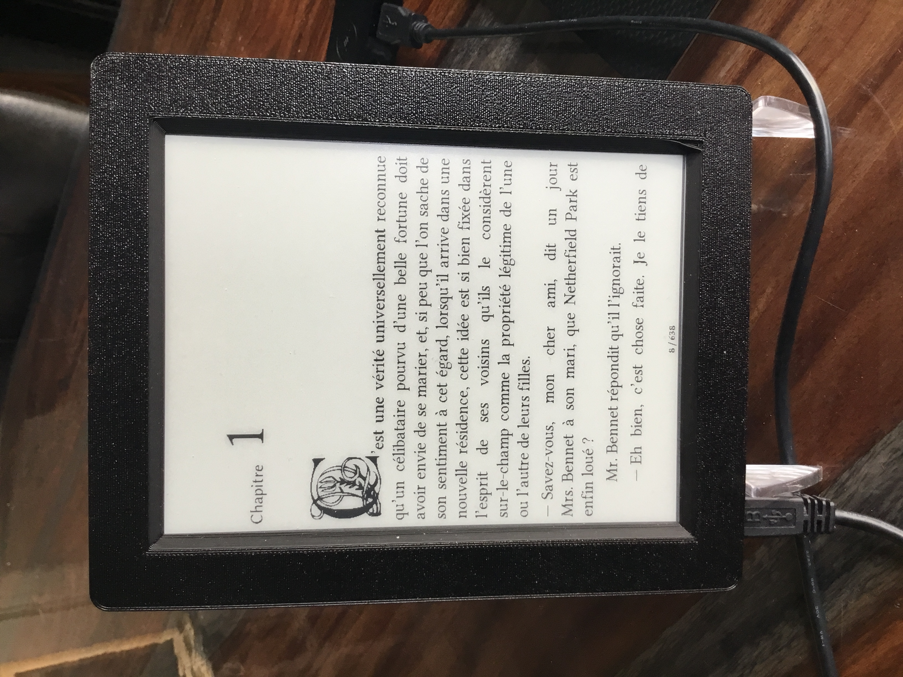
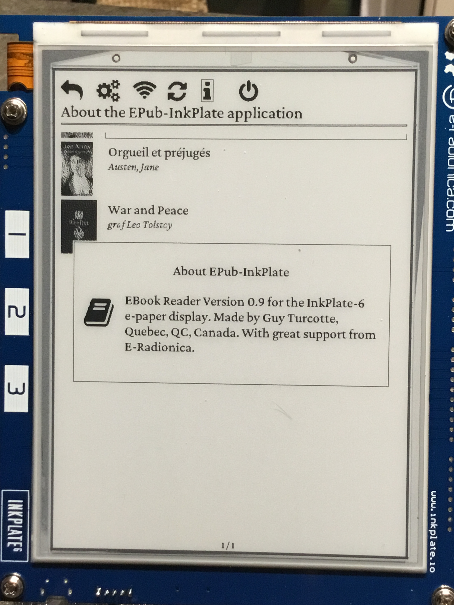
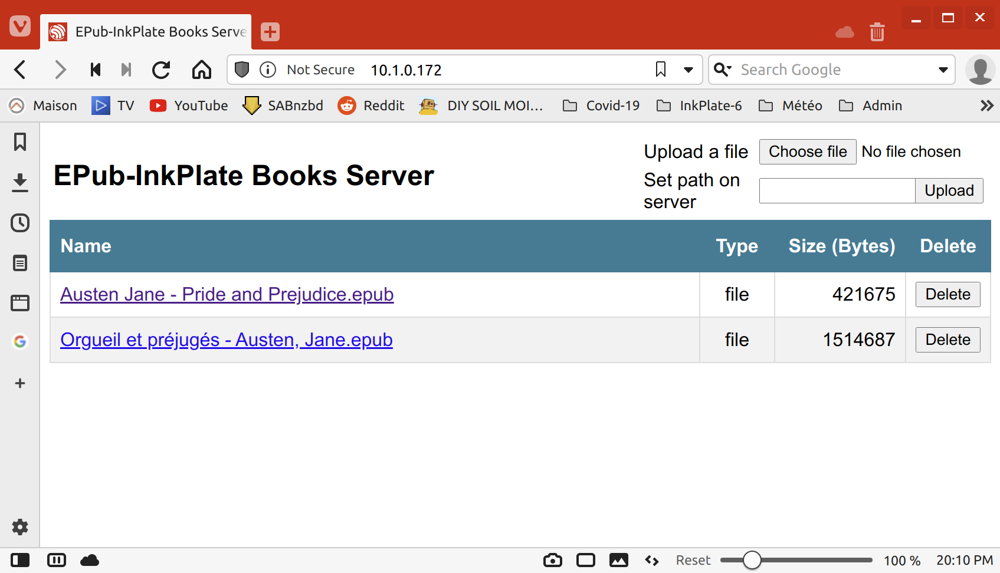

# EPub-InkPlate An EPub Reader for InkPlate devices

## Last news

(Updated 2026.06.27)

### Version 3.0.0 - What's New in This Release

This long-awaited update heavily refactors the core internal architecture to make the application significantly more stable, while introducing a variety of user interface enhancements to improve overall usability.

#### Important Installation Requirements

Because this is a major release, you must re-initialize and re-install your storage card.

- Initialize your SD card.
  
- Re-install the system files using the contents of the **SDCard** folder provided in this distribution package.
  
- For detailed steps, please consult the included **Installation Manual**.
  
#### Beta Testing & Feedback

This is a BETA release. If you encounter any bugs or unexpected behaviour, please submit an issue on our GitHub repository so we can address it promptly. If no critical issues are reported within the next two weeks, we will launch the final, stable Version 3.0.0.

#### Unified Distribution Files

To streamline our GitHub release page, distributions for all supported devices are now bundled under this single release entry: **Version 3.0.0 BETA**. Please download the specific .zip file that matches your target device:

|Inkplate device|From|Release filename|
|:-------------:|:--:|----------------|
|6|e-Radionica|release-v3.0.0-BETA-inkplate_6.zip|
|6PLUS|e-Radionica|release-v3.0.0-BETA-inkplate_6plus.zip|
|10|e-Radionica|release-v3.0.0-BETA-inkplate_10.zip|
|6PLUS V2|Soldered|release-v3.0.0-BETA-inkplate_6v2.zip|
|6FLICK|Soldered|release-v3.0.0-BETA-inkplate_6flick.zip|
|6 V2|Soldered|TBA (Bluetooth keypad)|
|10 V2|Soldered|TBA (Bluetooth keypad)|

Note: **TBA** is **To Be Announced**

Other versions in support of the exended keypad for older dervices, as available [here](https://github.com/turgu1/InkPlate-6-Extended-Case) and [here](https://github.com/turgu1/InkPlate-10-Extended-Case):

|Inkplate device|From|Release filename|
|:-------------:|:--:|----------------|
|6|e-Radionica|release-v3.0.0-BETA-inkplate_extended_case_6.zip|
|10|e-Radionica|release-v3.0.0-BETA-inkplate_extended_case_10.zip|

### Enhancements

A Demonstration Gallery has been prepared to showcase the major UI enhancements. You can access it [here](./doc/V3.0%20Pictures%20Demo/Demo%20V3.0.md).

#### User Interface & Navigation

- **Variable Cover Image Sizes**: The book library directory now supports small, medium, and large cover images.

- **New Image Types**: GIF, SVG, and BMP image types are now supported with some limitations.
 
- **Multi-Column Rendering**: Readers can now choose to render e-book pages across 1 to 4 columns.

- **Adjustable Line Spacing**: Added three distinct line height settings for text display: Tight, Medium, and Large.
  
- **Touch-Optimized Menus**: Icons within parameter and option menus are now larger and vertically centered across lines for more precise navigation.

- **Processing Indicator**: Added a visual waiting spinner that displays on-screen while large image files are being processed.

#### Core Enhancements & Hardware Control

- **Deep-Sleep Screensavers**: Supports custom JPEG images placed within the artworks/ folder on the SD card, which are randomly displayed when the device powers down into deep sleep. The default release package includes 7 pre-loaded images.

- **Advanced Typography**: Adjusted fonts and the underlying FreeType library to natively support kerning, alongside a lightweight custom algorithm for standard ligatures and minimal line-break hyphenation.

- **Battery Calibration**: Introduced a floating-point battery_trim configuration value, allowing users to linearly adjust and calibrate the battery voltage read by the Inkplate ADC.

- **Bluetooth support**: Upcoming capability for Inkplate devices without any input hardware support. A short demonstration on the Soldered InkPlate-10 V2 using a BLE mini keypad is available [Here](https://www.youtube.com/shorts/Jre9zbq_AkM).

### Bug Fixes & Under-the-Hood

- **Stability Enhancements**: Resolved numerous minor bugs and optimization issues throughout the codebase.

- **Updated Toolchains & Dependencies**:

  - **ESP-IDF** upgraded to v5.5.4
  - **PugiXML** upgraded to v1.15
  - **FreeType** upgraded to v2.14.3 (featuring significantly improved OTF font support)

See [CHANGES.md](CHANGES.md) for a list of changes including internal improvements.

For testing and validation workflows (unit suites, valgrind targets, page-locs tools), see
[TESTING_TOOLS_GUIDE.md](doc/development-notes/TESTING_TOOLS_GUIDE.md).

### Building the application image

The project is built with ESP-IDF, using CMake through `idf.py`. To build a new image, first install ESP-IDF v5.5.4 together with Espressif's tool suite. The recommended setup is Visual Studio Code with the Espressif IDF extension, although a command-line installation also works. Refer to the [ESP-IDF framework installation documentation](https://docs.espressif.com/projects/esp-idf/en/stable/esp32/get-started/). This guide assumes the framework is installed in `~/.espressif/v5.5.4`.

Clone this project locally using `git`, and be sure to include submodules:

```bash
$ git clone --recursive https://github.com/turgu1/EPub-InkPlate.git
```

1. Go into the main EPub-InkPlate folder. For example, if located in your home directory:

```bash
$ cd ~/EPub-InkPlate
```

2. If you are building from the command line, source the ESP-IDF environment script. This must be done each time you open a new terminal. If you are using Visual Studio Code with the Espressif extension, the extension can manage the environment for you:

```bash
$ . ~/.espressif/v5.5.4/esp-idf/export.sh
```

3. To build an image for a specific device, use the `idf.py build` command with two mandatory parameters:

- `-DDEVICE=INKPLATE_XXX` — the target device
- `-DAPP_VERSION=3.0.0` — the version number (example: `3.0.0`)

Supported device names:

- INKPLATE_6
- INKPLATE_6_V2
- INKPLATE_6PLUS
- INKPLATE_6PLUS_V2
- INKPLATE_6FLICK
- INKPLATE_10
- INKPLATE_10_V2

Example:

```bash
$ idf.py build -DDEVICE=INKPLATE_6PLUS_V2 -DAPP_VERSION=3.0.0
```

Once completed without errors, the application image will be located at `build/EPub-InkPlate.bin`.

### Building application releases

Release files are zip archives containing everything needed to prepare a device, including the application binary, fonts, user guide, and installation guide.

Two scripts automate this process:

- `bld_release.sh` — build a single release
- `bld_all.sh` — generate releases for all Inkplate device types (uses `bld_release.sh` internally)

#### Using bld_all.sh

The `bld_all.sh` script requires one parameter: the release version number.

Example:

```bash
$ ./bld_all.sh 3.0.0-BETA
```

This generates release files named `release-v<version>-inkplate_<XXX>.zip` in the main project folder.

#### Using bld_release.sh

The `bld_release.sh` script requires three parameters and one optional parameter:

- **First parameter**: version number (e.g., `3.0.0-BETA` or `3.0.0`)
- **Second parameter**: device type — `6`, `10`, `6V2`, `10V2`, `6plus`, `6plusv2`, or `6flick`
- **Third parameter**: buttons extension usage — `0` (no extension) or `1` (extension present). Currently, no known users have this extension, so use `0`.
- **Fourth parameter** (optional, may not work anymore... need testing): optimization mode
  - If omitted: the build folder is cleared, and the script aborts if a release zip already exists
  - If `1`: build folder is cleared and rebuilt; no release file is created
  - If `2`: build folder is kept and rebuilt; no release file is created

Example:

```bash
$ ./bld_release.sh 3.0.0 6plusv2 0
```

This generates `release-v3.0.0-inkplate_6plusv2.zip`.

------


Some other older videos are  available on YouTube:

- The first working version of the EPub-InkPlate application [Here](https://www.youtube.com/watch?v=VnTLMhEgsqA).
- Demostration on the InkPlate-10 [Here](https://www.youtube.com/watch?v=qNAjbnEax8k).
- Demonstration on the Inkplate-6PLUS [Here](https://www.youtube.com/watch?v=z1nvakbxiUQ).

Some pictures from the InkPlate-6 version:




A picture of the Web Server in a browser:



Books Directory List: Linear vs Matrix View:


### Runtime environment

The EPub-InkPlate application requires that a micro-SD Card be present in the device. This micro-SD Card must be pre-formatted with a FAT32 partition. Two folders must be present in the partition: `fonts` and `books`. You must put the base fonts in the `fonts` folder and your EPub books in the `books` folder. The books must have the extension `.epub` in lowercase. 

Height font types are supplied with the application. For each type, there are four fonts supplied, to support regular, bold, oblique, and bold-italic glyphs. The application offers the user to select one of those font types as the default font. The fonts have been cleaned-up and contain only Latin-1 glyphs.

Another font is mandatory. It can be found in `SDCard/fonts/drawings.otf` and must also be located in the micro-SD Card `fonts` folder. It contains the icons presented in parameters/options menus.

The `SDCard` folder under GitHub reflects what the micro-SD Card should look like. One file is missing there is the `books_dir.db` that is managed by the application. It contains the meta-data required to display the list of available ebooks on the card and is automatically maintained by the application. It is refreshed at boot time and when the user requires it to do so through the parameters menu. The refresh process takes some time (between 5 and 10 seconds per ebook) but is required to get fast ebook directory list on screen.

### Fonts cleanup

All fonts have been subsetted to Latin-1 plus some usual characters. The `fonts/orig` folder in the GitHub project contains all original fonts that are processed using the script `fonts/subsetter.sh`. This script uses the Python **pyftsubset** tool that is part of the **fontTools** package. To install the tool, you need to execute the following command:

```bash
$ pip install fonttools brotli zopfli
```

The script takes all font from the `orig` folder and generate the new subset fonts in `subset-latin1/otf` folder. The following commands must be executed:

```bash
$ cd fonts
$ ./subsetter.sh
```

After that, all fonts in the `subset-latin1/otf` folder must be copied back in the `SDCard/fonts` folder.

## Development environment

[Visual Studio Code](https://code.visualstudio.com/) is the editor used for development. For the ESP32 build, use the [Espressif IDF extension](https://marketplace.visualstudio.com/items?itemName=espressif.esp-idf-extension), which manages the ESP-IDF environment, build tasks, flashing, and menuconfig integration.

All source code is located in various folders:

- Source code shared by the application is located in the `src` folder
- ESP32-specific components are located in the `components` folder
- Linux support code is located in the `lib_linux` folder
- The bundled FreeType material used for the ESP32 build is located in `components/freetype` and `freetype-distrib`

The top-level `CMakeLists.txt`, together with the component `CMakeLists.txt` files and `sdkconfig.defaults`, contains the configuration needed to build the application with ESP-IDF.

Note that source code located in folders `old` and `test` is not used. It will be deleted from the project when the application development will be completed.

### Dependencies

The following are the libraries currently in use by the application:

- [GTK+3](https://www.gtk.org/) (Only for the Linux version) The development headers must be installed. This can be done with the following command (on Linux Mint):
  
  ``` bash
  $ sudo apt-get install build-essential libgtk-3-dev
  ```

The following are imported C header and source files, that implement some algorithms:

- [FreeType](https://www.freetype.org) (Parse, decode, and rasterize characters from TrueType fonts) A version of the library has been loaded in folder `freetype-2.14.3/` and compiled with specific options for the ESP32. See sub-section **FreeType library compilation for ESP32** below for further explanations.
- [PugiXML](https://pugixml.org/) (For XML parsing)
- [STB](https://github.com/nothings/stb) (For image resizing) :

  - `stb_image_resize.h` resize images larger/smaller 

- [PNGLE](https://github.com/kikuchan/pngle) (For PNG Images) The EPub-Inkplate uses a modified version that is optimized for grayscale output instead of RGBA.
- [MINIZ](https://github.com/kikuchan/pngle) (For Zip/PNG files and epub files decompress)
- [TJPGD](http://elm-chan.org/fsw/tjpgd/00index.html) (For JPeg Images)

The following libraries were used at first but replaced with counterparts:

- [ZLib](https://zlib.net/) deflating (unzip). A file deflation function is already supplied with `PNGLE`.
- [RapidXML](http://rapidxml.sourceforge.net/index.htm) (For XML parsing) Too much stack space required. Replaced with PubiXML.
- [SQLite3](https://www.sqlite.org/index.html) (The amalgamation version. For books simple database) Too many issues to get it runs on an ESP32. I built my own simple DB tool (look at `src/simple_db.cpp` and `include/simble_db.hpp`)
- [STB](https://github.com/nothings/stb) (For image extraction and unzip) Requires a lot of memory space depending on the ePub stored image resolution. Changed to use PNGLE and TJPGD combined with my own image classes to stream the image to the appropriate size without requiring to much memory space:

  - `stb_image.h` PNG and JPeg images extraction 

### FreeType library compilation for ESP32

The FreeType library is using a complex makefile structure to simplify (!) the compilation process. Here are the steps used to get a library suitable for integration in the EPub-InkPlate ESP32 application. As this process is already done, there is no need to run it again, unless a new version of the library is required or some changes to the modules selection are done.

1. The folder named `lib_freetype` is created to receive the library and its dependencies at install time:

    ``` bash
    $ mkdir lib_freetype
    ```

2. The ESP-IDF SDK must be installed in the main user folder. Usually, it is in folder ~/esp. The following location documents the installation procedure: https://docs.espressif.com/projects/esp-idf/en/latest/esp32/get-started/index.html . Look at Steps 1 to 4 (Setting Up Development Environment). This is important as the configuration setup below will access ESP32 related compilation tools.

3. The files `freetype-2.14.3/modules.cfg` and `freetype-2.14.3/include/freetype/config/ftoption.h` are modified to only keep the capabilities required to support TrueType and OpenType fonts. The original files have been saved in `*.orig` files.

4. A file named `freetype-2.14.3/myconf.sh` is created to simplify the configuration of the makefile structure. The `--prefix` option may require some modification to take into account the location where the EPub-InkPlate source code has been put. The `--prefix` must point to the `lib_freetype` folder.

5. The following commands are executed:

   ``` bash
   $ cd freetype-distrib/freetype-2.14.3
   $ bash myconf.sh
   $ make
   $ make install
   ```

   This will have created several files in the folder `lib_freetype`.

6. In the `components/freetype` folder, remove the `include`, `lib`, and `share` folders.

7. Copy the three folders `include`, `lib`, and `share` to the `components/freetype` folder.
8. Voilà...

### ESP-IDF configuration specifics

The EPub-InkPlate application requires some functionalities to be properly set up within the ESP-IDF. To do so, some parameters located in the `sdkconfig` file must be set accordingly. This must be done using the menuconfig application that is part of the ESP-IDF. 

The following is not required to be done as the file `sdkconfig.defaults` contains the changes that will trigger the generation of the suitable `sdkconfig.<project_name>` file related to the project being compiled.

If you need to inspect or modify the configuration interactively, use `idf.py menuconfig` from the command line, or the equivalent menuconfig command exposed by the Espressif VS Code extension.

The application will show a list of configuration aspects. 

The following elements have been done (No need to do it again as they are defined in file `sdkconfig.defaults`):
  
- **PSRAM memory management**: The PSRAM is an extension to the ESP32 memory that offers 4MB+4MB of additional RAM. The first 4MB is readily available to integrate into the dynamic memory allocation of the ESP-IDF SDK. To configure PSRAM:

  - Select `Component Config` > `ESP32-Specific` > `Support for external, SPI-Connected RAM`
  - Select `SPI RAM config` > `Initialize SPI RAM during startup`
  - Select `Run memory test on SPI RAM Initialization`
  - Select `Enable workaround for bug in SPI RAM cache for Rev 1 ESP32s`
  - Select `SPI RAM access method` > `Make RAM allocatable using malloc() as well`

  Leave the other options as they are. 

- **ESP32 processor speed**: The processor must be run at 240MHz. This can be verified or adjusted in `sdkconfig`:

  - Select `Component config` > `ESP32-Specific` > `CPU frequency` > `240 Mhz`

- **FAT Filesystem Support**: The application requires the usage of the micro SD card. This card must be formatted on a computer (Linux or Windows) with a FAT32 partition (maybe not required as this is the default format of brand new cards). The following parameters must be adjusted in `sdkconfig`:

  - Select `Component config` > `FAT Filesystem support` > `Max Long filename length` > `255`
  - Select `Number of simultaneously open files protected  by lock function` > `5`
  - Select `Prefer external RAM when allocating FATFS buffer`
  - Depending on the language to be used (My own choice is Latin-1 (CP850)), select the appropriate Code Page for filenames. Select `Component config` > `FAT Filesystem support` > `OEM Code Page...`. DO NOT use Dynamic as it will add ~480KB to the application!!
  - Also select `Component config` > `FAT Filesystem support` > `API character encoding` > `... UTF-8 ...`

- **HTTP Server**: The application is supplying a Web server (through the use of HTTP) to the user to modify the list of books present on the SDCard. The following parameters must be adjusted:
  - Select `Component config` > `HTTP Server` > `Max HTTP Request Header Length` > 1024
  - Select `Component config` > `HTTP Server` > `Max HTTP URI Length` > 1024

- **WiFi memory buffers in PSRAM**: The WiFi implementation use a large portion of memory. There is not enough main memory available for the buffer required, so it must be allocated from the PSRAM:
  - Select `Component config` > `ESP32-specific` > `Support for externa,, SPI-connected RAM` > `SPI RAM config` > `Try to allocate memories of WiFi and LWIP in SPIRAM firstly.`

The following is not configured through *menuconfig:*

- **Flash memory partitioning**: the file `partitions.csv` contains the table of partitions required to support the application in the 4MB flash memory. The factory partition has been set to be ~2.4MB in size (OTA is not possible as the application is too large to accommodate this feature; the OTA-related partitions have been commented out). The ESP-IDF build system is configured to use this partition table through the project's CMake and configuration files.
    
## In Memoriam

When I started this effort, I was aiming at supplying a tailored ebook reader for a friend of mine that has been impaired by a spinal cord injury for the last 13 years and a half. Reading books and looking at TV were the only activities she was able to do as she lost control of her body, from the neck down to the feet. After several years of physiotherapy, she was able to do some movement with her arms, without any control of her fingers. She was then able to push on buttons of an ebook reader with a lot of difficulties. I wanted to build a joystick-based interface to help her with any standard ebook reader but none of the commercially available readers allowed for this kind of integration.

On September 27th, 2020, we learned that she was diagnosed with the Covid-19 virus. She passed away during the night of October 1st.

I dedicate this effort to her. Claudette, my wife and I will always remember you!
