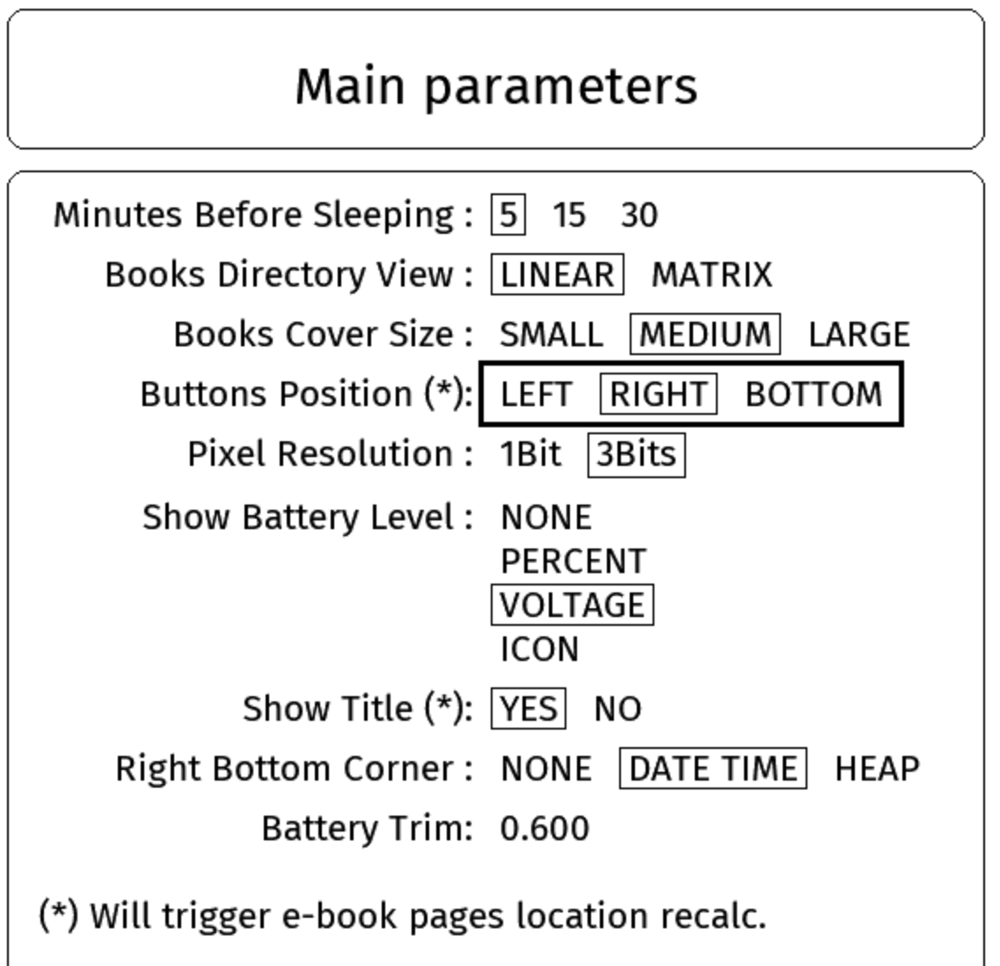

# EPub-InkPlate - User's Guide - Version 3.0.0

The EPub-InkPlate is an EPub reader application built specifically for the InkPlate ESP32-based devices.

For the installation process, please consult the `INSTALL.pdf` document.

Here are the main characteristics of the application:

- TTF and OTF embedded fonts support
- Normal, Bold, Italic, Bold+Italic face types
- Kerning, ligature, and minimal hyphenation
- Multi-column page rendering (1 to 4 columns)
- Bitmap images dithering display (JPEG, PNG, GIF, SVG, BMP)
- EPub (V2, V3) book format subset
- UTF-8 characters
- Screen orientation (buttons located to the left, right, down positions from the screen)
- Linear and Matrix view of books directory
- Three size cover pictures user's selectable
- Three size line height user's selectable
- Up to 200 books are allowed in the directory
- Left, center, right, and justify text alignments
- Indentation
- Some basic parameters and options
- Limited CSS formatting
- WiFi-based documents download
- Battery state and power management (light, deep sleep, battery level display)
- Real-Time clock (All devices, but the Inkplate-6)

## 1. Input Capabilities

There are four variation of input capability to interact with the device:

- **Original InkPlate 6 and 10**: Those devices were made by e-Radionica and possess three tactical buttons. Single and Double press on the keys are used by the application to get the equivalent of six different input *keys*.
- **Inkplate 6PLUS, 6PLUSV2, and 6FLICK**: Those are using a tactical (or *touch*) screen and permit different actions when touching the screen with your fingers. A wake-up key is available to get the device back working after it was put in sleep mode.
- **Inkplate 6V2, 10V2, and 5V2**: Those devices do not have any hardware input capability beyond the wake-up key.
- **Original Inkplate 6 and 10 using an extension board**: A small extension board can be hooked to the InkPlate 6 and 10 to get 6 mechanical keys.

In this manual, the following action names are used to identify each function done when using the keys or interacting with the tactical screen. Please note that there are some function that are not accessible by all device, depending on their input capabilities. Some key also may be used for more than one function, depending on the current application context. They are:

- **HOME**
- **SELECT**
- **NEXT**
- **PREVIOUS**
- **NEXT-2** or **DOWN**
- **PREVIOUS-2** or **UP**
- **UP**
- **DOWN**

For the 6PLUS, 6PLUSV2 and 6FLICK devices:

- **TAP**
- **TOUCH-AND-HOLD**
- **SWIPE-LEFT**
- **SWIPE-RIGHT**
- **PINCH-IN**
- **PINCH-OUT**

In the following text, the functions are also being called buttons.

The following sub-sections describe each of the device's input capabilities in greather details:

### 1.1 Original InkPlate 6 and 10

InkPlate devices have three tactile keys used to interact with the application. On the device, they are labeled 1, 2, and 3. The screen orientation can be selected in the parameters form. Depending on the orientation, the function of each key changes as follows:

- When the keys are on the **Bottom** side of the screen:

  - Key **1** is the **SELECT** function. Double-click on that key will trigger the **HOME** function.
  - Key **2** is the **PREVIOUS** function. Double-click on that key will trigger the **PREVIOUS-2** (or **UP**) function.
  - Key **3** is the **NEXT** function. Double-click on that key will trigger the **NEXT-2** (or **DOWN**) function.

- When the keys are on the **Left** side of the screen:

  - Key **3** is the **SELECT** function. Double-click on that key will trigger the **HOME** function.
  - Key **1** is the **PREVIOUS** function. Double-click on that key will trigger the **PREVIOUS-2** (or **UP**) function.
  - Key **2** is the **NEXT** function. Double-click on that key will trigger the **NEXT-2** (or **DOWN**) function.

- When the keys are on the **Right** side of the screen:

  - Key **1** is the **SELECT** function. Double-click on that key will trigger the **HOME** function.
  - Key **3** is the **PREVIOUS** function. Double-click on that key will trigger the **PREVIOUS-2** (or **UP**) function.
  - Key **2** is the **NEXT** function. Double-click on that key will trigger the **NEXT-2** (or **DOWN**) function.

### 1.2 Inkplate 6PLUS, 6PLUSV2, and 6FLICK

Those devices provide a touch screen interface for interacting with the application. The following gestures are supported:

- **TAP** { width=4% }: You briefly touch the screen surface with your fingertip. This is used in the following contexts:

- **TOUCH-AND-HOLD** { width=5% }: You touch the surface with your fingertip and hold position for an extended period of time. This is used to get access to descriptive texts in menus, or to get the author/title information of a book when displaying the list of books in the matrix view.

- **SWIPE-LEFT** and **SWIPE-RIGHT** { width=9% }: Move your fingertip across the screen from right to left, or from left to right, respectively. Used to change pages when reading a book or browsing the book list.

- **PINCH-IN** and **PINCH-OUT** { width=11% }: Touch the screen with two fingers and move them together or apart, respectively. Used to decrease or increase the screen backlight brightness.

### 1.3 Inkplate 6V2, 10V2, and 5V2

### 1.4 Original Inkplate 6 and 10 using an extension board

Extended InkPlate devices have six mechanical buttons used to interact with the application. The screen orientation can be selected in the parameters form. Depending on the orientation, the function of each key changes as follows:

- When the keys are on the **Bottom** side of the screen, from left to right:

  - The **HOME** function
  - The **LEFT** function
  - The **PREVIOUS-2** (or **UP**) and **NEXT-2** (or **DOWN**) function
  - The **RIGHT** function
  - The **SELECT** function

- When the keys are on the **Left** side of the screen, from top to bottom:

  - The **SELECT** function
  - The **PREVIOUS-2** (or **UP**) function
  - The **LEFT** and **RIGHT** function
  - The **NEXT-2** (or **DOWN**) function
  - The **HOME** function

- When the keys are on the **Right** side of the screen, from top to bottom:

  - The **SELECT** function
  - The **PREVIOUS-2** (or **UP**) function
  - The **LEFT** and **RIGHT** function
  - The **NEXT-2** (or **DOWN**) function
  - The **HOME** function


## 2. Application startup

When the device turns ON, the application executes the following tasks:

- Loads configuration information from the `config.txt` file located in the main SD-Card folder. 
- Loads fonts definition as defined in the `fonts_list.xml` file located in the main SD-Card folder. Fonts must be located in the `fonts` folder on the SD-Card.
- Verifies the presence of books on the SD-Card, and updates its database if required. The books must be located in the `books` folder on the SD-Card, be in the EPub V2 or V3 format, and have a filename ending with the `.epub` extension in lowercase.
- Presents the list of books to the user. If a book was previously in progress, it will be opened at the last-read page.


## 3. Interacting with the application

The application has two main display modes:

- The Books List mode — Shows the list of books available on the SD-Card, displaying a small cover thumbnail, title, and author for each book.
- The Book Reader mode — Displays a book's content one page at a time.

Each display mode also provides a set of functions the user can invoke. These are described in the sub-sections below.

### 3.1 The Books List mode

The list presents all books available to the user for reading. Two views are offered: a *linear view* and a *matrix view*:

- The Linear view will show books as a vertical list, showing the cover page on the left and the title/author on the right. 
- The Matrix view will show covers arranged in a matrix with the title/author of the currently selected book at the top of the screen.

The application keeps track of the reading page location of the last 10 books opened by the user. A book will have its title prefixed with `[Reading]` to show this fact in the displayed list. 

The books are presented in the following manner:

- Books being read are presented first in the list.
- The other books are then presented in alphabetical order by title.

The list may require several pages depending on the number of books present on the SD-Card and the size of the books' cover, selectable in the Main Parameters Form (see section 2.3 below).

{ width=50% }

{ width=50% }

On touch screen devices, you select the book you want to read by a **TAP** on the book's cover picture. Use the **SWIPE-LEFT** or **SWIPE-RIGHT** to show the previous/next page showing the books that are part of the library. Use the **TOUCH-AND-HOLD** on a book cover to display the information (title and author) of the book at the top of the screen. If you **TAP** elsewhere on screen, the main application menu will be shown.

For the other devices, use the **NEXT** and **PREVIOUS** buttons to highlight the appropriate book that you want to read, then use the **SELECT** button to have the book loaded, presenting the first page of it. The **NEXT-2** and **PREVIOUS-2** buttons can be used to show the previous/next page showing the books that are part of the library. The **HOME** button opens the main application menu.

### 3.2 The Main Application Menu

The main application menu is displayed at the top of the screen using an icon for each option and a label that would be shown below the menu. The options are as follows:

{ width=50% }

- { width=15 } **Return to the e-books list** - Closes the options menu and returns to the book list.
- { width=15 } **Return to the last e-book being read** - Opens the last book read, at the last page displayed.
- { width=15 } **Main parameters** - Opens the Main Parameters form, where you can adjust application behavior settings. Described below.
- { width=15 } **Default e-book parameters** - Opens the Default Parameters form, where you can set default font and image settings for book rendering. Described below.
- { width=15 } **WiFi access to the e-books folder** - Starts the Wi-Fi connection and a web server, allowing you to manage the book list on the SD-Card from a web browser — uploading, downloading, and removing books. Once started, pressing any key stops the server, closes the Wi-Fi connection, and restarts the device. Note that while the web server is running, power-saving features (deep sleep and light sleep) are disabled.
- { width=15 } **Refresh the e-books list** - Refreshes the books database. This happens automatically at startup and is rarely needed manually. Note that this action refreshes *all* books, which can be time-consuming — allow five to ten seconds per book.
- { width=15 } **Clear e-books' read history** - Erases all reading progress information (current position in each book and their priority placement at the top of the book list). The books themselves are not deleted.
- { width=15 } **Set Date/Time** - Opens a form to set the local date and time manually.
- { width=15 } **Retrieve Date/Time from Time Server** - Starts the Wi-Fi connection and retrieves the current time from an NTP server. The server address can be set in `config.txt`; the default is `pool.ntp.org`. Once the time is retrieved, press any button to restart the device.
- { width=15 } **Touch Screen Calibration** - (Touch Screen devices only) Launches the calibration screen. Each crosshair must be pressed **only once** to align the touch coordinates with the display. See section 3.2.1 for important details.
- { width=10 } **About the EPub-InkPlate application** - Shows a box with the application version number and developer's name.
- { width=15 } **Power OFF (Deep Sleep)** - Puts the device into Deep Sleep. Press any button to restart.

On touch screen devices, you select the option to execute with a **TAP** on the icon. A **TOUCH-AND-HOLD** on an icon will show the option table below the menu. A **TAP** outside of the menu space will return to the list of books in the library (equivalent to selecting the first icon in the menu).

For the other devices, the **NEXT** and **PREVIOUS** buttons move the cursor between options. Press **SELECT** to execute the highlighted option. **HOME** closes the application menu and returns to the book list (equivalent to selecting the first icon in the menu).

#### 3.2.1 Touchscreen Calibration

The touch screen calibration aligns the touch layer coordinates with the display. For some devices the alignment is already accurate enough and calibration is not needed, but you may notice a problem if tapping a menu entry or form option selects an adjacent item instead of the intended one.

When calibrating, touch each crosshair as precisely as possible. Imprecise touches will worsen alignment and can make menus and form inputs harder — or even impossible — to use.

If the calibration result is unsatisfactory, run the calibration again while you can still access it.

If calibration has made the screen impossible to use, remove the SD-Card, insert it into a computer, and open `config.txt`. Delete the following lines and save the file:

- calib_a
- calib_b
- calib_c
- calib_d
- calib_e
- calib_f
- calib_divider 

After removing those lines and rebooting, the device will use the default touch screen coordinates and calibration will be accessible again.

### 3.3 The Book Reader mode

The reader presents the book selected by the user one page at a time. Use the **NEXT** and **PREVIOUS** buttons to go to the next or previous page. The **DOUBLE-NEXT** and **DOUBLE-PREVIOUS** buttons will go 10 pages at a time.

If the user presses the **PREVIOUS** button when the first page of a book is presented, the reader will display the last page of the book. If the **NEXT** button is pressed when the last page of a book is presented, the reader will display the first page of the book.

As in the book list, **DOUBLE-SELECT** opens a list of options (**SELECT** does the same). The options are displayed at the top of the screen with an icon and label beneath each icon. The list is as follows:

{ width=50% }

- { width=15 } **Return to the e-book reader** - Returns to the page being read in the current book.
- { width=15 } **Table of Content** - If the book includes a table of contents, it will be shown here. Move the cursor to an entry and press **SELECT** to jump to that section. Available only if the EPub file contains a table of contents structure.
- { width=15 } **E-Books List** - Exits the book reader and returns to the book list.
- { width=15 } **Current e-book parameters** - Opens the parameters form for the current book, allowing you to select font and image display settings specific to this book. These settings are stored in a `.pars` file on the SD-Card. The available options are similar to those in the Default Parameters form, described below.
- { width=15 } **Revert e-book parameters to default values** - Resets all editable book formatting parameters to their default values.
- { width=15 } **Delete the current e-book** - Removes the current book and all its associated files from the device. A confirmation dialog is shown — press **SELECT** to confirm or any other button to cancel. After deletion, the book list is displayed.
- { width=15 } **WiFi access to the e-books folder** - Starts the Wi-Fi connection and a web server, allowing you to manage the book list on the SD-Card from a web browser — uploading, downloading, and removing books. Once started, pressing any key stops the server, closes the Wi-Fi connection, and restarts the device. Note that while the web server is running, power-saving features (deep sleep and light sleep) are disabled.
- { width=10 } **About the EPub-InkPlate application** - Shows a message box with the application version number and developer's name.
- { width=15 } **Power OFF (Deep Sleep)** - Puts the device into Deep Sleep. Press any button to restart.

The **NEXT** and **PREVIOUS** buttons move the cursor between options. Press **SELECT** to execute the highlighted option. **DOUBLE-SELECT** closes the options list and returns to the book list (equivalent to selecting the first entry).

### 3.4 The Main Parameters Form

As described in section 2.1, the Main Parameters form lets you adjust settings that affect application behavior. Each item is presented with a list of selectable options.

{ width=50% }

The following items are displayed:

- **Minutes Before Sleeping** - Options: 5, 15, or 30 minutes. The idle timeout after which the device enters Deep Sleep, a state in which battery consumption is minimal. Once asleep, the device wakes on any key press.
- **Books Directory View** - Options: Linear or Matrix. Selects how the book list is displayed. The Linear view shows books as a vertical list with the cover on the left and the title/author on the right. The Matrix view arranges covers in a grid with the title/author of the selected book shown at the top of the screen.
- **Books Cover Size** - Options: SMALL, MEDIUM, LARGE. Sets the size of the books cover that will be used to display the book list. They will be, respectively (Width x Height pixels): 70x90, 140x180, and 180x240 pixels.
- **Buttons Position** - Options: LEFT, RIGHT, BOTTOM. Sets the physical orientation of the device so the keys are located on the left, right, or bottom of the screen. Changing orientation between BOTTOM and LEFT/RIGHT (or vice versa) switches between landscape and portrait geometry, which affects how much content fits on each page and may trigger a recalculation of page locations for all books.
- **Pixel Resolution** - Selects how many bits are used per pixel. 3 bits per pixel enables font anti-aliasing but requires a full screen refresh on every page turn. 1 bit per pixel enables faster partial screen updates but disables anti-aliasing, resulting in visibly jagged glyphs.
- **Show Battery Level** - Options: NONE, PERCENT, VOLTAGE, ICON. Displays the battery level at the bottom-left of the screen, updated each time the screen refreshes in the book list and book reader modes (not updated while option menus or parameter forms are displayed). PERCENT shows the charge percentage (2.5 V = 0%, 3.7 V and more = 100%). VOLTAGE shows the raw battery voltage. The icon is shown for all options except NONE. (A 3.7 volts rechargeable battery may have a value than can go up to around 4.2 volts)
- **Show Title** - When selected, display the book title at the top portion of pages.
- **Right Bottom Selection** - What to show at the bottom-right of the screen: nothing, the date/time, or the stack/heap size. When date/time is selected, it is shown as `MM/DD - HH:MM` (e.g., `Mon - 01/24 22:44`). When stack/heap size is selected, three numbers are shown left to right: unused stack space, largest available heap chunk, and total available heap memory. This is primarily useful for diagnosing memory issues. The total stack is 60 KB and the heap is approximately 4.3 MB.
- **Battery Trim** - This is a linear trim factor to adjust the proper display of the battery level. It must be set to a value between 0.0 and 2.0 exclusive (normally will be closer to 1.0). The battery level is being read by means of one of the ESP32's A2D (Analog to Digital) interface. This interface is known to have some limitation when reading analogic values. The resistors used to divide the voltage at the entry of that interface could also offset the value being read depending on their values. Here is the way to adjust the factor (if you are not familiar with electronics voltmeter, try to find somebody to help you):
  1. Set the **Show Battery Level** parameter to VOLTAGE;
  2. Return to the books directory view;
  3. Take note of the voltage that is shown at the bottom of the screen;
  4. Power Off the device;
  5. Open the device cover to get access to the zone where the battery is connected. Pay attention in the way you manipulate the device;
  6. With a DC voltmeter, read the voltage of the battery. There must be some circuit pads close to the battery connector that allow to read that voltage;
  7. You can now compute the proper trim factor using the following formula: 
    ```
    Voltage read on the voltmeter divided by the Voltage displayed on the screen 
    ```

\newpage

When the form appears, the currently selected option for each item is highlighted with a small rectangle. A larger thin-line rectangle — the *selecting box* — surrounds all options of the first item. (See Figure 5)

{ width=50% }

To change an item, move the selecting box to it using **NEXT** and **PREVIOUS**, then press **SELECT**. The box changes to a **bold** rectangle around the options (see Figure 6). Use **NEXT** and **PREVIOUS** to cycle through choices, then press **SELECT** again to confirm. The box reverts to thin lines and advances to the next item.

Press **DOUBLE-SELECT** to exit the form. The new settings are saved and applied.

\newpage

### 3.5 The Default Parameters Form

As described in section 2.1, the Default Parameters form lets you set default font and image rendering values. Each item is presented with a list of selectable options.

{ width=50% }

The following items are displayed:

- **Default Font Size** - Options: 8, 10, 12, 15 points. Sets the character size for reflowable books (1 point = 1/72 inch).
- **Use Fonts in E-books** - Specifies whether fonts embedded in the book should be used to render pages.
- **Default Font** - Eight fonts are supplied with the application. Font names will have **CONDENSED**, **SERIF**, **SANS** (for sans-serif), or **TYPEWRITER** suffix to help distinguish the stroke of the font to use.
- **Show Images in E-books** - Controls whether images in books are rendered. Disabling images reduces memory usage and speeds up page rendering.
- **Column Count** - Choose to render e-book pages across 1 to 4 columns.

These are default values that apply to any book parameter that has not been customized for that specific book.

### 3.6 The Current book parameters form

As described in section 2.2, the current book parameters form lets you set font and image rendering values specific to the current book. These settings are stored in a `.pars` file on the SD-Card. The available options are similar to those in the Default Parameters form described in section 2.4.

{ width=50% }

The following items are displayed:

- **Font Size** - Options: 8, 10, 12, 15 points. Sets the character size for reflowable books (1 point = 1/72 inch).
- **Use Fonts in E-books** - Specifies whether fonts embedded in the book should be used to render pages.
- **Font** - Eight fonts are supplied with the application. Font names will have **CONDENSED**, **SERIF**, **SANS** (for sans-serif), or **TYPEWRITER** suffix to help distinguish the stroke of the font to use.
- **Show Images in E-books** - Controls whether images in the book are rendered. Disabling images reduces memory usage and speeds up page rendering.
- **Column Count** - Choose to render e-book pages across 1 to 4 columns.

When the form opens, it shows the values currently used to render the book's pages.

Parameters that the user has not explicitly set will show the value from the Default Parameters form. Once you change a parameter here, it is stored for this book. If you leave a parameter at its default, it will continue to track the value in the Default Parameters form — so updating the default will also update that book's presentation.

### 3.7 The Screen Saver

The V3 application now supports custom artwork being displayed during deep-sleep, loaded from the `artworks/` folder on the SD card. Seven default images are included in the distribution package, which the application selects at random when entering deep-sleep. Users can add their own custom JPEG images to this folder. Note that those images must *not* be saved as progressive as the application doesn't support this mode.

Use images that are close to the size of your device screen.

## 4. Additional information

### 4.1 The books database

The application maintains a small database of minimal metadata about each book (title, author, description, and a small cover image). This database is built the first time the application sees a book on the SD-Card and is used to present the book list. 

The only limit on the number of books is the SD-Card capacity. Too many books become difficult to browse, however: a few dozen are manageable, while a few hundred would be unwieldy. 

### 4.2 The Pages location computation

A book is presented one page at a time on the screen. The quantity of characters displayed on a page depends on the screen orientation (portrait or landscape), the fonts used, and the characters' size. Parameters in forms described in section 2, selectable by the user, have an impact on the number of pages and their localization in the EPub file. 

When a book is selected for display, the program checks whether its page locations need to be recalculated. This is transparent to the user. If required, a background task is started to recompute locations; it interferes minimally with reading and page navigation. The page count shown at the bottom of the screen becomes available only once the computation finishes. The locations are saved so that reopening the book does not require recomputation, provided the formatting parameters have not changed.

There is a big difference in the duration of the location computation between using slow SD-Cards and fast SD-Cards. The author made some tests with cards in hands. With SanDisk Ultra SD-Cards (both 16GB and 32GB), the scan duration with the two supplied books is ~3 minutes each. With a slow SD-Card (very old Sandisk 4GB), it took 8 minutes and 20 seconds.

### 4.3 On the complexity of EPub page formatting

The EPub standard allows for the use of a very large amount of flexible formatting capabilities available with HTML/CSS engines. This is quite a challenge to pack a reasonable amount of interpretation of formatting scripts on a small processor.

I've chosen a *good-enough* approach by which I obtain a reasonable page formatting quality. The aim is to get something that will allow the user to read a book and enjoy it without too much effort. There are cases for which the book content is way too complex to get good results...

One way to circumvent the problems is to use the epub converter provided with the [Calibre](https://calibre-ebook.com/) book management application. This is a tool able to manage a large number of books on computers. There are versions for Windows, macOS, and Linux. *Calibre* supplies a conversion tool (called 'Convert books' on the main toolbar) that, when choosing to *convert EPub to EPub*, will simplify the coding of styling that would be more in line with the interpretation capability of *EPub-InkPlate*. 

The convert tool in *Calibre* can also subset fonts so they contain only the glyphs required by the book (when the 'Convert books' tool is open, this option is under 'Look & feel' > 'Fonts' > 'Subset all embedded fonts'). Some books have four or five fonts of 1.5 MB each that the convert tool reduces to around 200 KB per font (roughly 1 MB total). 

For images, to get them reasonably in line with the screen resolution of the InkPlate devices (that is 600x800 for the InkPlate-6), the convert tool can be tailored to do so. Simply select the 'Generic e-ink' output profile from the 'Page setup' options once the convert tool is launched. For example, even at this size, a 600x800 image will take close to 500 kilobytes. 

It appears that the tool may omit to transform some images from the book. Also, the images will remain with RGB pixels instead of grayscale pixels that usually require more time to load. A script named `adjust_size.sh` is supplied with this release that can be used to transform all images in a book to use grayscale and a resolution equal to or lower than 800x600 pixels (if you prefer, you can modify it to use 1200x825 format for InkPlate-10 device). This script is using a tool supplied with the **ImageMagick** package available with Linux or macOS. It can also be loaded under MS Windows with **Cygwin**. 

### 4.4 In case of out of memory situation

The memory required to prepare a book to be displayed may become an issue if there is not enough memory available. The InkPlate devices are limited in memory: around 4.5 megabytes are available. A part of it is dedicated to the screen buffer and the rest of it is mainly used by the application.

As performance is a key factor, fonts are loaded and kept in memory by the application.  If a book is using too many fonts or fonts that are too big (they may contain more glyphs than necessary for the book), it will not be possible to show the document with the original fonts. 

Here are some steps that can be used to minimize the amount of memory that would be required to present the content of books:

- **Convert the book** - As indicated in the previous section, the *Calibre Convert* tool can be used to minimize both fonts and image size.
- **Use 1-bit pixels** - The frame buffer used to render pages consumes significant memory: 240 KB for 3-bit pixels, 60 KB for 1-bit pixels (for an Inkplate-6). Pixel resolution is set in the Main Parameters.
- **Deactivate images** - In the Main Parameters, you can disable image rendering.
- **Deactivate book fonts** - In the Font Parameters, you can disable fonts embedded in the book.

If an internal problem related to memory allocation is found by the application, a message will appear on the screen and the device will be put in a Deep Sleep state. The message will indicate the reason why the allocation was not successful. This can be used as a hint to use one or more steps indicated above.

### 4.5 Images rendering

Starting with version 1.3.0, the application is using a new *stream-based* approach to render images that are part of a book. This approach optimizes the use of memory to load pictures by using a minimal amount of memory as a picture is retrieved from the ePub file.

JPEG, PNG, GIF, SVG, and BMP image types are supported. Only basic formats of both types are recognized. For some books, image rendering may not be possible. The `adjust_size.sh` script supplied with the application can transform the resolution of embedded images and convert them to a format compatible with the application. See section 3.3 for details on how to run the script. 

### 4.6 Moving the SD-Card from an Inkplate model to another

For each book, the application may generate three additional files in the `books/` folder of the SD-Card:

- Pages location offsets (files with extension `.locs`). They are tailored to the screen resolution, selected fonts and formatting parameters.
- Table of Content (files with extension `.toc`). They may also be tailored to the screen resolution and formatting parameters.
- The book's formatting parameters (files with extension `.pars`).

These files are automatically generated when they are not present (or when a formatting parameter will impact the page rendering) in the folder at the time the user opens a book to be read.

Inkplate device models use different eInk screens that have different pixel resolutions. If you ever want to transfer an SD-Card from one model to another, the application normally detects the change of screen resolution and regenerates the page's location when the user opens the book. If you suspect that the pages are not properly displayed, it could be beneficial to erase some files in the SD-Card's `books` folder. The best way to do it is to plug the SD-Card into your computer or laptop and delete all those `.locs` and `.toc` files. The `.pars` files are the same for all Inkplate models.

### 4.7 Internal fonts replacement

Starting with version 1.3.1, the application allows for the replacement of fonts that can be selected by the user through the configuration forms. To do so, a fonts configuration file named `fonts_list.xml` is used to define which font can be selected. This file must be present in the main SD-Card folder. It is loaded at boot time or after deep sleep to initialize the structure of the fonts. 

Two groups of fonts are defined: SYSTEM fonts used to display application controls, and USER fonts that can be selected to display book content.
  
Each font in the USER group must define normal, bold, italic, and bold-italic filenames. Font files that are too large may cause problems: the four files combined are limited to 300 KB by the application.
  
The SYSTEM group is tailored to the needs of the EPub-Inkplate software. Changes may impact the way that the application behaves.
  
The font files must reside in the `fonts` folder on the SD-Card. The EPub-Inkplate distribution contains many other fonts that are not used in the `fonts_list.xml` but can be selected by the user by modifying the content of the XML file. Two font types are supported: True Type Fonts (`.ttf` files) and Open Type Fonts (`.otf` files). The previous versions of tha application were also supporting the IBMF fonts, these were replaced with their equivalent Open Type Fonts. IBMF fonts are no longer supported.

**Important:** If you modify the fonts in the USER group, previously computed page locations may shift because glyph sizes can differ between fonts. Delete the `.locs` files in the books folder; the application will recompute page locations automatically.

### 4.8 In case of a problem

The application may occasionally behave unexpectedly. That can happen for a variety of reasons beyond the testing effort made by the author.

The first thing to do is verify that your device is running the latest version of the application. You can check this through the **About the EPub-InkPlate application** menu entry, which shows the current version. New releases are published [here](https://github.com/turgu1/EPub-InkPlate/releases) from time to time. See the Install Manual for instructions on updating your device.

If your device is already on the latest release, connect it via USB cable and use a serial terminal emulator on your computer to view diagnostic output. When EPub-InkPlate is running, messages are sent to the USB port. Errors are usually reported there, which can help identify the issue. 

On both Linux and Mac computers, the author is using **minicom** to access the USB port. The device name is usually `/dev/ttyUSB0` and the baud rate to use is 115200 bps with 8N1 bits/parity.

On a Windows computer, there is a variety of terminal emulators available to select from. The device name is usually `COM3:` and the other parameters must be the same as for Linux.

If you can't resolve the problem by yourself, it is always possible to raise an issue [here](https://github.com/turgu1/EPub-InkPlate/issues). You have to explain the bad behavior of the application and attach any information that can help the author to find what the problem is.

### 4.9 Limitations

The Inkplate devices are based on ESP32-WROVER MPU. This is a very capable chip with a fair amount of processing power and memory. The following are the limitations imposed on the EPub-Inkplate application related to the capabilities available with the device.

- *Maximum number of books:* **200**. The application must keep some information about the books to quickly build and show the directory content.
- *Maximum single book size:* **25 Mbytes**.
- *Font formats:* **TTF, OTF**.
- *Maximum memory used for application internal fonts content:* **300 Kbytes**.
- *Maximum memory used for books' fonts content:* **800 Kbytes**. Fonts that are already loaded are kept for rendering. If the output is not appropriate, the user can disable the use of the fonts embedded with the book and use one of the fonts supplied with the application.
- *Maximum nested HTML tags in book content:* **50**. Testing the application, the author never had to deal with books having more than 15 nested tags. This limit is to track potential nested issues that would reset the device (stack overflow).
- *Image format types:* **subset of PNG, JPeg, GIF, SVG, and BMP**. The subsets are imposed by libraries used to interpret the image file content. In particular, JPeg pictures in progressive mode are not supported. They must be transformed to static mode using some tool (like Calibre) if you want them to be displayed. SVG support is very basic and will be enhanced in a future version. 
