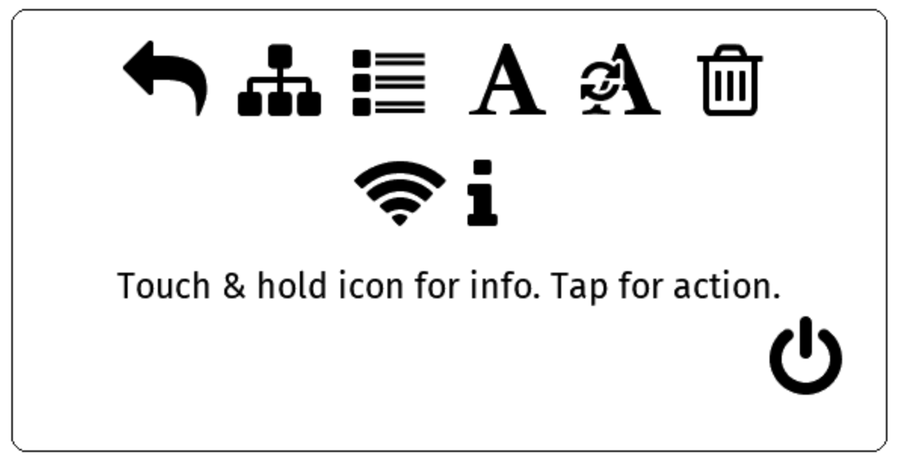
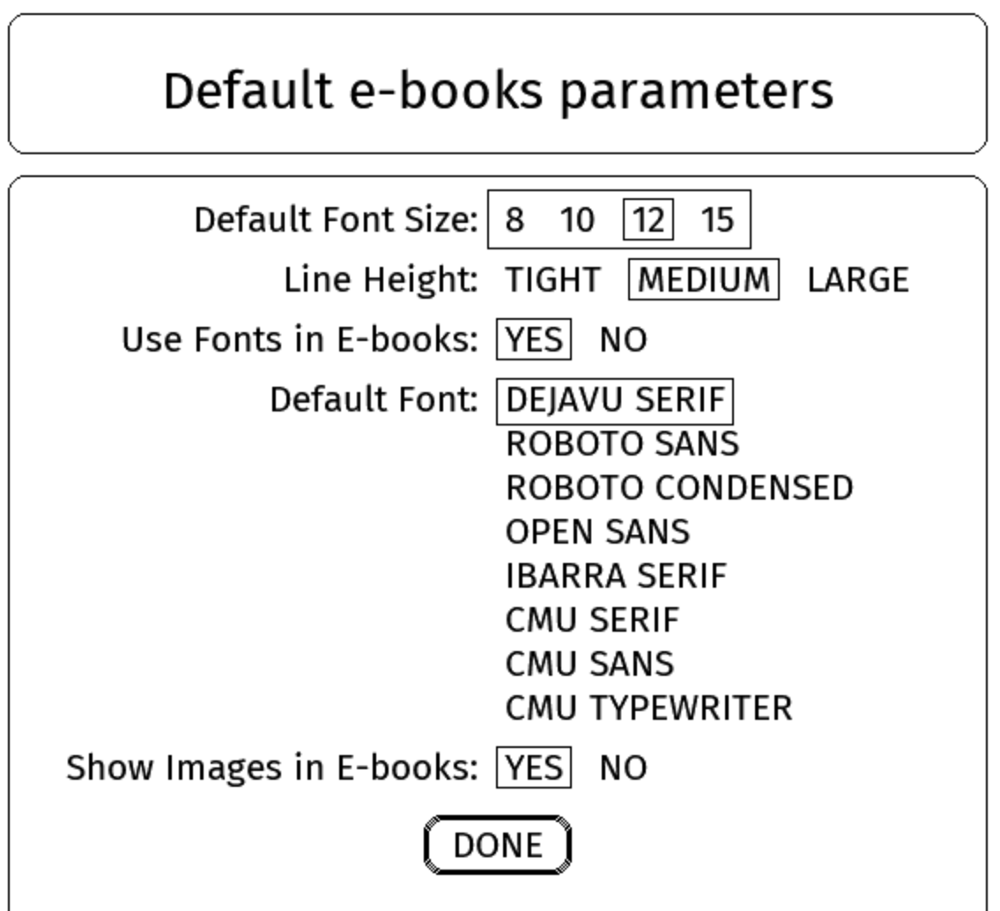
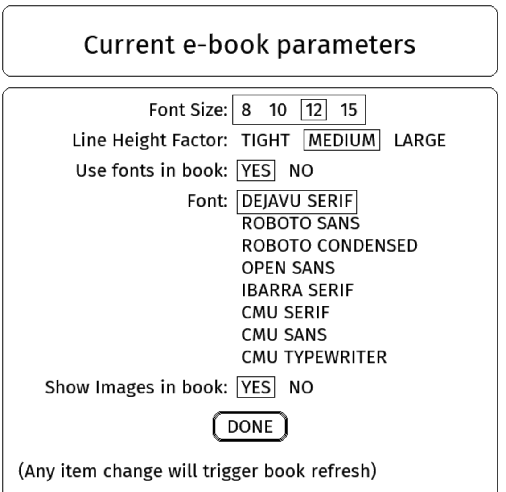

# EPub-InkPlate - Inkplate With Touch Screen User's Guide - Version 3.0.0

The EPub-InkPlate is an EPub reader application built specifically for the InkPlate ESP32-based devices. This version of the manual covers the following device types that use a touch screen:

 - E-Radionica Inkplate-6PLUS
 - Soldered Inkplate-6PLUS and Inkplate-6FLICK

For the installation process, please consult the `INSTALL.pdf` document.

Here are the main characteristics of the application:

- TTF and OTF embedded fonts support
- Bitmap fonts support in a specific IBMF font format
- Normal, Bold, Italic, Bold+Italic face types
- Bitmap images dithering display (JPEG, PNG, GIF, SVG)
- EPub (V2, V3) book format subset
- UTF-8 characters
- Screen orientation (SDCard located to the left, right, up, and down positions from the screen)
- Linear and Matrix view of books directory
- Three size cover pictures user's selectable
- Up to 200 books are allowed in the directory
- Left, center, right, and justify text alignments
- Indentation
- Some basic parameters and options
- Limited CSS formatting
- WiFi-based documents download
- Battery state and power management (light, deep sleep, battery level display)
- Real-Time clock (All devices, but the Inkplate-6)

## 1. Application startup

When the device turns ON, the application executes the following tasks:

- Loads configuration information from the `config.txt` file located in the main SD-Card folder. 
- Loads fonts definition as defined in the `fonts_list.xml` file located in the main SD-Card folder. Fonts must be located in the `fonts` folder on the SD-Card.
- Verifies the presence of books on the SD-Card, and updates its database if required. The books must be located in the `books` folder on the SD-Card, be in the EPub V2 or V3 format, and have a filename ending with the `.epub` extension in lowercase.
- Presents the list of books to the user. If a book was previously in progress, it will be opened at the last-read page.


## 2. Interacting with the application

The InkPlate-6PLUS provides a touch screen interface for interacting with the application. The following gestures are supported:


- **TAP** { width=4% }: You briefly touch the screen surface with your fingertip. This is used in forms and menus when a selection is to be made. It is also used to change pages when reading a book.

- **TOUCH-AND-HOLD** { width=5% }: You touch the surface with your fingertip and hold position for an extended period of time. This is used to get access to descriptive texts in menus, or to get the author/title information of a book when displaying the list of books in the matrix view.

- **SWIPE-LEFT** and **SWIPE-RIGHT** { width=9% }: Move your fingertip across the screen from right to left, or from left to right, respectively. Used to change pages when reading a book or browsing the book list.

- **PINCH-IN** and **PINCH-OUT** { width=11% }: Touch the screen with two fingers and move them together or apart, respectively. Used to decrease or increase the screen backlight brightness.

The application has two main display modes:

- The Books List mode — Shows the list of books available on the SD-Card, displaying a small cover thumbnail, title, and author for each book.
- The Book Reader mode — Displays a book's content one page at a time.

Each display mode also provides a set of functions the user can invoke. These are described in the sub-sections below.

### 2.1 The Books List mode

The list presents all books available to the user for reading. Two views are offered: a **linear view** and a **matrix view**:

- The Linear view will show books as a vertical list, showing the cover page on the left and the title/author on the right. 
- The Matrix view will show covers arranged in a matrix with the title/author of the currently selected book at the top of the screen.

The application keeps track of the reading page location of the last 10 books opened by the user. A book will have its title prefixed with `[Reading]` to show this fact in the displayed list. 

The books are presented in the following manner:

- Books being read are presented first in the list.
- The other books are then presented in alphabetical order by title.

The list may require several pages depending on the number of books present on the SD-Card and the size of the books' cover, selectable in the Main Parameters Form (see section 2.3 below).

{ width=40% }

{ width=40% }


Use the **TAP** gesture on the cover page to have the book loaded, presenting the first page of it, or the last page read. The **SWIPE-LEFT** and **SWIPE-RIGHT** can be used to move to the next or previous page.

Using the Linear view, you can use the **TAP** gesture in the center of the page to display the options menu.

Using the Matrix view, you can use the **TOUCH-AND-HOLD** gesture on a cover page to get the title and author information on the top of the screen. The **TAP** gesture in the top portion of the screen or outside of the covers space will display the options menu.

The options menu is displayed at the top of the screen as icons. The options are as follows:

{ width=50% }

- { width=15 } **Return to the e-books list** - Closes the options menu and returns to the book list.
- { width=15 } **Return to the last e-book being read** - Opens the last book read, at the last page displayed.
- { width=15 } **Main parameters** - Opens the Main Parameters form, where you can adjust application behavior settings. Described below.
- { width=15 } **Default e-book parameters** - Opens the Default Parameters form, where you can set default font and image settings for book rendering. Described below.
- { width=15 } **WiFi access to the e-books folder** - Starts the Wi-Fi connection and a web server, allowing you to manage the book list on the SD-Card from a web browser — uploading, downloading, and removing books. Once started, tap the screen to stop the server, close the Wi-Fi connection, and restart the device. Note that while the web server is running, power-saving features (deep sleep and light sleep) are disabled.
- { width=15 } **Refresh the e-books list** - Refreshes the books database. This happens automatically at startup and is rarely needed manually. Note that this action refreshes *all* books, which can be time-consuming — allow five to ten seconds per book.
- { width=15 } **Clear e-books' read history** - Erases all reading progress information (current position in each book and their priority placement at the top of the book list). The books themselves are not deleted.
- { width=15 } **Set Date/Time** - Opens a form to set the local date and time manually.
- { width=15 } **Retrieve Date/Time from Time Server** - Starts the Wi-Fi connection and retrieves the current time from an NTP server. The server address can be set in `config.txt`; the default is `pool.ntp.org`. Once the time is retrieved, tap the screen to restart the device.
- { width=15 } **Touch Screen Calibration** - Launches the calibration screen. Each crosshair must be pressed **only once** to align the touch coordinates with the display. See section 2.1.1 for important details.
- { width=10 } **About the EPub-InkPlate application** - Shows a box with the application version number and developer name.
- { width=15 } **Power OFF (Deep Sleep)** - Puts the device into Deep Sleep. Press the WakeUp button to restart.

Use the **TOUCH-AND-HOLD** gesture on an icon to display the associated information text. Use the **TAP** gesture on the icon to select the option and execute its function.

#### 2.1.1 Touchscreen Calibration

The touch screen calibration aligns the touch layer coordinates with the display. For some devices the alignment is already accurate enough and calibration is not needed, but you may notice a problem if tapping a menu entry or form option selects an adjacent item instead of the intended one.

When calibrating, touch each crosshair as precisely as possible. Imprecise touches will worsen alignment and can make menus and form inputs harder — or even impossible — to use.

If the calibration result is unsatisfactory, run the calibration again while you can still access it.

If calibration has made the screen impossible to use, remove the SD-Card, insert it into a computer, and open `config.txt`. Delete the following lines and save the file:

- calib_a
- calib_b
- calib_c
- calib_d
- calib_e
- calib_f
- calib_divider 

After removing those lines and rebooting, the device will use the default touch screen coordinates and calibration will be accessible again.

### 2.2 The Book Reader mode

The reader displays the selected book one page at a time.

The screen is divided into three vertical zones: left, center, and right. **TAP** the right zone to go to the next page; **TAP** the left zone to go to the previous page. **SWIPE-LEFT** and **SWIPE-RIGHT** also move forward and back one page, respectively.

If you request the previous page while on the first page, the reader wraps to the last page, and vice versa.

**TAP** the center zone to open the book options menu.

{ width=50% }

- { width=15 } **Return to the e-book reader** - Returns to the page being read in the current book.
- { width=15 } **Table of Content** - If the book includes a table of contents, it is shown here. Use **SWIPE-LEFT** and **SWIPE-RIGHT** to page through it, and **TAP** an entry to jump to that section. Available only if the EPub file contains a table of contents structure.
- { width=15 } **E-Books List** - Exits the book reader and returns to the book list.
- { width=15 } **Current e-book parameters** - Opens the parameters form for the current book, allowing you to select font and image settings specific to this book. These settings are stored in a `.pars` file on the SD-Card. The available options are similar to those in the Default Parameters form, described below.
- { width=15 } **Revert e-book parameters to default values** - Resets all editable book formatting parameters to their default values.
- { width=15 } **Delete the current e-book** - Removes the current book and all its associated files from the device. A confirmation dialog is shown — **TAP** the confirm button to proceed, or tap elsewhere to cancel. After deletion, the book list is displayed.
- { width=15 } **WiFi access to the e-books folder** - Starts the Wi-Fi connection and a web server, allowing you to manage the book list on the SD-Card from a web browser — uploading, downloading, and removing books. Once started, pressing any button stops the server, closes the Wi-Fi connection, and restarts the device. Note that while the web server is running, power-saving features (deep sleep and light sleep) are disabled.
- { width=10 } **About the EPub-InkPlate application** - Shows a message box with the application version number and developer name.
- { width=15 } **Power OFF (Deep Sleep)** - Puts the device into Deep Sleep. Press the WakeUp button to restart.

Use the **TOUCH-AND-HOLD** gesture on an icon to display the associated information text. Use the **TAP** gesture on the icon to select the option and execute its function.


### 2.3 The Main Parameters Form

As described in section 2.1, the Main Parameters form lets you adjust settings that affect application behavior. Each item is presented with a list of selectable options.

{ width=50% }

The following items are displayed:

- **Minutes Before Sleeping** - Options: 5, 15, or 30 minutes. The idle timeout after which the device enters Deep Sleep, a state in which battery consumption is minimal. Once asleep, the device wakes when the WakeUp button is pressed.
- **Books Directory View** - Options: Linear or Matrix. Selects how the book list is displayed. The Linear view shows books as a vertical list with the cover on the left and the title/author on the right. The Matrix view arranges covers in a grid with the title/author of the selected book shown at the top of the screen.
- **Books Cover Size** - Options: SMALL, MEDIUM, LARGE. Sets the size of the books cover that will be used to display the book list. They will be, respectively (Width x Height pixels): 70x90, 140x180, and 180x240 pixels.
- **uSDCard Position** - Options: LEFT, RIGHT, TOP, BOTTOM. Sets the physical orientation of the device so the SD-Card slot is on the left, right, top, or bottom of the screen. Changing orientation between TOP/BOTTOM and LEFT/RIGHT (or vice versa) switches between portrait and landscape geometry, which affects how much content fits on each page and may trigger a recalculation of page locations for all books.
- **Pixel Resolution** - Selects how many bits are used per pixel. 3 bits per pixel enables font anti-aliasing but requires a full screen refresh on every page turn. 1 bit per pixel enables faster partial screen updates but disables anti-aliasing, resulting in visibly jagged glyphs.
- **Show Battery Level** - Options: NONE, PERCENT, VOLTAGE, ICON. Displays the battery level at the bottom-left of the screen, updated each time the screen refreshes in the book list and book reader modes (not updated while option menus or parameter forms are displayed). PERCENT shows the charge percentage (2.5 V = 0%, 3.7 V and more = 100%). VOLTAGE shows the raw battery voltage. The icon is shown for all options except NONE. (A 3.7 volts rechargeable battery may have a value than can go up to around 4.2 volts)
- **Show Title** - When selected, display the book title at the top portion of pages.
- **Right Bottom Selection** - What to show at the bottom-right of the screen: nothing, the date/time, or the stack/heap size. When date/time is selected, it is shown as `DDD - MM/DD HH:MM` (e.g., `Mon - 01/24 22:44`). When stack/heap size is selected, three numbers are shown left to right: unused stack space, largest available heap chunk, and total available heap memory. This is primarily useful for diagnosing memory issues. The total stack is 60 KB and the heap is approximately 4.3 MB.
- **Battery Trim** - This is a linear trim factor to adjust the proper display of the battery level. It must be set to a value between 0.0 and 2.0 exclusive (normally will be closer to 1.0). The battery level is being read by means of one of the ESP32's A2D (Analog to Digital) interface. This interface is known to have some limitation when reading analogic values. The resistors used to divide the voltage at the entry of that interface could also offset the value being read depending on their values. Here is the way to adjust the factor (if you are not familiar with electronics voltmeter, try to find somebody to help you):
  1. Set the **Show Battery Level** parameter to VOLTAGE;
  2. Return to the books directory view;
  3. Take note of the voltage that is shown at the bottom of the screen;
  4. Power Off the device;
  5. Open the device cover to get access to the zone where the battery is connected. Pay attention in the way you manipulate the device;
  6. With a DC voltmeter, read the voltage of the battery. There must be some circuit pads close to the battery connector that allow to read that voltage;
  7. You can now compute the proper trim factor using the following formula: 
    ```
    Voltage read on the voltmeter divided by the Voltage displayed on the screen 
    ```
  
When the form appears, the currently selected option for each item is highlighted with a small rectangle. To change an option, **TAP** the desired value.

Tap the **DONE** button to close the form. The new settings are saved and applied.

### 2.4 The Default Parameters Form

As described in section 2.1, the Default Parameters form lets you set default font and image rendering values. Each item is presented with a list of selectable options.

{ width=50% }

The following items are displayed:

- **Default Font Size** - Options: 8, 10, 12, 15 points. Sets the character size for reflowable books (1 point = 1/72 inch).
- **Line Height** - Options: TIGHT, MEDIUM, LARGE. Sets the line height that will be used to display the text of the books.
- **Use Fonts in E-books** - Specifies whether fonts embedded in the book should be used to render pages.
- **Default Font** - Eight fonts are supplied with the application. Font names will have **CONDENSED**, **SERIF**, **SANS** (for sans-serif), or **TYPEWRITER** suffix to help distinguish the stroke of the font to use.
- **Show Images in E-books** - Controls whether images in books are rendered. Disabling images reduces memory usage and speeds up page rendering.

These are default values that apply to any book parameter that has not been customized for that specific book.
   
When the form appears, the currently selected option for each item is highlighted with a small rectangle. To change an option, **TAP** the desired value.

Tap the **DONE** button to close the form. The new settings are saved and applied.

### 2.5 The Current book parameters form

As described in section 2.2, the current book parameters form lets you set font and image rendering values specific to the current book. These settings are stored in a `.pars` file on the SD-Card. The available options are similar to those in the Default Parameters form described in section 2.4.

{ width=50% }

The following items are displayed:

- **Font Size** - Options: 8, 10, 12, 15 points. Sets the character size for reflowable books (1 point = 1/72 inch).
- **Line Height** - Options: TIGHT, MEDIUM, LARGE. Sets the line height that will be used to display the text of the books.
- **Use Fonts in E-books** - Specifies whether fonts embedded in the book should be used to render pages.
- **Font** - Eight fonts are supplied with the application. Font names will have **CONDENSED**, **SERIF**, **SANS** (for sans-serif), or **TYPEWRITER** suffix to help distinguish the stroke of the font to use.
- **Show Images in E-books** - Controls whether images in the book are rendered. Disabling images reduces memory usage and speeds up page rendering.

When the form opens, it shows the values currently used to render the book's pages.

Parameters that the user has not explicitly set will show the value from the Default Parameters form. Once you change a parameter here, it is stored for this book. If you leave a parameter at its default, it will continue to track the value in the Default Parameters form — so updating the default will also update that book's presentation.

When the form appears, the currently selected option for each item is highlighted with a small rectangle. To change an option, **TAP** the desired value.

Tap the **DONE** button to close the form. The new settings are saved and applied.

## 3. Additional information

### 3.1 The books database

The application maintains a small database of minimal metadata about each book (title, author, description, and a small cover image). This database is populated the first time the application detects a book on the SD-Card and is used to build the book list.

The only hard limit on the number of books is the capacity of the SD-Card. That said, a very large collection becomes difficult to browse — a few dozen books is comfortable, while a few hundred starts to feel unwieldy.

### 3.2 The Pages location computation

A book is displayed one page at a time. How much content fits on a page depends on the screen orientation (portrait or landscape), the fonts used, and the character size. The user-selectable parameters described in section 2 affect the number of pages and their positions within the EPub file.

When a book is opened, the application checks whether page locations need to be recalculated. If so, a background task handles this transparently, interfering minimally with reading and navigation. The page number shown at the bottom of the screen becomes available only once recalculation is complete. Locations are saved to a file so they do not need to be recomputed the next time the book is opened, provided the formatting parameters have not changed.

Page-location computation speed varies significantly with SD-Card speed. In tests with SanDisk Ultra cards (16 GB and 32 GB), each of the two supplied books took approximately 3 minutes to scan. With a slow older card (SanDisk 4 GB), the same scan took 8 minutes and 20 seconds.

### 3.3 On the complexity of EPub page formatting

The EPub standard exposes an enormous range of HTML/CSS formatting capabilities, and fitting a reasonable subset of that into a small processor is a real challenge.

I use a *good-enough* approach aimed at producing readable, enjoyable results. Some books with highly complex formatting will not render perfectly.

One practical remedy is the EPub converter in [Calibre](https://calibre-ebook.com/), a book management application available for Windows, macOS, and Linux. Using *Convert books* to convert an EPub to EPub simplifies its styling in a way that EPub-InkPlate handles more reliably.

The Calibre converter can also subset fonts to include only the glyphs needed by the book (in the *Convert books* tool: *Look & Feel* > *Fonts* > *Subset all embedded fonts*). One book I tested had four or five fonts totalling about 6 MB; after subsetting they came down to around 200 KB per font.

For images, select the *Generic e-ink* output profile under *Page setup* to resize images to match the InkPlate screen resolution (600×800 for InkPlate-6). Even at that size, a 600×800 image can take close to 500 KB.

Note that Calibre may not convert all images, and converted images will remain in RGB rather than grayscale, which increases load time. The script `adjust_size.sh` supplied with this release converts all embedded images to grayscale at a resolution of 800×600 pixels or smaller (you can modify it for 1200×825 for InkPlate-10). It requires **ImageMagick**, available on Linux, macOS, and Windows via **Cygwin**.

### 3.4 In case of out of memory situation

The memory available to prepare a book for display can be a limiting factor. InkPlate devices have approximately 4.5 MB of RAM, part of which is dedicated to the screen buffer.

For performance, fonts are loaded and kept in memory. A book that uses many fonts, or fonts containing far more glyphs than the book actually needs, may exhaust available memory.

The following steps can help reduce memory usage:

- **Convert the book** - As described above, the Calibre converter can reduce both font and image size.
- **Use 1-bit pixels** - The frame buffer uses 240 KB at 3 bits/pixel and 60 KB at 1 bit/pixel (for an Inkplate-6). Select pixel resolution in Main Parameters.
- **Deactivate images** - In Main Parameters, you can disable image rendering.
- **Deactivate book fonts** - In Font Parameters, you can disable fonts embedded in the book.

If the application encounters a memory allocation failure, it will display a message explaining the cause and put the device into Deep Sleep. The message can guide you toward the appropriate step above.

### 3.5 Images rendering

Starting with version 1.3.0, the application uses a *stream-based* approach to render images, loading picture data incrementally from the EPub file to minimize memory usage.

JPEG, PNG, GIF, and SVG image types are supported, but only in their basic formats. Some books may contain images that cannot be rendered. The `adjust_size.sh` script included with the application can convert embedded images to a compatible format and resolution. See section 3.3 for details.

### 3.6 Moving the SD-Card from an Inkplate model to another

For each book, the application may generate three additional files in the `books/` folder of the SD-Card:

- Pages location offsets (files with extension `.locs`). They are tailored to the screen resolution, selected fonts and formatting parameters.
- Table of Content (files with extension `.toc`). They may also be tailored to the screen resolution and formatting parameters.
- The book's formatting parameters (files with extension `.pars`).

These files are automatically generated when they are not present (or when a formatting parameter will impact the page rendering) in the folder at the time the user opens a book to be read.

Different InkPlate models use eInk screens with different pixel resolutions. The application normally detects a resolution change and regenerates page locations when the user opens a book. If pages appear incorrectly after moving a card, delete all `.locs` and `.toc` files from the `books` folder on the SD-Card (plug the card into a computer to do this). The `.pars` files are compatible across all InkPlate models.

### 3.7 Internal fonts replacement

Starting with version 1.3.1, the application allows for the replacement of fonts that can be selected by the user through the configuration forms. To do so, a fonts configuration file named `fonts_list.xml` is used to define which font can be selected. This file must be present in the main SD-Card folder. It is loaded at boot time or after deep sleep to initialize the structure of the fonts. 

Two groups of fonts are defined: SYSTEM fonts used to render application controls, and USER fonts that the user can select for displaying book content.

Each font in the USER group must specify normal, bold, italic, and bold-italic filenames. To avoid bad application behavior, the four combined font files for any single entry are limited to 300 KB.

The SYSTEM group is tailored to the needs of EPub-InkPlate. Modifying it may affect how the application appears.

Font files must reside in the `fonts` folder on the SD-Card. The EPub-InkPlate distribution includes additional fonts not referenced in `fonts_list.xml` by default; you can add them by editing the XML file. Two font types are supported: True Type Fonts (`.ttf` files) and Open Type Fonts (`.otf` files). The previous versions of tha application were also supporting the IBMF fonts, these were replaced with their equivalent Open Type Fonts. IBMF fonts are no longer supported.

**Important:** If you change fonts in the USER group, previously computed page locations may become invalid because glyph dimensions may differ. Delete all `.locs` files from the `books` folder; the application will recompute page locations automatically.

### 3.8 In case of a problem

If the application behaves unexpectedly, first check whether you are running the latest version using the **About the EPub-InkPlate application** menu entry. New releases are published at: https://github.com/turgu1/EPub-InkPlate/releases. Consult the Installation Guide for upgrade instructions.

If you are already on the latest release, connect the InkPlate to your computer with a USB cable and open a serial terminal. EPub-InkPlate sends diagnostic messages over the USB port while running, and any detected problem is likely to produce a message that identifies the cause.

On Linux and macOS, **minicom** works well for this. The device is typically `/dev/ttyUSB0`; use 115200 bps, 8N1.

On Windows, any serial terminal emulator will do. The device is typically `COM3:` with the same settings.

If you cannot resolve the issue on your own, open a report at: https://github.com/turgu1/EPub-InkPlate/issues — describe the unexpected behavior and attach any relevant diagnostic output.

### 3.9 Limitations

The Inkplate devices are based on ESP32-WROVER MPU. This is a very capable chip with a fair amount of processing power and memory. The following are the limitations imposed on the EPub-Inkplate application related to the capabilities available with the device.

- *Maximum number of books:* **200**. The application must keep some information about the books to quickly build and show the directory content.
- *Maximum single book size:* **25 Mbytes**.
- *Font formats:* **TTF, OTF**.
- *Maximum memory used for application internal fonts content:* **300 Kbytes**.
- *Maximum memory used for books' fonts content:* **800 Kbytes**. Fonts that are already loaded are kept for rendering. If the output is not appropriate, the user can disable the use of the fonts embedded with the book and use one of the fonts supplied with the application.
- *Maximum nested HTML tags in book content:* **50**. Testing the application, the author never had to deal with books having more than 15 nested tags. This limit is to track potential nested issues that would reset the device (stack overflow).
- *Image format types:* **subset of PNG, JPeg, GIF, and SVG**. The subsets are imposed by libraries used to interpret the image file content. In particular, JPeg pictures in progressive mode are not supported. They must be transformed to static mode using some tool (like Calibre) if you want them to be displayed. 
