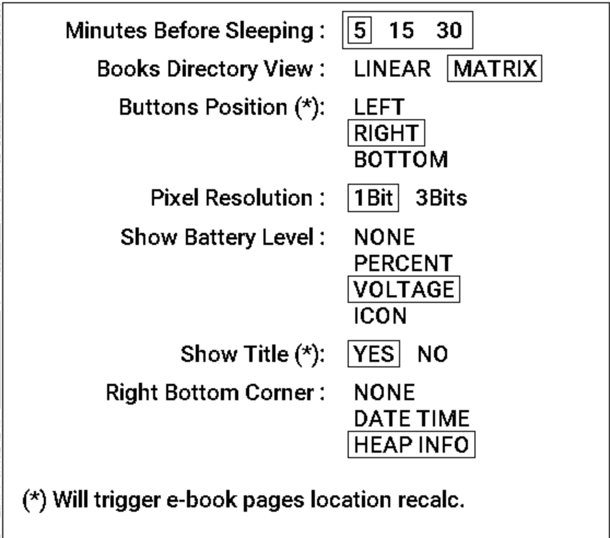
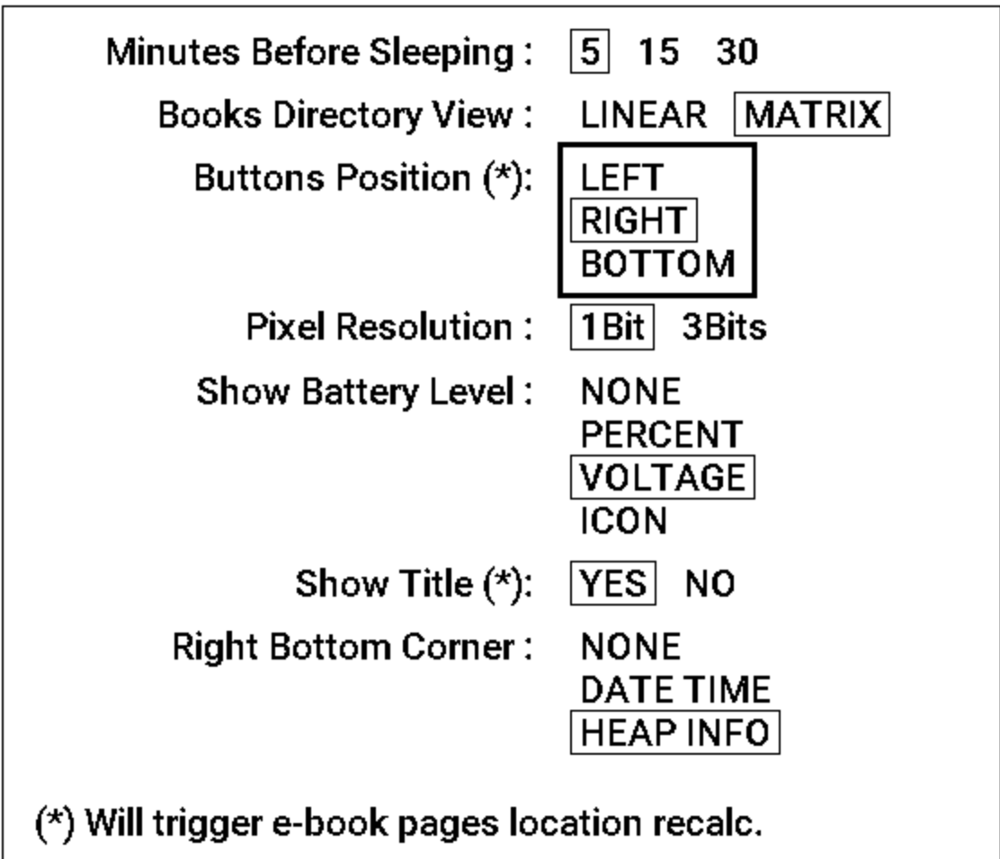
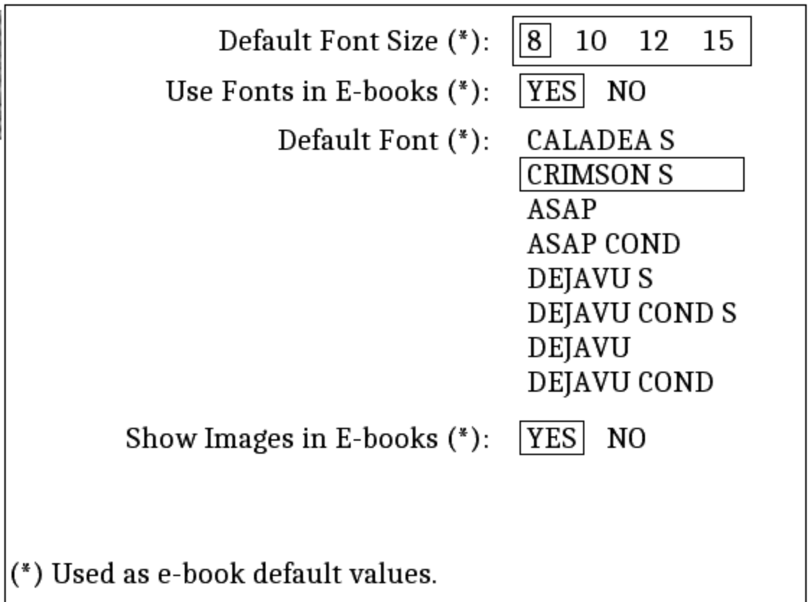
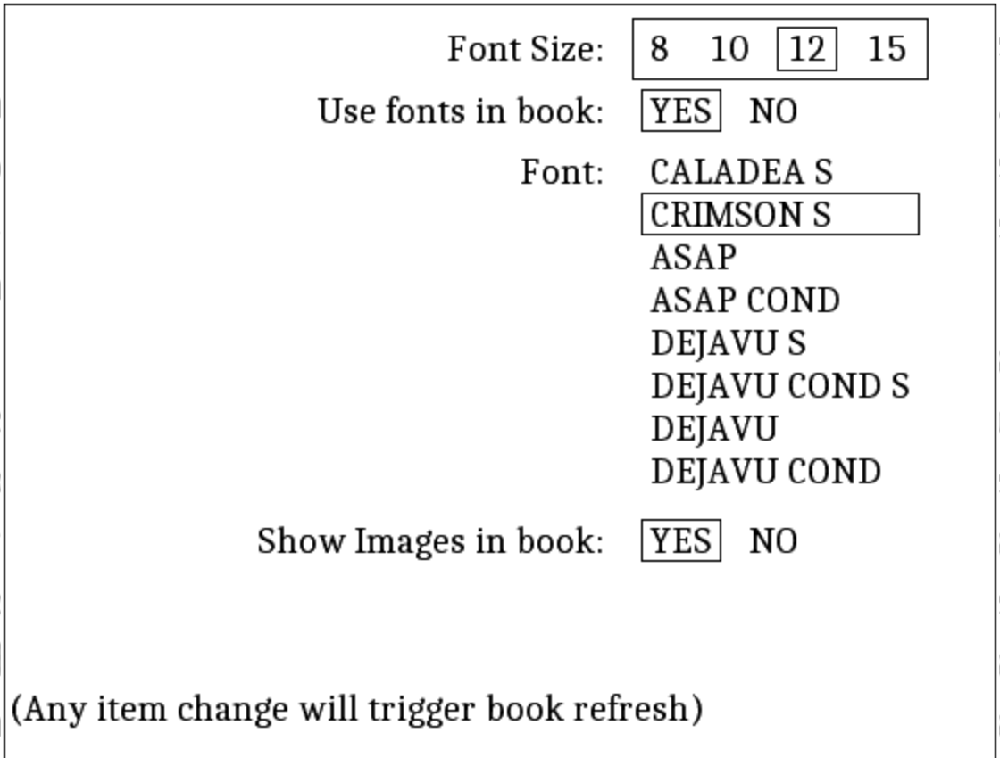

# EPub-InkPlate - User's Guide - Version 2.1.0

The EPub-InkPlate is an EPub books reader application built specifically for the InkPlate ESP32 based devices.

For the installation process, please consult the `INSTALL.pdf` document.

Here are the main characteristics of the application:

- TTF and OTF embedded fonts support
- Bitmap fonts support in a specific IBMF font format
- Normal, Bold, Italic, Bold+Italic face types
- Bitmap images dithering display (JPEG, PNG)
- EPub (V2, V3) book format subset
- UTF-8 characters
- InkPlate tactile keys to interact with the device (single and double `click` to get six buttons)
- Screen orientation (buttons located to the left, right, down positions from the screen)
- Linear and Matrix view of books directory
- Up to 200 books are allowed in the directory
- Left, center, right, and justify text alignments
- Indentation
- Some basic parameters and options
- Limited CSS formatting
- WiFi-based documents download
- Battery state and power management (light, deep sleep, battery level display)
- Real-Time clock (Inkplate-10 and Inkplate-6PLUS only)

## 1. Application startup

When the device turns ON, the application executes the following tasks:

- Loads configuration information from the `config.txt` file located in the main SD-Card folder. 
- Loads fonts definition as defined in the `fonts_list.xml` file located in the main SD-Card folder. Fonts must be located in the `fonts` folder on the SD-Card.
- Verifies the presence of books on the SD-Card, and updates its database if required. The books must be located in the `books` folder on the SD-Card, be in the EPub V2 or V3 format, and have a filename ending with the `.epub` extension in lowercase.
- Presents the list of books to the user, ready to let the user selects a book to read. If a book was being read before, it will be presented to the location where the user was reading the last time.

## 2. Interacting with the application

InkPlate devices possess three tactical keys that are used to interact with the application. On the device, they are labeled 1, 2, and 3. The application allows for the selection of the screen orientation in the parameters form. Depending on the screen orientation, the function associated with the keys will change as follow:

- When the keys are on the **Bottom** side of the screen:

  - Key 1 is the **SELECT** function
  - Key 2 is the **PREVIOUS** function
  - Key 3 is the **NEXT** function

- When the keys are on the **Left** side of the screen:

  - Key 3 is the **SELECT** function
  - Key 1 is the **PREVIOUS** function
  - Key 2 is the **NEXT** function

- When the keys are on the **Right** side of the screen:

  - Key 1 is the **SELECT** function
  - Key 3 is the **PREVIOUS** function
  - Key 2 is the **NEXT** function

All keys are associated with a second function when the user double-click on them. They are **DOUBLE-SELECT**, **DOUBLE-NEXT**, and **DOUBLE-PREVIOUS**.

In the following text, the functions are called buttons.

The application is having two main display modes:

- The Books List mode - Presents the list of books available on the SD-Card, showing for each book a small title page caption, the title, and the author of the book.
- The Book Reader mode - Presents a book content, one page at a time for reading.

Each display mode is also supplying a list of specific functions that can be selected by the user. They are presented in the following sub-sections after the description of the display mode.

### 2.1 The Books List mode

The list presents all books available to the user for reading. Two views are offered: a *linear view* and a *matrix view*:

- The Linear view will show books as a vertical list, showing the cover page on the left and the title/author on the right. 
- The Matrix view will show covers arranged in a matrix with the title/author of the currently selected book at the top of the screen.

The application keeps track of the reading page location of the last 10 books opened by the user. A book will have its title prefixed with `[Reading]` to show this fact in the displayed list. 

The books are presented in the following manner:

- Books being read are presented first in the list.
- The other bools are then presented in title alphabetical order.

The list may require several pages depending on the number of books present on the SD-Card.

{ width=50% }

{ width=50% }

Use the **NEXT** and the **PREVIOUS** buttons to highlight the appropriate book that you want to read, then use the **SELECT** button to have the book loaded, presenting the first page of it.

The **DOUBLE-NEXT** and **DOUBLE-PREVIOUS** buttons can be used to move:

- one page at a time in the list for the linear view.
- one column at a time in the list for the matrix view.

The **DOUBLE-SELECT** will open a list of options. These options are presented at the top of the screen with an icon and label shown below the icons. The list is as follow:

{ width=50% }

- { width=15 } **Return to the e-books list** - This will simply get out of the options list, back to the list of books.
- { width=15 } **Return to the last e-book being read** - This will open the last book read by the user, to the last page shown on the screen. 
- { width=15 } **Main parameters** - This will present the main parameters form, allowing the user to modify some elements of the application behavior. Its content is described below.
- { width=15 } **Default e-book parameters** - This will present the default parameters form, allowing the user to modify some elements related to the book's reader. Those parameters constitute default values for books preparation and presentation. Its content is described below.
- { width=15 } **WiFi access to the e-books folder** - This will start the WiFi connection and a Web server, allowing the user to access - through a Web Browser - the list of books on the SD-Card, uploading, downloading, and removing books from there. Once started, pressing one of the keys on the device will stop the server and the WiFi connection, and the device will be restarted. Be aware that as the Web server is running, it is *not* lowering the use of the power (deep sleep and light sleep are disabled).
- { width=15 } **Refresh the e-books list** - This will launch the books database refresher. This operation is usually done automatically at application startup and is not usually required to be used. Be aware that this action will refresh *all* books. Depending on the number of books present in the `books` folder, it could be a long process (it takes between five and ten seconds per book to gather metadata).
- { width=15 } **Clear e-books' read history** - This will erase all information about the books being read (the current location in the books and their appearance at the beginning of the book list). The books themselves are not deleted.
- { width=15 } **Set Date/Time** - This will show a form to allow the modification of the local date and time.
- { width=15 } **Retrieve Date/Time from Time Server** -  This will launch the WiFi connection and retrieve a Time packet from a NTP server. The server can be defined in the `config.txt` file. By default, it will be `pool.ntp.org`. Once retrieved, the Inkplate will be restarted. The user must **TAP** the screen to do so.
- { width=10 } **About the EPub-InkPlate application** - This will show a simple box showing the application version number and the EPub-InkPlate developer name (me!).
- { width=15 } **Power OFF (Deep Sleep)** - This option will put the device in DeepSleep. The device will be restarted by pressing any button.

The **NEXT** and **PREVIOUS** buttons can be used to move the cursor from one option to the other. The **SELECT** button can then be used to select the option and execute its function. The **DOUBLE-SELECT** button will simply get out of the options list, back to the list of books (The same behavior as if the first entry of the options list is selected).

### 2.2 The Book Reader mode

The reader presents the book selected by the user one page at a time. Use the **NEXT** and **PREVIOUS** buttons to go to the next or previous page. The **DOUBLE-NEXT** and **DOUBLE-PREVIOUS** buttons will go 10 pages at a time.

If the user presses the **PREVIOUS** button when the first page of a book is presented, the reader will display the last page of the book. If the **NEXT** button is pressed when the last page of a book is presented, the reader will display the first page of the book.

As for the books list, the **DOUBLE-SELECT** button will open a list of options (the **SELECT** button will do the same). These options are presented at the top of the screen with an icon and label shown below the icons. The list is as follow:

{ width=50% }

- { width=15 } **Return to the e-book reader** - This will simply get out of the options list, back to the page being read in the currently displayed book.
- { width=15 } **Table of Content** - This, if present, will show the book's table of content. The user can move the cursor on one of the entries and press the **SELECT** button. The application will then move in the book to the selected table of content's entry. This option is available only if a table of content structure is available in the EPub file. 
- { width=15 } **E-Books List** - This will get you out of the book reader, returning to the books list.
- { width=15 } **Current e-book parameters** - This will present the parameters form, allowing the user to select specific values related to fonts and pictures usage for the currently displayed book. Those parameters are specific to the currently displayed book and are kept in a `.pars` file on the SD-Card. Its content is similar to the Default parameters form of the books list and is described below.
- { width=15 } **Revert e-book parameters to default values** - This will reset the editable book formatting parameters to default values. 
- { width=15 } **Delete the current e-book** - This will remove the current book from the device. All related files will also be removed. A dialog will be shown asking the user to confirm the deletion of the book. Confirmation must be done using the **SELECT** button. Using another button will cancel the deletion. Once confirmed, the book will be removed and the list of books will then be shown to the user for further selection.
- { width=15 } **WiFi access to the e-books folder** - This will start the WiFi connection and a Web server, allowing the user to access - through a Web Browser - the list of books on the SD-Card, uploading, downloading, and removing books from there. Once started, pressing one of the keys on the device will stop the server and the WiFi connection, and the device will be restarted. Be aware that as the Web server is running, it is *not* lowering the use of the power (deep sleep and light sleep are disabled). 
- { width=10 } **About the EPub-InkPlate application** - This will show a simple message box showing the application version number and the EPub-InkPlate developer name (me!).
- { width=15 } **Power OFF (Deep Sleep)** - This option will put the device in DeepSleep. The device will be restarted by pressing any button. At start time, if the user was reading a book, it will be presented on screen.

The **NEXT** and **PREVIOUS** buttons can be used to move the cursor from one option to the other. The **SELECT** button can then be used to select the option and execute its function. **DOUBLE-SELECT** will simply get out of the options list, back to the list of books (Same behavior as if the first entry of the options list is selected).

### 2.3 The Main Parameters Form

As indicated in section 2.1, the Main Parameters form allows for the modification of some items available to the user that will change some application behavior. Each item is presented with a list of options selectable through the use of the keys.

{ width=50% }

The following items are displayed:

- **Minutes Before Sleeping** - Options: 5, 15 or 30 minutes. This is the timeout period for which the application will wait before entering a Deep Sleep state. Deep Sleep is a means by which battery power usage is minimal. Once sleeping, the device will be rebooted at the press of a key.
- **Books Directory View** - Options: Linear or Matrix. This will select how the list of books will be presented to the user. The Linear view will show books as a vertical list, showing the cover page on the left and the title/author on the right. The Matrix view will show covers arranged in a matrix with the title/author of the currently selected book at the top of the screen.
- **Buttons Position** - Options: LEFT, RIGHT, BOTTOM. This item selects the orientation of the device, such that the keys will be located on the left, the right, or the bottom of the screen. Changing the orientation may trigger refreshing the page's location if passing from BOTTOM to LEFT or RIGHT, or from LEFT or RIGHT to BOTTOM. As the screen geometry is changing (between Portrait and Landscape), this impacts the amount of text that will appear on each page of all books.
- **Pixel Resolution** - Select how many bits are used for each pixel on the screen. 3 bits per pixel allow for the use of antialiasing for fonts but will require a complete screen update on every page change. 1 bit per pixel allows for the use of partial screen update, much faster refresh, but no antialiasing possible: the glyphs are displayed with irregularities.
- **Show Battery Level** - Options: NONE, PERCENT, VOLTAGE, ICON. This item is showing the battery level at the bottom left of the screen and is updated every time the screen is refreshed in the books list and the book reader modes (It is *not* refreshed when the options menus or the parameters form is displayed). PERCENT will show the power percentage (2.5 volts and below is 0%, 3.7 volts and higher is 100%). VOLTAGE will show the battery voltage. The ICON is shown for all options, but NONE.
- **Show Title** - When selected, display the book title at the top portion of pages.
- **Right Bottom Selection** - What to show on the bottom right of the screen. You can choose between nothing, the date/time, or the stack/heap size. When the data/time is selected, it will be shown as `MM/DD - HH:MM` (For example: Mon - 01/24 22:44). When the stack/heap size is selected, three numbers are shown (from left to right): the size of the unused stack space, the size of the largest memory chunk available in the heap, and the total size of the heap available memory. This is mainly used to debug potential issues with memory allocation. The total stack size is 60 Kbytes and the heap size is ~4.3 Mbytes.
   
When the form is presented on the screen, the currently selected option of each item is surrounded by a small rectangle. A bigger rectangle appears around all options of the first item in the form (see Figure 5). It is a thin line rectangle, called the selecting box, that can be moved from an item to the other.

{ width=50% }

To be able to modify an item, you must first move the selecting box from one item to the other using the **NEXT** and **PREVIOUS** buttons. Then, you press the **SELECT** button. The selection box will change as a **bold** rectangle around the options (see Figure 6). You can change the current option with the **NEXT** and **PREVIOUS** button. Pressing the **SELECT** button again will then *freeze* the selection. The selection box will change to thin lines and will go to the next item.

To quit the form, use the **DOUBLE-SELECT** button. The newly selected options will then be saved and applied by the application.

### 2.4 The Default Parameters Form

As indicated in section 2.1, the Default Parameters form allows for the modification of default values related to fonts and pictures usage. Each item is presented with a list of options selectable through the use of the keys.

{ width=50% }

The following items are displayed:

- **Default Font Size** - Options: 8, 10, 12, 15 points. This item will select the size of the characters to be presented on the screen, in points (1 point = ~1/72 of an inch). Please note that this will only be effective with reflowable books.
- **Use Fonts in E-books** - If a book contains embedded fonts, this item permits to indicate if those fonts are to be used to present the pages.
- **Default Font** - Height fonts are supplied with the application. This item permits the selection of the font to be used by default. Fonts with a **Cond** suffix are *Condensed* fonts. Fonts with a **S** suffix are *Serif* fonts. Font names prefixed with *TeX* are bitmap fonts produced using the TeX MetaFont toolkit and are tailored for the specific screen resolution.
- **Show Images in E-books** - This item allows for the display or not of images present in books. This can be used to diminish the amount of memory required and the speed of rendition. 

These are default values. They will be used for parameters that have not be modified for a book.

### 2.5 The Current book parameters form

As indicated in section 2.2, the current book parameters form allows for the selection of specific values related to fonts and pictures usage for the currently displayed book. Those parameters are specific to the currently displayed book and are kept in a `.pars` file on the SD-Card. Its content is similar to the Default parameters form of the books list as described in section 2.4.

{ width=50% }

The following items are displayed:

- **Font Size** - Options: 8, 10, 12, 15 points. This item will select the size of the characters to be presented on the screen, in points (1 point = ~1/72 of an inch). Please note that this will only be effective with reflowable books. 
- **Use Fonts in E-books** - If a book contains embedded fonts, this item permits to indicate if those fonts are to be used to present the pages.
- **Font** - Height fonts are supplied with the application. This item permits the selection of the font to be used by default. Fonts with a **Cond** suffix are *Condensed* fonts. Fonts with a **S** suffix are *Serif* fonts. Font names prefixed with *TeX* are bitmap fonts produced using the TeX MetaFont toolkit and are tailored for the specific screen resolution.
- **Show Images in E-books** - This item allows for the display or not of images present in books. This can be used to diminish the amount of memory required and the speed of rendition. 

When displayed, the form shows the current values being used to present the pages of the book. 

Parameters for which no specific value has been chosen by the user will display the default value as specified in the Default Parameters form. If such a default parameter is modified in the `Current E-book Parameters` form, it will then be frozen for this book. If a parameter is not modified from its default value, it will retain the value present in the Default Parameters form. If the user changes the parameter in the Default Parameters form, it will then be applied to the book presentation.
   
## 3. Additional information

### 3.1 The books database

The application maintains a small database that contains minimal meta-data about the books (Title, author, description, small cover picture). This list is computed initially when the application sees for the first time the presence of a book on the SD-Card. This small database is used to present the list of books present on the SD-Card. 

The only limit in terms of the number of books managed by the application is the SD-Card capacity. You can have as many books as possible to put on the SD-Card. Too many books would become difficult for the user to browse in the books list. A few dozen books are manageable. A few hundred books would become difficult to overlook. 

### 3.2 The Pages location computation

A book is presented one page at a time on the screen. The quantity of characters displayed on a page depends on the screen orientation (portrait or landscape), the fonts used, and the characters' size. Parameters in forms described in section 2, selectable by the user, have an impact on the number of pages and their localization in the EPub file. 

When a book is selected for display, the program verifies if it's required to compute the pages' location. This is transparent to the user. If required, a background task is then started to recompute locations and is minimally interfere with the user reading and moving from one page to the other. The page number that is normally shown at the bottom of the screen will only become available at the end of the pages' location computation process. The locations are saved in a file such that the next time the book will be open, the locations will not be required to be computed again if the formatting parameters have not been changed.

There is a big difference in the duration of the location computation between using slow SD-Cards and fast SD-Cards. The author made some tests with cards in hands. With SanDisk Ultra SD-Cards (both 16GB and 32GB), the scan duration with the two supplied books is ~3 minutes each. With a slow SD-Card (very old Sandisk 4GB), it took 8 minutes and 20 seconds.

### 3.3 On the complexity of EPub page formatting

The EPub standard allows for the use of a very large amount of flexible formatting capabilities available with HTML/CSS engines. This is quite a challenge to pack a reasonable amount of interpretation of formatting scripts on a small processor.

I've chosen a *good-enough* approach by which I obtain a reasonable page formatting quality. The aim is to get something that will allow the user to read a book and enjoy it without too much effort. There are cases for which the book content is way too complex to get good results...

One way to circumvent the problems is to use the epub converter provided with the [Calibre](https://calibre-ebook.com/) book management application. This is a tool able to manage a large number of books on computers. There are versions for Windows, macOS, and Linux. *Calibre* supplies a conversion tool (called 'Convert books' on the main toolbar) that, when choosing to *convert EPub to EPub*, will simplify the coding of styling that would be more in line with the interpretation capability of *EPub-InkPlate*. 

The convert tool of *Calibre* can also shrink fonts such that they only contain the glyphs required for the book (When the 'Convert books' tool is launched, the option is located in 'Look & feel' > 'Fonts' > 'Subset all embedded fonts'). I've seen some books having four of five fonts requiring 1.5 megabytes each shrunk to around 1 meg for all fonts by the convert tool (around 200 kilobytes per font). 

For images, to get them reasonably in line with the screen resolution of the InkPlate devices (that is 600x800 for the InkPlate-6), the convert tool can be tailored to do so. Simply select the 'Generic e-ink' output profile from the 'Page setup' options once the convert tool is launched. For example, even at this size, a 600x800 image will take close to 500 kilobytes. 

It appears that the tool may omit to transform some images from the book. Also, the images will remain with RGB pixels instead of grayscale pixels that usually require more time to load. A script named `adjust_size.sh` is supplied with this release that can be used to transform all images in a book to use grayscale and a resolution equal to or lower than 800x600 pixels (if you prefer, you can modify it to use 1200x825 format for InkPlate-10 device). This script is using a tool supplied with the **ImageMagick** package available with Linux or macOS. It can also be loaded under MS Windows with **Cygwin**. 

### 3.4 In case of out of memory situation

The memory required to prepare a book to be displayed may become an issue if there is not enough memory available. The InkPlate devices are limited in memory: around 4.5 megabytes are available. A part of it is dedicated to the screen buffer and the rest of it is mainly used by the application.

As performance is a key factor, fonts are loaded and kept in memory by the application.  If a book is using too many fonts or fonts that are too big (they may contain more glyphs than necessary for the book), it will not be possible to show the document with the original fonts. 

Here are some steps that can be used to minimize the amount of memory that would be required to present the content of books:

- **Convert the book** - As indicated in the previous section, the *Calibre Convert* tool can be used to minimize both fonts and image size.
- **Use 1bit pixels** - The frame buffer used to render pages on screen is using a good chunk of memory: 240 kilobytes for 3bits pixels, 60 kilobytes for 1bit pixels (those numbers are for an Inkplate-6 device). You can select the pixel resolution in the Main Parameters.
- **Desactivate images** - In the Main Parameters, you can request not to show images on the screen.
- **Desactivate book fonts** - In the Font Parameters, you can request not to use fonts supplied with a book.

If an internal problem related to memory allocation is found by the application, a message will appear on the screen and the device will be put in a Deep Sleep state. The message will indicate the reason why the allocation was not successful. This can be used as a hint to use one or more steps indicated above.

### 3.5 Images rendering

Starting with version 1.3.0, the application is using a new *stream-based* approach to render images that are part of a book. This approach optimizes the use of memory to load pictures by using a minimal amount of memory as a picture is retrieved from the ePub file.

JPeg and PNG image types are supported. Only basic formats of both types are recognized. For some books, the rendering of images may not be possible. A script named `adjust_size.sh` and supplied with the application can be used to transform the resolution of the embedded images. It also may transform the images to a format that will be compatible with the application's capabilities. Look in section 3.3 for further details on how to use the script on your computer. 

### 3.6 Moving the SD-Card from an Inkplate model to another

For each book, the application may generate three additional files in the `books/` folder of the SD-Card:

- Pages location offsets (files with extension `.locs`). They are tailored to the screen resolution, selected fonts and formatting parameters.
- Table of Content (files with extension `.toc`). They may also be tailored to the screen resolution and formatting parameters.
- The book's formatting parameters (files with extension `.pars`).

These files are automatically generated when they are not present (or when a formatting parameter will impact the page rendering) in the folder at the time the user opens a book to be read.

Inkplate device models use different eInk screens that have different pixel resolutions. If you ever want to transfer an SD-Card from one model to another, the application normally detects the change of screen resolution and regenerates the page's location when the user opens the book. If you suspect that the pages are not properly displayed, it could be beneficial to erase some files in the SD-Card's `books` folder. The best way to do it is to plug the SD-Card into your computer or laptop and delete all those `.locs` and `.toc` files. The `.pars` files are the same for all Inkplate models.

### 3.7 Internal fonts replacement

Starting with version 1.3.1, the application allows for the replacement of fonts that can be selected by the user through the configuration forms. To do so, a fonts configuration file named `fonts_list.xml` is used to define which font can be selected. This file must be present in the main SD-Card folder. It is loaded at boot time or after deep sleep to initialize the structure of the fonts. 

Two groups of fonts are defined: SYSTEM fonts that are used to display application controls, and USER's fonts that can be selected by the user to display books content.
  
Each font in the USER's group must define normal, bold, italic, and bold-italic filenames. Too large font files may cause bad application behavior: the 4 files combined are limited to 300 Kbytes by the application.
  
The SYSTEM group is tailored to the needs of the EPub-Inkplate software. Changes may impact the way that the application behaves.
  
The font files must reside in the `fonts` folder on the SD-Card. The EPub-Inkplate distribution contains many other fonts that are not used in the `fonts_list.xml` but can be selected by the user by modifying the content of the XML file. Two kinds of fonts are supplied: True Type fonts (with extension `.otf`) vector-based fonts, and bitmap fonts (with extension `.ibmf`). Bitmap fonts have been extracted from the Metafont system of font generation mainly used by the TeX typesetting tools.

As the bitmap fonts have been generated to support the specific resolution of each Inkplate type, their filename reflects this fact with an indication of the *dpi* (dots per inch) for which the fonts have been tailored for. 

The following are the dpi values of each Inkplate type:

- Inkplate-6: 166 dpi
- Inkplate-10: 150 dpi
- Inkplate-6PLUS: 212 dpi

To have a single `fonts_list.xml` file for all Inkplate devices types, the application replaces the string `%DPI%` (in uppercase) presents in filenames with the proper dpi value for the current device type. This allows having the SD-Card moved from one type of Inkplate to the other without changing the configuration information. Read section 3.6 on how to manage books when moving the SD-Card to another Inkplate device type.

IMPORTANT: If you modify the fonts in the USER's group, the page's location computed by the application may become offset due to the change of glyph sizes that may happen in the newly selected fonts. It is then required to delete the files with the extension `.locs` in the books folder. The application will then recompute pages location automatically.

### 3.8 In case of a problem

It is possible that the application behaves in a way that you don't understand. That may happen for a variety of reasons beyond the testing effort made by the author to ensure that the application is working properly.

The first thing to do is to verify if your device is using the last version of the application. This can be done through the **About the EPub-InkPlate application** menu entry. The message will show which version you are using. From time to time, new versions are developed and made available [here](https://github.com/turgu1/EPub-InkPlate/releases). Please consult the Install Manual on how to update your Inkplate device.

If your Inkplate is already using the last available release, one way to try to find what is going wrong is to use a serial port terminal emulator on your computer after the Inkplate device has been connected using a USB cable. When EPub-InkPlate is running, messages are sent to the USB port related to the running firmware. When the application detects something wrong, there is a good chance that a message would be transmitted to the USB serial port indicating what the problem is. 

On both Linux and Mac computers, the author is using **minicom** to access the USB port. The device name is usually `/dev/ttyUSB0` and the baud rate to use is 115200 bps with 8N1 bits/parity.

On a Windows computer, there is a variety of terminal emulators available to select from. The device name is usually `COM3:` and the other parameters must be the same as for Linux.

If you can't resolve the problem by yourself, it is always possible to raise an issue [here](https://github.com/turgu1/EPub-InkPlate/issues). You have to explain the bad behavior of the application and attach any information that can help the author to find what the problem is.

### 3.9 Limitations

The Inkplate devices are based on ESP32-WROVER MPU. This is a very capable chip with a fair amount of processing power and memory. The following are the limitations imposed on the EPub-Inkplate application related to the capabilities available with the device.

- *Maximum number of books:* **200**. The application must keep some information about the books to quickly build and show the directory content.
- *Maximum single book size:* **25 Mbytes**.
- *Font formats:* **TTF, OTF, IBMF**.
- *Maximum memory used for application internal fonts content:* **300 Kbytes**.
- *Maximum memory used for books' fonts content:* **800 Kbytes**. Fonts that are already loaded are kept for rendering. If the output is not appropriate, the user can disable the use of the fonts embedded with the book and use one of the fonts supplied with the application.
- *Maximum nested HTML tags in book content:* **50**. Testing the application, the author never had to deal with books having more than 15 nested tags. This limit is to track potential nested issues that would reset the device (stack overflow).
- *Image format types:* **subset of PNG and JPeg**. GIF and SVG are not supported. The subsets are imposed by libraries used to interpret the image file content. 
