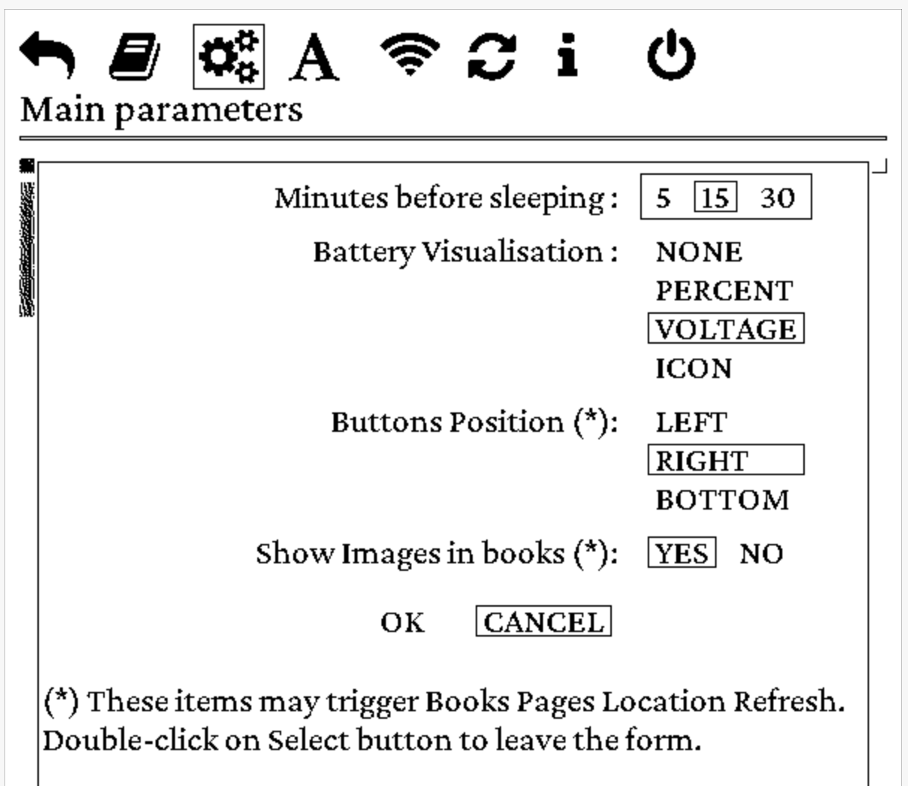
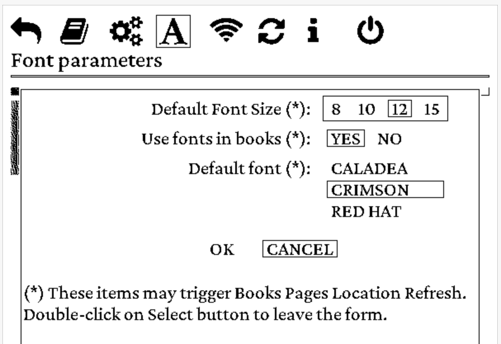

# EPub-InkPlate - User's Guide - Version 1.1.0
**(Draft document)**

The EPub-InkPlate is an EPub books reader application built specifically for the InkPlate ESP32 based devices.

For the installation process, please consult the `INSTALL.pdf` document.

Here are the main characteristics of the application:

- TTF and OTF embedded fonts support
- Normal, Bold, Italic, Bold+Italic face types
- Bitmap images dithering display (JPEG, PNG)
- EPub (V2, V3) book format subset
- UTF-8 characters
- InkPlate tactile keys (single and double click to get six buttons)
- Screen orientation (buttons located to the left, right, down positions from the screen)
- Left, center, right, and justify text alignments
- Indentation
- Some basic parameters and options
- Limited CSS formatting
- WiFi-based documents download
- Battery state and power management (light, deep sleep, battery level display)

## 1. Application startup

When the device is turned ON, the application executes the following tasks:

- Initializes itself, verify the presence of books on the SD-Card, and updates its database if required. The books must be located in the `books` folder, be in the EPub V2 or V3 format and have a filename ending with the `.epub` extension.
- Presents the list of books to the user, ready to let the user selects a book to read.

## 2. Interacting with the application

The InkPlate device possesses three tactical keys that are used to interact with the application. On the device, they are labeled 1, 2, and 3. The application allows for the selection of the screen orientation in the parameters form. Depending on the screen orientation, the function associated with the keys will change as follow:

- When the keys are on the **Bottom** side of the screen:

  - Key 1 is the **SELECT** function
  - Key 2 is the **PREVIOUS** function
  - Key 3 is the **NEXT** function

- When the keys are on the **Left** side of the screen:

  - Key 3 is the **SELECT** function
  - Key 1 is the **PREVIOUS** function
  - Key 2 is the **NEXT** function

- When the keys are on the **Right** side of the screen:

  - Key 1 is the **SELECT** function
  - Key 3 is the **PREVIOUS** function
  - Key 2 is the **NEXT** function

All keys are associated with a second function when the user double-click on them. They are **DOUBLE-CLICK-SELECT**, **DOUBLE-CLICK-NEXT**, and **DOUBLE-CLICK-PREVIOUS**.

In the following text, the functions are called buttons.

The application is having two main display modes:

- E-Books List - Presents the list of books available on the SD-Card, showing for each book a small title page caption, the title, and the author of the book.
- E-Book Reader - Presents a book content, one page at a time for reading.

Each of the display modes is also supplying a list of specific functions that can be selected by the user. They are presented in the following sub-sections after the description of the display mode.

### 2.1 The E-Books List

The list presents all books available to the user for reading. They are presented in alphabetical order and may require several pages depending on the number of books present on the SD-Card.

Use the **NEXT** and the **PREVIOUS** buttons to highlight the appropriate book that you want to read, then use the **SELECT** button to have the book loaded, presenting the first page of it.

The **DOUBLE-CLICK-NEXT** and **DOUBLE-CLICK-PREVIOUS** buttons can be used to move one page at a time in the list.

The **DOUBLE-CLICK-SELECT** will open a list of options. These options are presented at the top of the screen with an icon and label shown below the icons. The list is as follow:

{ width=50% }

- **Return to the books list** - This will simply get out of the options list, back to the list of books.
- **Return to the last book being read** - This will open the last book read by the user, to the last page shown on screen. 
- **Main parameters** - This will present a parameters form, allowing the user to modify some elements of the application behavior. Its content is described below.
- **Font parameters** - This will present a font parameters form, allowing the user to modify some elements related to fonts usage. Its content is described below.
- **WiFi access to the books folder** - This will start the WiFi connexion and a Web server, allowing the user to access - through a Web Browser - the list of books on the SD-Card, uploading, downloading, and removing books from there. Once started, pressing one of the keys on the device will stop the server and the WiFi connexion, and the device will be restarted. Be aware that as the web server is running, it is *not* lowering the use of the power (deep sleep and light sleep are disabled).
- **Refresh the books list** - This will launch the books database refresher. This operation is usually done automatically at application startup and is not usually required to be used. Be aware that this action will refresh *all* books. Depending on the number of books present in the `books` folder, it could be a long process (it takes between one and three minutes per book to recalculate the page locations). It can be used if you suspect that the transition between pages loses lines or words. Also when updating the application with a new version, it could be necessary as page formatting could be different from the preceding version.
- **About the EPub-InkPlate application** - This will show a simple box showing the application version number and the EPub-InkPlate developer name (me!).
- **Power Off (Deep Sleep)** - This option will put the device in DeepSleep. The device will be restarted by pressing any button.

The **NEXT** and **PREVIOUS** buttons can be used to move the cursor from one option to the other. The **SELECT** button can then be used to select the option and execute its function. The **DOUBLE-CLICK-SELECT** button will simply get out of the options list, back to the list of books (Same behavior as if the first entry of the options list is selected).

### 2.2 The E-Book Reader

The reader presents the book selected by the user one page at a time. Use the **NEXT** and **PREVIOUS** buttons to go to the next or previous page. The **DOUBLE-CLICK-NEXT** and **DOUBLE-CLICK-PREVIOUS** buttons will go 10 pages at a time.

If the user presses the **PREVIOUS** button when the first page of a book is presented, the reader will display the last page of the book. If the **NEXT** button is pressed when the last page of a book is presented, the reader will display the first page of the book.

As for the books list, the **DOUBLE-CLICK-SELECT** button will open a list of options. These options are presented at the top of the screen with an icon and label shown below the icons. The list is as follow:

{ width=50% }

- **Return to the book reader** - This will simply get out of the options list, back to the page being read in the currently displayed book.
- **E-Books List** - This will get you out of the book reader, returning to the books list.
- **WiFi access to the books folder** - This will start the WiFi connexion and a Web server, allowing the user to access - through a Web Browser - the list of books on the SD-Card, uploading, downloading, and removing books from there. Once started, pressing one of the keys on the device will stop the server and the WiFi connexion, and the device will be restarted. Be aware that as the web server is running, it is *not* lowering the use of the power (deep sleep and light sleep are disabled). 
- **About the EPub-InkPlate application** - This will show a simple message box showing the application version number and the EPub-InkPlate developer name (me!).
- **Power Off (Deep Sleep)** - This option will put the device in DeepSleep. The device will be restarted by pressing any button.

The **NEXT** and **PREVIOUS** buttons can be used to move the cursor from one option to the other. The **SELECT** button can then be used to select the option and execute its function. **DOUBLE-CLICK-SELECT** will simply get out of the options list, back to the list of books (Same behavior as if the first entry of the options list is selected).

### 2.3 The Main Parameters Form

As indicated in section 2.1, the Main Parameters form allows for the modification of some items available to the user that will change some application behavior. Each item is presented with a list of options selectable through the use of the keys.

{ width=50% }

The following items are displayed:

- **Minutes before sleeping** - Options: 5, 15 or 30 minutes. This is the timeout period for which the application will wait before entering a Deep Sleep state. Deep Sleep is a means by which battery power usage is minimal. Once sleeping, the device will be rebooted at the press of a key.
- **Buttons Position** - Options: LEFT, RIGHT, BOTTOM. This item selects the orientation of the device, such that the keys will be located on the left, the right, or the bottom of the screen. Changing the orientation may trigger refreshing the page's location if passing from BOTTOM to LEFT or RIGHT, or from LEFT or RIGHT to BOTTOM. As the screen geometry is changing (between Portrait and Landscape), this impacts the amount of text that will appear on each page of all books.
- **Show images in books** - This item allow for the display or not of images present in books. This can be used to diminish the amount of memory required. Changing this item will trigger refreshing page's location in all books.
- **Pixel Resolution** - Select how many bits are used for each pixel on the screen. 3 bits per pixel allow for the use of antialiasing for fonts but will require a complete screen update on every page change. 1 bit per pixel allows for the use of partial screen update, much faster refresh, but no antialiasing possible: the glyphs are displayed with irregularities.
- **Battery Visualisation** - Options: NONE, PERCENT, VOLTAGE, ICON. This item is showing the battery level at the bottom left of the screen and is updated every time the screen is refreshed in the books list and the book reader modes (It is *not* refreshed when the options menus or the parameters form is displayed). PERCENT will show the power percentage (2.5 volts and below is 0%, 3.7 volts and higher is 100%). VOLTAGE will show the battery voltage. The ICON is shown for all options, but NONE.
- **OK and CANCEL** - When entering in the parameters form, the CANCEL option is selected. That means that none of the modifications done in the form will be kept. Before leaving the form, it is necessary to select the OK option to get the selected options been saved.

When the form is presented on the screen, the currently selected option of each item is surrounded by a small rectangle. A bigger rectangle appears around all options of the first item in the form (see Figure 3). It is a thin line rectangle, called the selecting box below, that can be moved from an item to the other.

{ width=50% }

To be able to modify an item, you must first move the selecting box from one item to the other using the **NEXT** and **PREVIOUS** buttons. Then, you press the **SELECT** button. The selection box will change as a **bold** rectangle around the options (see Figure 4). You can change the current option with the **NEXT** and **PREVIOUS** button. Pressing the **SELECT** button again will then *freeze* the selection. The selection box will change to thin lines and will go to the next item.

To quit the form, use the **DOUBLE-CLICK-SELECT** button. If the OK options as been selected before using that button, the new selected options will then be saved and applied by the application.

### 2.4 The Font Parameters Form

As indicated in section 2.1, the Font Parameters form allows for the modification of elements related to fonts usage. Each item is presented with a list of options selectable through the use of the keys.

{ width=50% }

The following items are displayed:

- **Default Font Size** - Options: 8, 10, 12, 15 points. This item will select the size of the characters to be presented on the screen, in points (1 point = ~1/72 of an inch). Changing the size of the fonts will trigger refreshing the page's location for all books.
- **Use fonts in books** - If a book contains embeded fonts, this item permits to indicate if those fonts are to be used to present the pages. Changing the use of fonts in books will trigger refreshing the page's location for all books.
- **Default font** - Height fonts are supllied with the application. This item permits the selection of the font to be used by default. Changing the default font will trigger refreshing the page's location for all books. Fonts with a **Cond** suffix are *Condensed* fonts. Fonts with a **S** suffix are *Serif* fonts.

- **OK and CANCEL** - When entering in the parameters form, the CANCEL option is selected. That means that none of the modifications done in the form will be kept. Before leaving the form, it is necessary to select the OK option to get the selected options been saved.
   
## 3. Additional information

### 3.1 The books database

The application maintains a small database that contains minimal meta-data about the books (Title, author, description) and the list of page positions. This list is computed initially when the application sees for the first time the presence of a book on the SD-Card. 

Page positions in the books depend on the screen orientation (portrait or landscape) and the characters' size. Both are selectable by the user in the application parameter form. Changes to these parameters will trigger the scan of the books to recompute the list.

There is a big difference in duration between using slow SD-Cards and fast SD-Cards. The author made some tests with cards in hands. With SanDisk Ultra SD-Cards (both 16GB and 32GB), the scan duration with the two supplied books is ~3 minutes. With a slow SD-Card (very old Sandisk 4GB), it took 8 minutes and 20 seconds.

### 3.2 On the complexity of EPub page formatting

The EPub standard allows for the use of a very large amount of flexible formatting capabilities available with HTML/CSS engines. This is quite a challenge to pack a reasonable amount of interpretation of formatting scripts on a small processor.

I've chosen a *good-enough* approach by which I obtain a reasonable page formatting quality. The aim is to get something that will allow the user to read a book and enjoy it without too much effort. There are cases for which the ebook content is way too complex to get good results...

One way to circumvent the problems is to use the epub converter provided with the [Calibre](https://calibre-ebook.com/) book management application. This is a tool able to manage a large number of books on computers. There are versions for Windows, macOS, and Linux. *Calibre* supplies a conversion tool (called 'Convert books' on the main toolbar) that, when choosing to *convert EPub to EPub*, will simplify the coding of styling that would be more in line with the interpretation capability of *EPub-InkPlate*. 

The convert tool of *Calibre* can also shrink fonts such that they only contain the glyphs required for the book (When the 'Convert books' tool is launched, the option is located in 'Look & feel' > 'Fonts' > 'Subset all embedded fonts'). I've seen some books having four of five fonts requiring 1.5 megabytes each shrunk to around 1 meg for all fonts by the convert tool (around 200 kilobytes per fonts). 

For images, to get them raisonnably in line with the screen resolution of the InkPlate devices (that is 600x800 for the InkPlate-6), the convert tool can be tailored to do so. Simply select the 'Generic e-ink' output profile from the 'Page setup' options once the convert tool is launched. For example, even at this size, a 600x800 image will take close to 500 kilobytes. 

It appears that the tool may omit to transform some images from the book. Also, the images will remain with RGB pixels instead of grayscale pixels that usually require more memory to load. A script named `adjust_size.sh` is supplied with this release that can be used to transform all images in a book to use grayscale and a resolution equal to or lower than 600x800 pixels (if you prefer, you can modify it to use 825x1200 format for InkPlate-10 device). This script is using a tool supplied with the **ImageMagick** package available with Linux or macOS. It can also be loaded under MS Windows with **Cygwin**. 

### 3.3 In case of out of memory situation

The memory required to prepare a book to be displayed may become an issue if there is not enough memory available. The InkPlate devices are limited in memory: around 4.5 megabytes are available. A part of it is dedicated to the screen buffer and the rest of it is mainly used by the application.

As performance is a key factor, fonts are loaded and kept in memory by the application.  If a book is using too many fonts or fonts that are too big (they may contain more glyphs than necessary for the book), it will not be possible to show the document with the original fonts. Images that are integrated into a book may also be taking a lot of memory. For example, a 1600x1200 image requires close to 2 megabytes of memory.

Here are some steps that can be used to minimize the amount of memory that would be required to present the content of books:

- **Convert the book** - As indicated in the previous section, the *Calibre Convert* tool can be used to minimize both fonts and image size.
- **Use 1bit pixels** - The frame buffer used to render pages on screen is using a good chunk of memory: 240 kilobytes for 3bits pixels, 60 kilobytes for 1bit pixels (those numbers are for an Inkplate-6 device). You can select the pixel resolution in the Main Parameters.
- **Desactivate images** - In the Main Parameters, you can request not to show images on the screen.
- **Desactivate book fonts** - In the Font Parameters, you can request not to use fonts supplied with a book.

If an internal problem related to memory allocation is found by the application, a message will appear on the screen and the device will be put in a Deep Sleep state. The message will indicate the reason why the allocation was not successful. This can be used as a hint to use one or more steps indicated above.