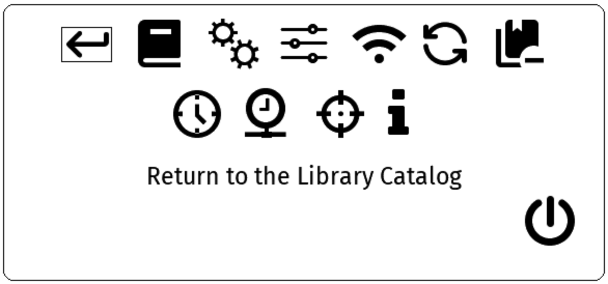
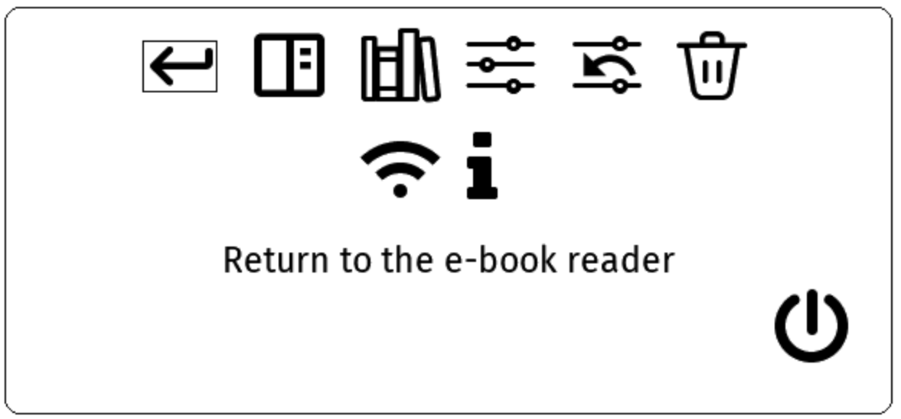
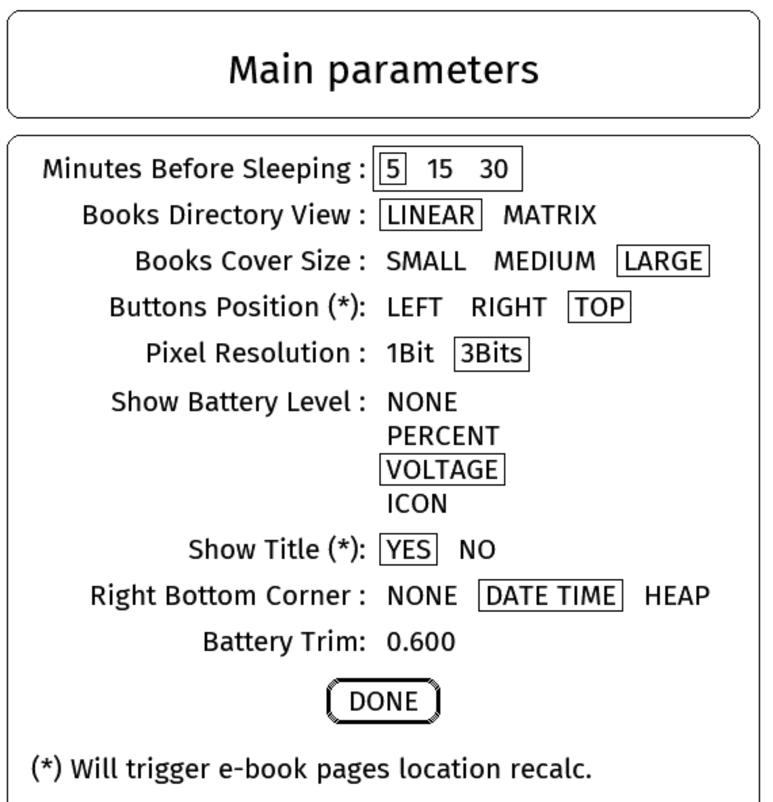
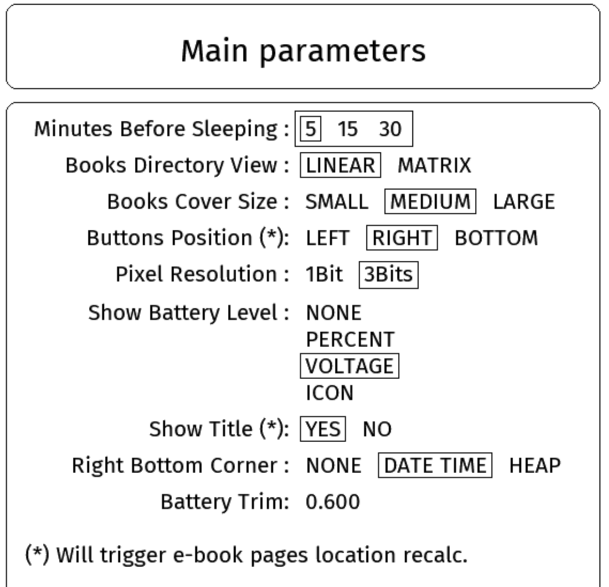
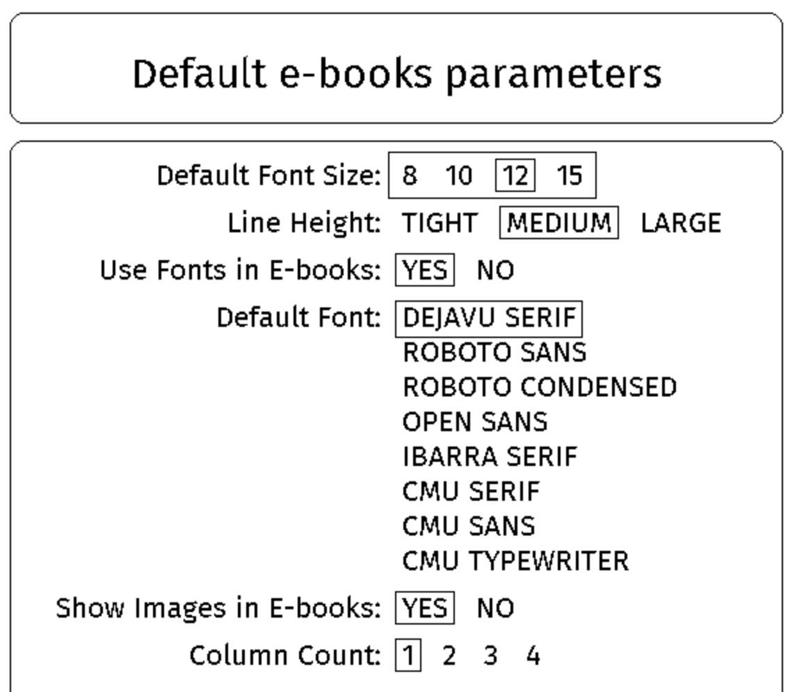
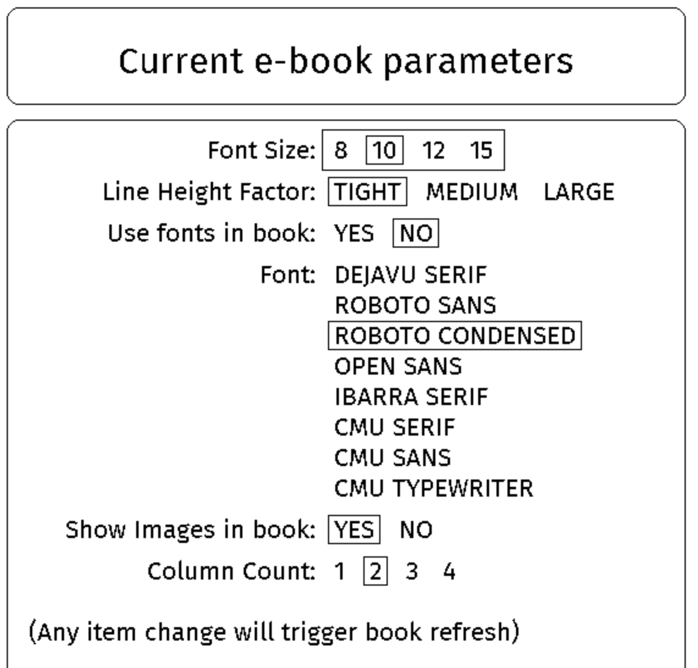

# EPub-InkPlate - User's Guide - Version 3.0.0

### EPub-InkPlate: An EPub Reader for InkPlate Devices

This manual provides a comprehensive operational overview, configuration guide, and troubleshooting framework for **EPub-InkPlate**, a dedicated e-reader application engineered specifically for low-power, ESP32-WROVER-based InkPlate e-paper devices. The document details how the software balances the strict hardware constraints of microcontrollers (featuring a 4.5 MB total RAM budget) with advanced rendering capabilities to deliver a polished, distraction-free typography layout.

### Key Architectural and Operational Components Covered:

* **System Capabilities:** Full support for standard TrueType (`.ttf`) and OpenType (`.otf`) fonts, dynamic 1-to-4 column page rendering, baseline image decoding across five major formats (JPEG, PNG, GIF, SVG, BMP), and granular power-saving state management (light and deep sleep tracking).
* **Hardware Interactivity Mapping:** A complete navigation matrix tracking how the software's functional commands (**HOME**, **SELECT**, **NEXT**, **PREVIOUS**) adapt across diverse InkPlate hardware interfaces, including the original e-Radionica tactile buttons, touchscreen gesture layers, 6-key physical extension boards, and external Bluetooth Low Energy (BLE) mini-keypads.
* **Interface Mechanics:** Step-by-step guidance on navigating the dual-mode ecosystem, which switches between a Library Catalog (supporting Linear or Grid/Matrix views with active reading history tracking) and the active Book Reader mode. 
* **Global and Local Parameterization:** Instruction on using the Main, Default, and Current Book Parameter forms, highlighting the application's configuration inheritance structure where individual books can maintain custom formatting overrides or dynamically track global typography layouts.
* **Optimization and Maintenance Protocols:** Actionable asset management workflows using open-source tools like **Calibre** and the bundled `adjust_size.sh` script to subset memory-heavy embedded fonts and downscale artwork to true grayscale for faster e-paper refreshes. 
* **Troubleshooting and System Limits:** Clear operational constraints—such as a 200-book directory ceiling, an 800 KB e-book font allocation budget, and a 50-level HTML tag nesting threshold to prevent stack overflows—alongside emergency touchscreen calibration bypasses and real-time USB serial debugging procedures using standard `8N1` terminal configurations.

For detailed installation instructions, please refer to the `INSTALL.pdf` document.

#### Key Features & Technical Specifications

* **Advanced Typography:** Full support for embedded TTF and OTF fonts with normal, bold, italic, and bold-italic styles. Features built-in kerning, ligatures, and hyphenation for an optimal reading experience.
* **Hyphenator:** Based on the Knuth-Liang algorithm. The following 16 languages are supported: Albanian, Croatian, Czech, Danish, Dutch, English, French, German, Icelandic, Italian, Polish, Portuguese, Slovak, Slovenian, Spanish, and Turkish.
* **Flexible Page Layouts:** Supports dynamic multi-column page rendering (from 1 to 4 columns) alongside left, centered, right, and fully justified text alignments with paragraph indentation.
* **Image Rendering:** Displays dithered bitmap images across multiple formats, including JPEG, PNG, GIF, SVG, and BMP.
* **Format Compatibility:** Reads a subset of the EPub (V2 and V3) book format and supports complete UTF-8 character encoding.
* **Dynamic Screen Orientation:** Configurable screen rotation optimized for left, right, or bottom physical button layouts.
* **Library Management:** Organizes a directory of up to 200 books with choices between a linear or matrix layout, three user-selectable book cover sizes, and three adjustable line-height settings.
* **Connectivity & Downloads:** Features built-in Wi-Fi for wireless document downloads and Bluetooth support for a BLE mini keypad to enable remote interaction.
* **Power & Time Management:** Includes a real-time clock (available on all devices except the Inkplate-6) alongside advanced power management, tracking battery levels, light sleep, and deep sleep modes.
* **Layout Styling:** Offers customizable basic parameters, option menus, and support for limited CSS formatting.

## 1. Input Capabilities

The application supports four hardware input configurations to accommodate different device models:

* **Original InkPlate 6 and 10:** Manufactured by e-Radionica, these devices feature three tactile hardware buttons. The application registers both single and double presses on these keys to provide six distinct input commands. These models can also be expanded using an add-on physical extension board that uses 6 mechanical keys. All elements to produce the extension board and a new case are available:
  
  * For the Inkplate 6: https://github.com/turgu1/InkPlate-6-Extended-Case
  * For the Inkplate 10: https://github.com/turgu1/InkPlate-10-Extended-Case

* **Inkplate 6PLUS, 6PLUSV2, and 6FLICK:** These models utilize a touchscreen interface for gesture-based navigation and control. They also include a dedicated hardware wake-up key to resume operation from sleep mode.
* **Inkplate 5V2, 6V2, and 10V2:** These devices lack built-in physical navigation buttons or touchscreen capabilities, relying solely on a hardware wake-up key. They require a connected Bluetooth BLE mini-keypad for full user interaction.

The following table summarizes the available hardware input configurations:

| Input Method | Supported Devices |
| :--- | :--- |
| **Tactile Buttons** | Inkplate 6, 10 |
| **Add-On Extension** | Inkplate 6, 10 |
| **Touchscreen Interface** | Inkplate 6PLUS, 6PLUSV2, 6FLICK |
| **Bluetooth Mini-Keypad** | Inkplate 5V2, 6V2, 10V2 |

Various application distributions are supplied to support each of the input configuration variants:

|Inkplate device|Input Configuration|Release filename|
|:-------------:|:--:|----------------|
|6|Tactile Buttons|release-v3.0.0-inkplate_6.zip|
|6|Extension Board|release-v3.0.0-inkplate_6_ext.zip|
|10|Tactile Buttons|release-v3.0.0-inkplate_10.zip|
|10|Extension Board|release-v3.0.0-inkplate_10_ext.zip|
|6PLUS|Touchscreen|release-v3.0.0-inkplate_6plus.zip|
|6PLUS V2|Touchscreen|release-v3.0.0-inkplate_6plusv2.zip|
|6FLICK|Touchscreen|release-v3.0.0-inkplate_6flick.zip|
|5 V2|BLE Mini Keypad|release-v3.0.0-inkplate_5v2.zip|
|6 V2|BLE Mini Keypad|release-v3.0.0-inkplate_6v2.zip|
|10 V2|BLE Mini Keypad|release-v3.0.0-inkplate_10v2.zip|

### Core Functions and Gestures

This manual uses standardized action names to describe how physical inputs map to software functions. Please note that certain features may be unavailable on specific models due to hardware limitations. Additionally, some inputs change contextually depending on the active screen or menu.

#### Button-Mapped Actions

* **HOME**
* **SELECT**
* **NEXT**
* **PREVIOUS**
* **NEXT-2** / **DOWN**
* **PREVIOUS-2** / **UP**
* **UP**
* **DOWN**

#### Touchscreen Gestures (6PLUS, 6PLUSV2, and 6FLICK only)

* **TAP**
* **TOUCH-AND-HOLD**
* **SWIPE-LEFT**
* **SWIPE-RIGHT**
* **PINCH-IN**
* **PINCH-OUT**

*(Note: For clarity, functional action names and touch gestures may occasionally be referred to as "buttons" throughout the remaining text.)*

The following sub-sections describe each configuration and its respective mapping layout in greater detail:

### 1.1 Tactile Buttons

The InkPlate 6 and 10 devices feature three hardware tactile keys, labeled 1, 2, and 3, to interact with the application. Screen orientation can be adjusted in the settings menu. Because the physical positions of the keys rotate with the screen, their functional mappings adjust automatically based on the chosen layout:

#### Keys at the Bottom

* **Key 1:** **SELECT** (Single-click) / **HOME** (Double-click)
* **Key 2:** **PREVIOUS** (Single-click) / **PREVIOUS-2** / **UP** (Double-click)
* **Key 3:** **NEXT** (Single-click) / **NEXT-2** / **DOWN** (Double-click)

#### Keys on the Left

* **Key 3:** **SELECT** (Single-click) / **HOME** (Double-click)
* **Key 1:** **PREVIOUS** (Single-click) / **PREVIOUS-2** / **UP** (Double-click)
* **Key 2:** **NEXT** (Single-click) / **NEXT-2** / **DOWN** (Double-click)

#### Keys on the Right

* **Key 1:** **SELECT** (Single-click) / **HOME** (Double-click)
* **Key 3:** **PREVIOUS** (Single-click) / **PREVIOUS-2** / **UP** (Double-click)
* **Key 2:** **NEXT** (Single-click) / **NEXT-2** / **DOWN** (Double-click)

### 1.2 Touchscreen Interface

The Inkplate 6PLUS, 6PLUSV2, and 6FLICK devices utilize a capacitive touchscreen for intuitive, gesture-based navigation. The application supports the following interactions:

* **TAP** { width=4% }
  Briefly touch the screen surface with a single fingertip. This action is used to select menu items, open links, or confirm selections.
* **TOUCH-AND-HOLD** { width=5% }
  Press and hold your fingertip on the screen for an extended duration. Use this gesture to view context-specific descriptive text in menus or to display the author and title information of a book in the matrix catalog view.
* **SWIPE-LEFT / SWIPE-RIGHT** { width=9% }
  Slide your fingertip horizontally across the screen. Swipe left or right to turn pages while reading a book or to browse through the book directory.
* **PINCH-IN / PINCH-OUT** { width=11% }
  Touch the screen with two fingers and move them closer together or further apart. This gesture dynamically decreases or increases the screen backlight brightness.

### 1.3 BLE Mini Keypad

The application supports two optional Bluetooth Low Energy (BLE) mini-keypad featuring six physical buttons. They are currently the only supported BLE accessories and can be purchased on AliExpress:

* **Beauty-R1**: https://www.aliexpress.com/item/1005007944515439.html
* **J06 Pro**: https://www.aliexpress.com/item/1005011855666831.html

\begin{center}
Bluetooth BLE Keypads
\end{center}
| Beauty-R1 | J06 Pro |
|:-----------:|:-----------:|
|{ width=40% }|{ width=40% }|

The six physical keys map to the following software functions:

* **Center Button:** **SELECT**
* **Left Arrow:** **PREVIOUS**
* **Right Arrow:** **NEXT**
* **Up Arrow:** **PREVIOUS-2** / **UP**
* **Down Arrow:** **NEXT-2** / **DOWN**
* For the Beauty-R1 - **Bottom Button:** **HOME**
* For the J06 Pro - **Bottom Right Button:** **HOME**

For the **Beauty-R1**:

* On the right, the switch is for power ON/OFF.

For the **J06 Pro**:

* The bottom left button is for power ON/OFF. Keep the button pressed for 3 seconds for the action to occur.
* On the left there is a switch that permits to select the protocol to use. It **must** be put to the **DOWN** position (Photo Mode).

#### Connection and Troubleshooting

The application automatically handles pairing when the keypad is powered on. A small Bluetooth icon will appear at the bottom of the Inkplate screen, just to the left of the battery level indicator, to confirm a successful connection.

{ width=5% }

If the keypad fails to connect or the Bluetooth icon does not appear, try the following troubleshooting steps:

* Ensure the keypad power switch is turned **ON**.
* Press any button on the keypad to re-trigger the automated connection protocol.
* Verify the battery status; the integrated blue LED will not light up upon keypresses if the battery is depleted.

*Note: The blue LED on the keypad will flash repeatedly if it loses connection with the Inkplate. This occurs when the Inkplate enters sleep mode or if the device is moved out of Bluetooth range.*

### 1.4 Extension Board

The physical expansion board provides six standalone mechanical buttons for application control. Because the physical positions of the keys rotate with the display, their functional mappings adjust automatically based on your chosen screen orientation:

#### Keys at the Bottom (Indexed Left to Right)

* **Button 1:** **HOME**
* **Button 2:** **PREVIOUS**
* **Button 3:** **PREVIOUS-2** / **UP**
* **Button 4:** **NEXT-2** / **DOWN**
* **Button 5:** **NEXT**
* **Button 6:** **SELECT**

#### Keys on the Left (Indexed Top to Bottom)

* **Button 1:** **SELECT**
* **Button 2:** **PREVIOUS-2** / **UP**
* **Button 3:** **PREVIOUS**
* **Button 4:** **NEXT**
* **Button 5:** **NEXT-2** / **DOWN**
* **Button 6:** **HOME**

#### Keys on the Right (Indexed Top to Bottom)

* **Button 1:** **SELECT**
* **Button 2:** **PREVIOUS-2** / **UP**
* **Button 3:** **PREVIOUS**
* **Button 4:** **NEXT**
* **Button 5:** **NEXT-2** / **DOWN**
* **Button 6:** **HOME**

## 2. Application Startup

Upon powering on the device, the application automatically executes the following startup sequence:

* **Configuration Loading:** Retrieves system settings and preferences from the `config.txt` file located in the root directory of the SD card.
* **Font Initialization:** Loads typography rules defined in the `fonts_list.xml` file (located in the root directory). All corresponding font files must reside within the `fonts/` folder on the SD card.
* **Library Cataloging:** Scans the `books/` folder on the SD card to verify the available file catalog and dynamically update the internal database. To be recognized, books must use the EPub (V2 or V3) format and feature a lowercase `.epub` file extension.
* **Interface Launch:** Displays the library directory to the user. If a book was actively being read during the previous session, the application bypasses the directory and reopens that book directly to the last-read page.

## 3. Interacting with the Application

The application features two primary display modes:

* **Book List Mode:** Displays the catalog of books available on the SD card, complete with cover thumbnails, titles, and authors.
* **Book Reader Mode:** Displays the content of a selected book, formatted one page at a time.

Each mode provides a specific set of interactive functions, which are detailed in the sub-sections below.

### 3.1 Book List Mode

The library interface organizes all available books into two user-selectable layouts: a *linear view* and a *matrix view*.

* **Linear View:** Displays books in a vertical list format, featuring the cover thumbnail on the left and the title and author on the right.
* **Matrix View:** Displays book covers arranged in a grid. The title and author of the currently highlighted book are displayed at the top of the screen.

The application automatically tracks the exact reading progress for the 10 most recently opened books. To easily identify these active titles in the list, their names are prefixed with a **[Reading]** tag. 

Books are sorted and displayed using the following hierarchy:

1. Active books currently being read are pinned to the top of the list.
2. All remaining books are sorted alphabetically by title.

The total number of catalog pages varies depending on how many books are stored on the SD card and the cover thumbnail size chosen in the Main Parameters Form (see Section 3.5).

\begin{center}
Books List Display Modes
\end{center}
| Linear View | Matrix View |
|:-----------:|:-----------:|
|{ width=90% }|{ width=90% }|

#### Touchscreen Navigation (6PLUS, 6PLUSV2, and 6FLICK)

* **Open a Book:** **TAP** directly on a book cover to load it.
* **Browse Pages:** **SWIPE-LEFT** or **SWIPE-RIGHT** to flip through pages of the library catalog.
* **View Metadata:** **TOUCH-AND-HOLD** a book cover to display its title and author at the top of the screen.
* **Open Menu:** **TAP** anywhere on an empty area of the screen to open the main application menu.

#### Button-Based Navigation (All Other Devices)

* **Highlight a Book:** Use the **NEXT** and **PREVIOUS** buttons to navigate through the titles on the current page.
* **Open a Book:** Press the **SELECT** button while a book is highlighted to load it.
* **Browse Pages:** Use the **NEXT-2** and **PREVIOUS-2** buttons to jump to the next or previous page of the library catalog.
* **Open Menu:** Press the **HOME** button to access the main application menu.

### 3.2 The Main Application Menu

The main application menu is displayed at the top of the screen. Each option is represented by an icon, with its corresponding descriptive label displayed directly below the menu bar. 

{ width=50% }

* { width=15 } **Return to the e-books list** – Closes the options menu and returns to the library catalog.
* { width=15 } **Return to the last e-book being read** – Reopens the most recently read book at the last viewed page.
* { width=15 } **Main parameters** – Opens the Main Parameters form to customize application behavior and system settings (detailed below).
* { width=15 } **Default e-book parameters** – Opens the Default Parameters form to configure default font and image settings for book rendering (detailed below).
* { width=15 } **WiFi access to the e-books folder** – Connects to Wi-Fi and launches a local web server, enabling you to manage books on the SD card (upload, download, or delete) via a standard web browser. Pressing any key stops the server, closes the Wi-Fi connection, and reboots the device. *Note: Power-saving modes (light and deep sleep) are disabled while the web server is running.*
* { width=15 } **Refresh the e-books list** – Manually reindexes the books database. This process runs automatically at startup and is rarely required manually. *Note: This action re-scans every book, which can take 5 to 10 seconds per file.*
* { width=15 } **Clear e-books' read history** – Erases all tracking data, including current page progress and priority placement at the top of the library list. This action does not delete the book files.
* { width=15 } **Set Date/Time** – Opens a manual configuration form to set the local system date and time.
* { width=15 } **Retrieve Date/Time from Time Server** – Connects to Wi-Fi to sync the system clock with a Network Time Protocol (NTP) server. The server address can be customized in `config.txt` (defaults to `pool.ntp.org`). Press any button after synchronization to restart the device.
* { width=15 } **Touch Screen Calibration** *(Touchscreen models only)* – Launches the display alignment utility. Each crosshair must be pressed exactly once to sync touch input with the screen coordinates (see Section 3.2.1 for critical details).
* { width=10 } **About the EPub-InkPlate application** – Displays system information, including the application version and developer credits.
* { width=15 } **Power OFF (Deep Sleep)** – Suspends the device into a low-power Deep Sleep mode. Press any button to wake and reboot.

#### Touchscreen Navigation (6PLUS, 6PLUSV2, and 6FLICK)

* **Execute an Option:** **TAP** an icon to launch its function.
* **View Descriptions:** **TOUCH-AND-HOLD** an icon to display its label in the text box below.
* **Exit Menu:** **TAP** anywhere outside the menu boundaries to return to the library list (equivalent to selecting the first icon).

#### Button-Based Navigation (All Other Devices)

* **Navigate Options:** Use the **NEXT** and **PREVIOUS** buttons to cycle through the menu items.
* **Execute an Option:** Press **SELECT** to confirm and run the highlighted function.
* **Exit Menu:** Press **HOME** to dismiss the menu and return to the library list (equivalent to selecting the first icon).

#### 3.2.1 Touchscreen Calibration

The calibration tool aligns the capacitive touch layer with the underlying visual display. While factory calibration is sufficient for most units, manual adjustment is recommended if tapping a menu option consistently registers on adjacent items instead.

When running this utility, touch the center of each crosshair as accurately as possible. Careless or inaccurate inputs will degrade alignment, making forms and menus difficult or impossible to navigate.

If the resulting alignment is poor, immediately launch and run the calibration utility again while the interface remains accessible.

##### Emergency Reset via SD Card

If an inaccurate calibration has rendered the touchscreen completely unresponsive, you can manually reset the coordinates:

1. Remove the SD card and insert it into a computer.
2. Open the `config.txt` file located in the root directory.
3. Locate and delete the following lines:
   
   * `calib_a`
   * `calib_b`
   * `calib_c`
   * `calib_d`
   * `calib_e`
   * `calib_f`
   * `calib_divider`
  
4. Save the file, reinsert the SD card, and power on the Inkplate. 

The device will reboot using default hardware touch coordinates, restoring menu accessibility so you can attempt calibration again.

### 3.3 Book Reader Mode

The reader interface presents the content of your selected book one page at a time. 

#### Touchscreen Navigation (6PLUS, 6PLUSV2, and 6FLICK)

The screen is divided into three invisible, vertical zones: left, center, and right.

* **Next Page:** **TAP** the right zone or perform a **SWIPE-LEFT** gesture.
* **Previous Page:** **TAP** the left zone or perform a **SWIPE-RIGHT** gesture.
* **Open Context Menu:** **TAP** the center zone to access the book action menu.

#### Button-Based Navigation (All Other Devices)

* **Next Page:** Press the **NEXT** or **SELECT** button.
* **Previous Page:** Press the **PREVIOUS** button.
* **Skip 10 Pages:** Press the **NEXT-2** (forward 10 pages) or **PREVIOUS-2** (backward 10 pages) button.
* **Open Context Menu:** Press the **HOME** button to access the book action menu.

### 3.4 Book Context Menu

The action menu is displayed at the top of the screen. Each function is represented by an icon, with its corresponding descriptive label displayed directly below the menu bar.

{ width=50% }

* { width=15 } **Return to the e-book reader** – Closes the menu and returns to the active page of the current book.
* { width=15 } **Table of Contents** – Displays the book's internal navigation index. Scroll to an entry and press **SELECT** to jump directly to that section. *Note: This option is only available if the EPub file contains a valid table of contents structure.*
* { width=15 } **E-Books List** – Exits the active book and returns to the main library catalog.
* { width=15 } **Current e-book parameters** – Opens a custom configuration form to adjust font and image rendering settings exclusively for this book. These preferences are saved in a localized `.pars` file on the SD card.
* { width=15 } **Revert e-book parameters to default values** – Clears book-specific settings and restores formatting parameters to global application defaults.
* { width=15 } **Delete the current e-book** – Completely removes the active book and its companion data files from the SD card. A confirmation dialog will prompt you to verify the action; press **SELECT** to confirm or any other button to cancel.
* { width=15 } **WiFi access to the e-books folder** – Connects to Wi-Fi and launches a local web server, enabling you to manage books on the SD card (upload, download, or delete) via a standard web browser. Pressing any key stops the server, closes the Wi-Fi connection, and reboots the device. *Note: Power-saving modes (light and deep sleep) are disabled while the web server is running.*
* { width=10 } **About the EPub-InkPlate application** – Displays system information, including the application version and developer credits.
* { width=15 } **Power OFF (Deep Sleep)** – Suspends the device into a low-power Deep Sleep mode. Press any button to wake and reboot.

#### Menu Navigation on Touchscreen Devices

* **Execute an Option:** **TAP** an icon to launch its function.
* **View Descriptions:** **TOUCH-AND-HOLD** an icon to display its label in the text box below.

#### Menu Navigation on Button-Based Devices

* **Navigate Options:** Use the **NEXT** and **PREVIOUS** buttons to cycle through the menu items.
* **Execute an Option:** Press **SELECT** to confirm and run the highlighted function.
* **Exit Menu:** Press **HOME** to dismiss the menu and return to the reading view.

\newpage

### 3.5 The Main Parameters Form

The Main Parameters form allows you to adjust settings that dictate the core behavior of the application. Each configuration item presents a list of selectable, mutually exclusive options.

\begin{center}
The Main Parameters Form
\end{center}
| For Touchscreen Devices | For Button-base Devices |
|:-----------------------:|:-----------------------:|
|{ width=100% }|{ width=100% }|

The form displays the following items:

* **Minutes Before Sleeping** – Options: `5`, `15`, or `30` minutes. Defines the idle timeout period before the device enters Deep Sleep to minimize battery consumption. Once in sleep mode, pressing any physical button will wake and reboot the device.
* **Books Directory View** – Options: `Linear` or `Matrix`. Toggles the layout style of the library catalog. Linear view displays a vertical list with the cover on the left and metadata on the right. Matrix view arranges covers in a grid and displays the highlighted book's metadata at the top of the screen.
* **Books Cover Size** – Options: `SMALL`, `MEDIUM`, or `LARGE`. Sets the resolution of the book covers in the library view. The dimensions correspond to `70x90`, `140x180`, and `180x240` pixels, respectively.
* **Buttons Position** – Options: `LEFT`, `RIGHT`, or `BOTTOM`. Configures the physical orientation of the device. Switching between `BOTTOM` and `LEFT`/`RIGHT` alternates the display between landscape and portrait formats. *Note: Changing orientation alters page layouts and will trigger a background recalculation of page positions for all books.*
* **Pixel Resolution** – Configures the bit-depth per pixel. `3 bits per pixel` enables anti-aliasing for smooth typography but requires a full, slower screen refresh on every page turn. `1 bit per pixel` allows rapid partial screen updates but disables anti-aliasing, resulting in jagged font edges.
* **Show Battery Level** – Options: `NONE`, `PERCENT`, `VOLTAGE`, or `ICON`. Displays the battery charge status at the bottom-left of the screen. This value updates during standard screen refreshes in the catalog and reader views, but remains static while menus or forms are open. `PERCENT` tracks the charge relative to voltage thresholds (2.5V = 0%, 3.7V and above = 100%). `VOLTAGE` shows the raw battery reading (a standard 3.7V rechargeable battery can peak near 4.2V when fully charged). The battery icon accompanies all choices except `NONE`.
* **Show Title** – When enabled, displays the active book's title at the top of every page in reader mode.
* **Right Bottom Selection** – Configures the metadata displayed at the bottom-right of the screen. Options include: `Nothing`, `Date/Time`, or `Memory Status`. `Date/Time` formatting displays as `Day - MM/DD HH:MM` (e.g., `Mon - 01/24 22:44`). `Memory Status` outputs three values for developer diagnostics: unused stack space, the largest available contiguous heap chunk, and total available heap memory. The device features a 60 KB total stack and approximately 4.3 MB of total heap.
* **Battery Trim** – A linear calibration factor used to adjust the accuracy of the battery readout. The value must sit strictly between `0.0` and `2.0` (typically resting close to `1.0`). Because the ESP32's internal Analog-to-Digital Converter (ADC) has non-linear limitations, and hardware voltage-divider resistors have inherent tolerances, manual trimming may be required. 

  ##### Battery Calibration Steps

  1. Set **Show Battery Level** to `VOLTAGE`.
  2. Return to the main book catalog and note the displayed voltage string at the bottom.
  3. Power off the device completely.
  4. Carefully open the device casing to expose the physical battery connection terminal. 
  5. Use a reliable digital DC voltmeter to read the voltage directly across the battery circuit pads.
  6. Calculate your precise trim factor using the following formula:
     $$\text{Battery Trim Factor} = \frac{\text{Voltage read on physical voltmeter}}{\text{Voltage displayed on e-reader screen}}$$

#### Form Navigation on Touchscreen Devices

When the form is launched, the active setting for each parameter is bounded by a thin selection rectangle. To modify a setting, **TAP** your desired option.

**TAP** the **DONE** button at the bottom of the screen to commit your adjustments, save the configuration, and return to the application.

#### Form Navigation on Button-Based Devices

When the form opens, active settings are highlighted by a small rectangle. A larger, thin-lined bounding box (the *selecting box*) highlights the entire first parameter category.

1. Press **NEXT** or **PREVIOUS** to move the thin selection box to the parameter category you wish to edit.
2. Press **SELECT** to enter editing mode for that item. The thin box will transform into a **bold** focus rectangle.
3. Use **NEXT** or **PREVIOUS** to cycle through the choices within that category.
4. Press **SELECT** again to confirm your choice. The focus rectangle will revert to a thin line and automatically advance to the next category.
5. Press **HOME** at any time to save your changes, exit the form, and apply the new configuration.

### 3.6 The Default Parameters Form

The Default Parameters form establishes the global typography and image rendering defaults for the application. These settings apply automatically to any book that has not been explicitly configured with its own custom parameters.

{ width=50% }

The form displays the following items:

* **Default Font Size** – Options: `8`, `10`, `12`, or `15` points. Configures the base character size for reflowable text layout (where 1 point equals 1/72 of an inch).
* **Use Fonts in E-books** – Toggles whether the application should honor and render custom typefaces embedded directly within the EPub file structure.
* **Default Font** – Selects the fallback typeface from the eight standard fonts supplied with the application. Font names include **CONDENSED**, **SERIF**, **SANS** (sans-serif), or **TYPEWRITER** suffixes to describe their visual style and stroke characteristics.
* **Show Images in E-books** – Controls whether images embedded within books are rendered on screen. Disabling image rendering reduces system memory consumption and accelerates page generation speeds.
* **Column Count** – Options: `1`, `2`, `3`, or `4`. Configures the multi-column layout engine, allowing you to split reflowable text across up to four vertical columns on a single screen layout.

### 3.7 The Current Book Parameters Form

The Current Book Parameters form lets you customize typography and image rendering values exclusively for the active title. These localized settings are saved on the SD card in a dedicated `.pars` file matching the book's filename. The configuration layout mirrors the global options found in the Default Parameters form (see Section 3.6).

{ width=50% }

The form displays the following items:

* **Font Size** – Options: `8`, `10`, `12`, or `15` points. Overrides the base character size for reflowable text layout (where 1 point equals 1/72 of an inch).
* **Use Fonts in E-books** – Toggles whether the application renders custom typefaces embedded directly within this specific EPub file.
* **Font** – Overrides the global fallback typeface using one of the eight standard fonts supplied with the application (**CONDENSED**, **SERIF**, **SANS**, or **TYPEWRITER**).
* **Show Images in E-books** – Controls whether images inside this book are rendered on screen. Disabling images lowers memory overhead and speeds up local page rendering.
* **Column Count** – Options: `1`, `2`, `3`, or `4`. Customizes the multi-column text layout engine for the active book layout.

#### Parameter Inheritance and Overrides
When this form opens, it populates with the active settings currently being used to render the book's pages. 

Any configuration item that you have not explicitly changed will continue to inherit its value from the global Default Parameters form. If you modify an item here, it creates a permanent override stored specifically for this book. Unmodified items will continue to dynamically track global defaults; updating a setting in the Default Parameters menu will automatically update this book's rendering as well.

### 3.8 The Screen Saver

The application supports custom artwork displayed automatically during deep-sleep mode, retrieved from the `artworks/` folder on the SD card. Seven default images are included in the distribution package, which the application selects at random each time the device enters deep sleep. 

Users can add their own custom images to this directory under the following constraints:

* **Format:** Images must be saved as standard JPEG files.
* **Compression:** Do **not** use progressive JPEG compression, as the rendering engine does not support this mode.
* **Resolution:** For optimal display quality and to avoid scaling artifacts, use images that closely match the native pixel resolution of your specific device's screen.

## 4. Additional Information

### 4.1 The Books Database

The application maintains a lightweight internal database to store essential metadata for each title, including the title, author, description, and a small cover thumbnail. This database is automatically generated the first time the application detects a new file on the SD card and is used to render the library catalog. 

While the maximum number of supported books is limited only by the physical capacity of your SD card, large libraries can become difficult to browse. A collection of a few dozen books is highly manageable, whereas several hundred titles will become unwieldy to navigate within the interface.

### 4.2 Page Location Computation

Books are rendered on the screen one page at a time. The volume of text displayed per page dynamically shifts based on your chosen screen orientation (portrait or landscape), the active typeface, and the selected font size. Because user-adjustable parameters (detailed in Section 3) directly influence how text flows, any changes to these settings alter both the total page count and the text mapping within the EPub file.

When you open a book, the application automatically determines if its page boundaries need to be recalculated. This process runs transparently in the background, allowing you to read and turn pages with minimal performance interruption. The total page count indicator at the bottom of the screen will display as soon as this background calculation concludes. Once generated, these page coordinates are saved to the SD card so that subsequent viewings load instantly, provided your formatting parameters remain unchanged.

#### SD Card Performance Impacts

The time required to compute page locations is highly dependent on the read/write speeds of your SD card. Benchmarks using the two bundled e-books yielded the following results:

* **High-Speed Storage (SanDisk Ultra 16GB / 32GB):** Approximately 3 minutes per book.
* **Legacy/Slow Storage (Older SanDisk 4GB):** Approximately 8 minutes and 20 seconds per book.

Using a modern, high-quality SD card is strongly recommended for an optimal user experience.

### 4.3 EPub Formatting Complexity and Optimization

The EPub standard supports extensive, flexible design styling powered by complex HTML and CSS layout engines. Interpreting and rendering these demanding stylesheets on a lightweight, low-power microcontroller presents a significant engineering challenge.

To balance performance and usability, the application employs a streamlined rendering approach designed to deliver high-quality text layout for standard reading. This ensures a clean, distraction-free reading experience for the vast majority of publications. However, documents containing highly complex or nested CSS styling layouts may not render correctly.

#### Optimizing Files with Calibre

To ensure optimal layout compatibility, you can pre-process your library using the open-source eBook management platform [Calibre](https://calibre-ebook.com/) (available for Windows, macOS, and Linux). Re-encoding your files using Calibre simplifies nested styles into a clean format optimized for the `EPub-InkPlate` rendering engine:

1. Import your book into Calibre and click the **Convert books** button on the main toolbar.
2. Set the output format in the top-right corner to **EPUB**.
3. **Font Subsetting:** To compress file sizes, navigate to **Look & feel > Fonts** and enable **Subset all embedded fonts**. This option strips out unused characters; for example, it can safely compress multiple 1.5 MB embedded fonts down to roughly 200 KB per font, drastically saving system memory.
4. **Resolution Scaling:** To match the target e-paper display, navigate to **Page setup** and set the output profile to **Generic e-ink**. This automatically scales artwork downward to fit standard e-paper boundaries (such as the 600x800 resolution of the InkPlate-6), where a typical full-screen image consumes roughly 500 KB.

#### Advanced Image Optimization Script

Because automated conversion tools occasionally bypass certain embedded graphics or leave them in a resource-heavy RGB color space, this release includes an optimization script named `adjust_size.sh`. 

This script parses an EPub file, downscales all embedded images to a maximum resolution of 800x600 pixels, and converts them to true grayscale. Grayscale images load significantly faster on e-paper hardware and require less processing overhead. 

* *Note:* If you are using an InkPlate-10 device, you can manually edit the script's configuration variables to target its native 1200x825 resolution instead.
* *Prerequisites:* The script relies on the open-source **ImageMagick** suite. It runs natively on Linux and macOS terminal environments, and can be executed on Windows systems utilizing the **Cygwin** compatibility layer.

### 4.4 Out of Memory Handling and Troubleshooting

System memory limitations can become an issue if a complex publication demands more resources than the hardware can allocate. InkPlate hardware operates within strict memory constraints, providing approximately 4.5 MB of total available RAM. A portion of this memory is permanently reserved for the display frame buffer, while the remaining pool is dynamically allocated by the application.

To maximize performance, the application loads active fonts directly into RAM. If an EPub file utilizes an excessive number of typefaces, or if the embedded font files are unnecessarily large (containing full global glyph sets rather than just the characters needed for the text), the system will be unable to render the document using its native styling.

If you encounter memory issues, implement the following steps to significantly reduce the application's RAM overhead:

* **Convert the Publication:** Use the Calibre conversion engine as detailed in Section 4.3 to compress embedded font files and scale down high-resolution graphics.
* **Switch to 1-Bit Pixel Resolution:** The system frame buffer consumes a significant portion of memory depending on its color depth. For example, on an Inkplate-6, a 3-bit color layout requires 240 KB of RAM, whereas switching to a 1-bit layout reduces this footprint to just 60 KB. This can be adjusted in the Main Parameters menu.
* **Disable Embedded Images:** Toggle image rendering off within the Default or Current Book Parameters form to stop the application from allocating memory for graphical assets.
* **Disable Embedded Book Fonts:** Toggle embedded font support off in the Default or Current Book Parameters form to force the document to fall back to the lightweight, pre-installed system fonts.

#### Low-Memory Emergency Safeguard

If the core application encounters a fatal memory allocation error, it will immediately output a diagnostic failure message directly to the e-paper screen and place the hardware into Deep Sleep to protect system stability. The on-screen error message will pinpoint exactly which asset or buffer caused the allocation failure, serving as a direct hint for which of the optimization steps above you should apply to the problematic EPub file.

### 4.5 Image Rendering Engine

The application features a highly optimized, stream-based rendering architecture. This framework drastically minimizes the system's memory overhead by decoding and parsing graphical data sequentially as it is pulled from the compressed EPub container, preventing the need to cache large, uncompressed image files entirely in RAM.

The layout engine supports **JPEG**, **PNG**, **GIF**, **SVG**, and **BMP** image types. However, please note that only the core, baseline specifications of these graphical standards are officially supported. Highly advanced variations or non-standard formatting profiles within certain books may fail to render on screen. 

If embedded images fail to load or display correctly, run the bundled `adjust_size.sh` script to re-encode them into a fully compatible, grayscale format at an optimized resolution (refer to **Section 4.3** for detailed operational and configuration instructions).

### 4.6 Transferring the SD Card Between Different Inkplate Models

To manage your library, the application may automatically generate up to three companion data files alongside each primary publication inside the `books/` folder on your SD card:

* **Page Location Offsets (`.locs` files):** Store the background text mappings. These are highly specific to the device's native screen resolution, active typefaces, and formatting parameters.
* **Table of Contents Cache (`.toc` files):** Store parsed index structures, which may also be tailored to active screen geometry and formatting constraints.
* **Book Formatting Parameters (`.pars` files):** Store custom user layout overrides applied explicitly to that title.

The system automatically generates these companion files when you open a book if they are missing or if a newly altered formatting option impacts page layout structure.

Because different Inkplate hardware models feature varying e-paper screens with distinct pixel resolutions, swapping an SD card into a different model changes layout dynamics. While the application is engineered to detect resolution shifts automatically and regenerate page maps on the fly, layout anomalies can occasionally occur. 

If you notice formatting issues after swapping devices, it is highly recommended to perform a manual cache reset:

1. Connect the SD card to a computer or laptop.
2. Navigate to the `books/` directory.
3. Delete all `.locs` and `.toc` files. 

*Note: You do not need to delete `.pars` files, as these formatting preference values are completely universal and translate identically across all Inkplate hardware models.*

The following issues must also be considered when moving the SD card to another device:

* **The Battery Trim Factor:** The default calibration value is `1.0` (no adjustment). If this factor was modified on the original device, it will likely provide inaccurate battery readouts on the new hardware. You should reset the trim factor back to `1.0` or recalibrate it following the steps detailed in **Section 3.4**.
* **Touchscreen Calibration:** If the touchscreen was calibrated on the previous device, those coordinates will be incorrect on the new hardware—especially if you are switching between models with different native screen resolutions. This misalignment will make it difficult to accurately tap menu icons or form items. You must reset your touchscreen calibration parameters using the emergency method explained in **Section 3.2.1**.

### 4.7 Custom and Internal Font Replacement

The application allows you to expand and customize the available typography selection. Font mapping is governed by a central configuration file named `fonts_list.xml`, which must reside in the root directory of the SD card. This layout map is evaluated at boot time and upon waking from deep sleep to initialize system typefaces.

The configuration engine divides typefaces into two strict categories:

* **SYSTEM Fonts:** Hardcoded layouts used exclusively to render the application's menus, buttons, forms, and dialog boxes. *Warning: Modifying the SYSTEM group may destabilize the interface layout and cause unexpected behavior.*
* **USER Fonts:** The collection of typefaces made available for selection inside the document parameter forms to render e-book content.

#### Custom Font Constraints and Integration

Every typeface integrated into the USER category must include four standalone companion files mapping to its **Normal**, **Bold**, **Italic**, and **Bold-Italic** weights. 

To protect system stability and prevent low-memory crashes, strict file size limits are enforced: the combined file size of all four font weights within a single family must not exceed **400 KB**.

All active font files must reside within the `fonts/` directory on the SD card. The base distribution package includes a rich assortment of pre-loaded fonts that are not enabled by default in the stock `fonts_list.xml` file, which you can easily activate by modifying the XML configuration markup. 

The engine natively supports standard **TrueType Fonts (`.ttf`)** and **OpenType Fonts (`.otf`)**. 

*Note: Legacy IBMF font support has been completely deprecated and replaced with superior OpenType equivalents. IBMF files are no longer recognized by the rendering engine.*

**Important Layout Notice:** Changing or modifying active USER fonts will alter glyph dimensions across your library, causing previously calculated text layouts to drift. After modifying your font configuration map, you must delete the existing `.locs` files from your `books/` folder to force the application to accurately recompute your page layouts on the next launch.

### 4.8 Troubleshooting and Technical Support

If the application behaves unexpectedly, implement the following diagnostic steps to resolve the issue:

#### 1. Verify Software Version

Ensure the device is running the latest stable release. You can check the active version number via the **About the EPub-InkPlate application** menu entry. The latest official distributions are hosted on the [EPub-InkPlate Releases Repository](https://github.com/turgu1/EPub-InkPlate/releases). If your version is outdated, refer to the installation manual for upgrade instructions.

#### 2. Analyze Serial Output Logs

If the issue persists on the latest release, connect the device to a computer via a USB cable to monitor real-time diagnostic logs. The application streams runtime warnings and errors over the serial interface.

Configure your serial terminal emulator using the following parameters:

* **Baud Rate:** `115200 bps`
* **Data Bits:** `8`
* **Parity:** `None`
* **Stop Bits:** `1` (`8N1`)
* **Linux / macOS Port:** Typically maps to `/dev/ttyUSB0` (utilities like **minicom** are recommended)
* **Windows Port:** Typically maps to a `COM` port (such as `COM3:`)

#### 3. Submit a Bug Report

If you cannot resolve the issue independently, submit a formal bug report on the [EPub-InkPlate Issues Tracker](https://github.com/turgu1/EPub-InkPlate/issues). Provide a detailed description of the unexpected behavior and attach your serial log outputs alongside any problematic EPub files to help accelerate debugging.

### 4.9 System Limitations

The EPub-InkPlate application operates within the constraints of the ESP32-WROVER microcontroller architecture. To protect system stability and prevent stack overflows or memory fragmentation, the following thresholds are strictly enforced:

* **Maximum Library Capacity:** 200 books (required to maintain indexing speeds for the catalog layout).
* **Maximum Individual File Size:** 25 MB per EPub document.
* **Supported Font Formats:** Standard TrueType (`.ttf`) and OpenType (`.otf`) containers.
* **System Font Memory Budget:** 400 KB maximum allocation for core application typefaces.
* **Document Font Memory Budget:** 800 KB maximum allocation for active, book-embedded typefaces. 
* **HTML Tag Nesting Depth:** 50 levels maximum (implemented as a safeguard against recursive stack-overflow crashes).
* **Supported Image Ecosystem:** Baseline profiles of PNG, JPEG, GIF, SVG, and BMP.

*Note on Typography and Images:* If an EPub's embedded fonts exceed the 800 KB allocation pool, disable embedded fonts within the configuration menu to fall back to the pre-installed system typefaces. Progressive JPEG compression profiles are completely unsupported; images must be converted to standard baseline layouts using optimization tools like Calibre or the bundled `adjust_size.sh` script prior to loading. SVG rendering remains basic and will be expanded in future versions.
 