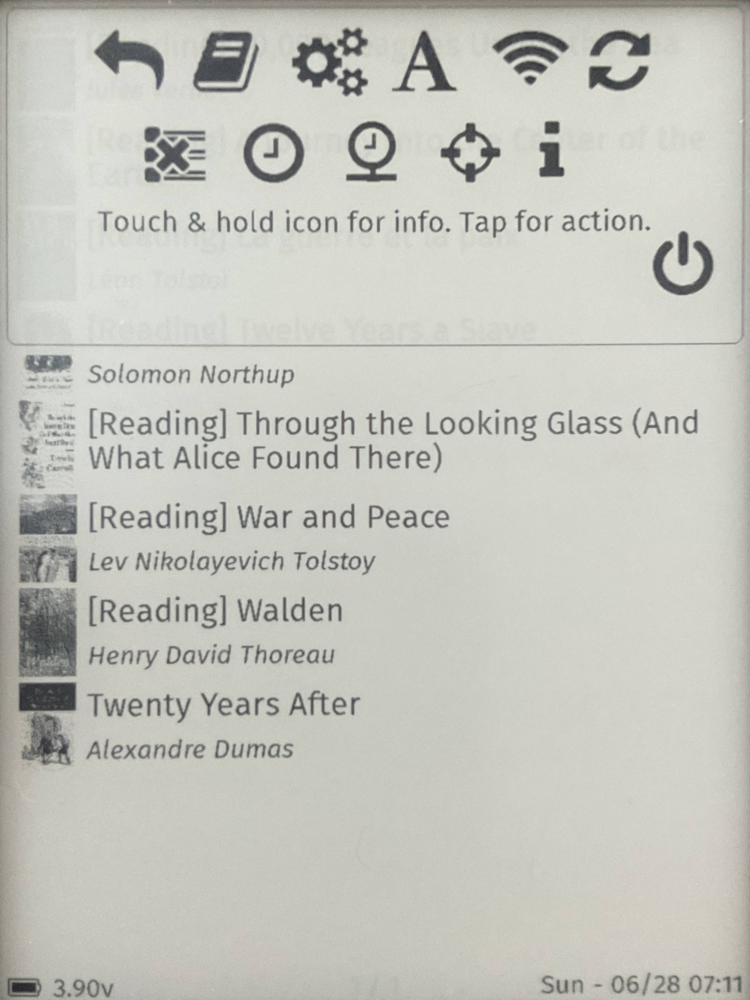
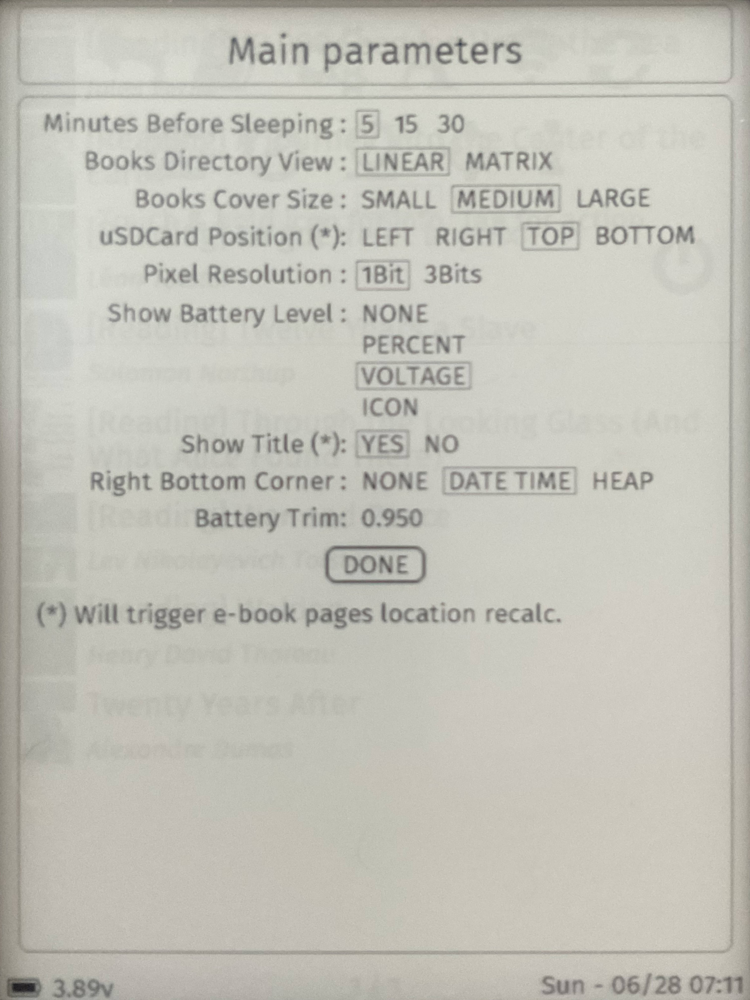
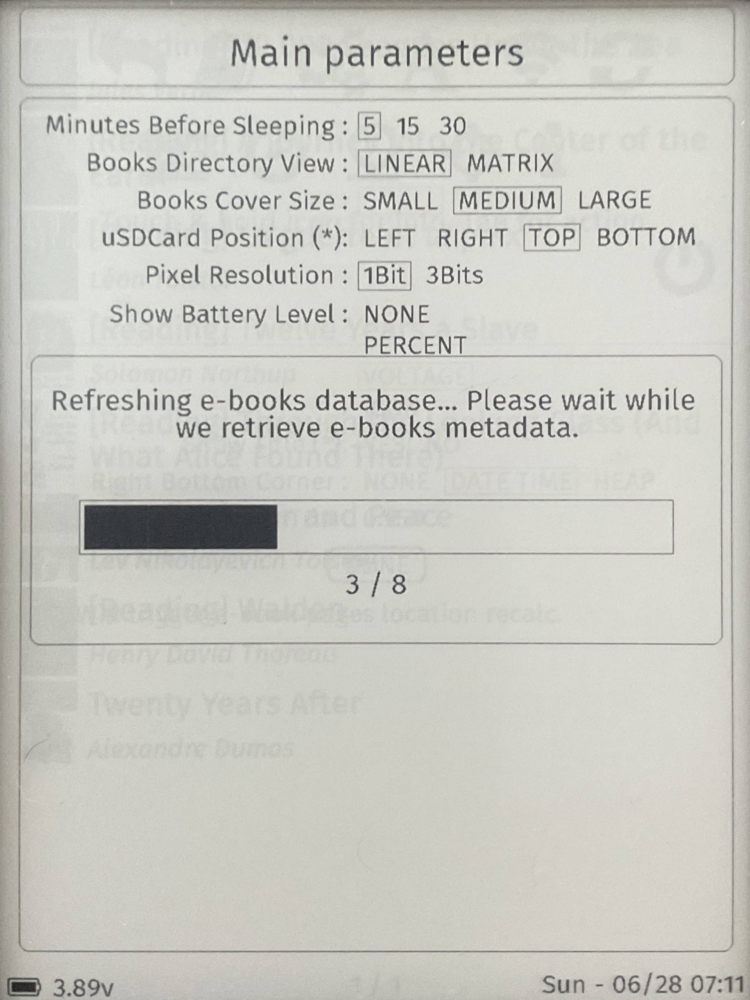
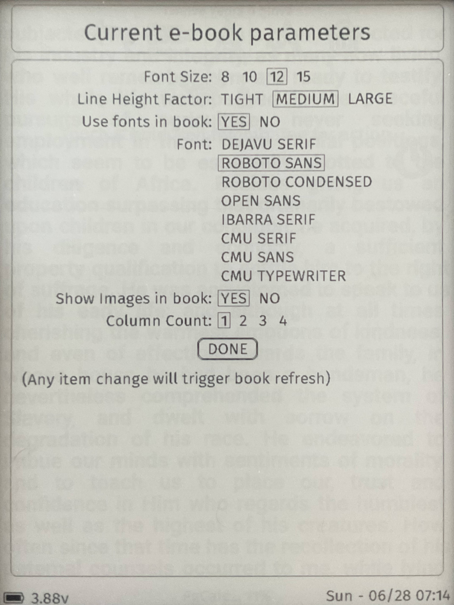

## EPub-Inkplate V3.0.0 Demo Gallery

(2026.06.26)

The following images demonstrate version 3.0.0 of the EPub-Inkplate application, running on an Inkplate-6FLICK device. This preview focuses specifically on the user interface enhancements introduced in version 3.0.0, meaning some core application functionalities are not pictured.

All photos were captured using an iPad camera and perspective-corrected into standard rectangles using GIMP on Linux. No other alterations have been made. Consequently, slight e-Ink ghosting may be visible in some images; the application triggers a full screen refresh every 10 page turns to clear these artifacts.

Beyond the UI overhaul, the application's core architecture was extensively refactored to establish a robust foundation for future updates. The codebase has been modernized to leverage contemporary C++ capabilities.

### 1. Deep-Sleep Artwork Display

The updated application now supports custom artwork during deep-sleep, loaded from the new `artworks/` folder on the SD card. Seven default images are included in the distribution package, which the application selects at random when entering deep-sleep. Users can add their own custom JPEG images to this folder.

### 2. E-Book Library Directory

The standard linear e-book directory structure remains available, consistent with previous versions of the application.

### 3. Main Application Menu

This menu showcases the redesigned UI framework. The new layout features larger touch targets, making navigation significantly easier on touchscreens.

### 4. Application Settings

The settings panel introduces several new configuration options: 

- **Book Cover Size**: Users can choose from three distinct sizes. Changing this setting automatically triggers a directory refresh (see image 5).
- **Battery Trim Factor**: A linear calibration adjustment used to align the displayed battery voltage more closely with the actual physical voltage.

### 5. Library Database Refresh

When settings are modified, the directory updates automatically. A new progress panel keeps the user informed of the background refresh status.

### 6. Medium Cover View

Once the database refresh completes, the library view updates to display the e-book list with medium-sized covers.

### 7. E-Book Reading View

When a book is opened, the application immediately restores the reader to their last saved reading position.

### 8. Document Settings

This panel manages formatting settings for the active e-book. Notable new additions include:

- **Line Height Factor**: Allows readers to adjust line spacing beyond the document's default layout.
- **Column Count**: Allows readers to choose the number of text columns displayed on screen.

### 9. Increased Line Spacing Example

An example of the e-book reader view utilizing an expanded line height setting.

### 10. Two-Column Layout

An example of the reader view configured for a two-column text layout.

### 11. Three-Column Layout

An example of the reader view configured for a three-column text layout.

