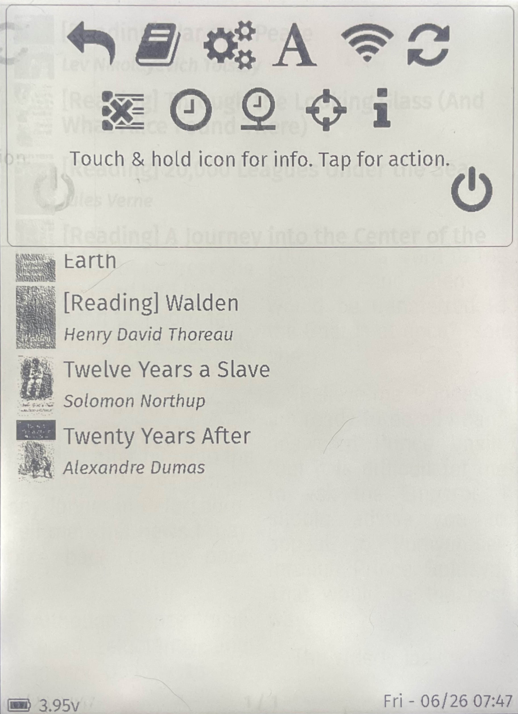
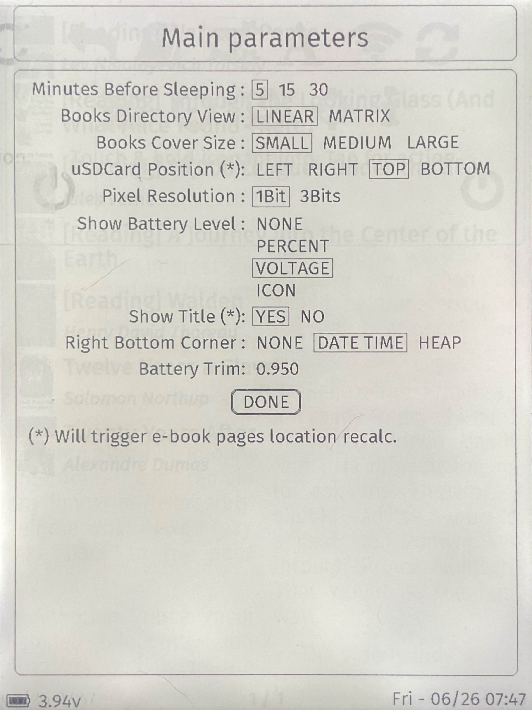
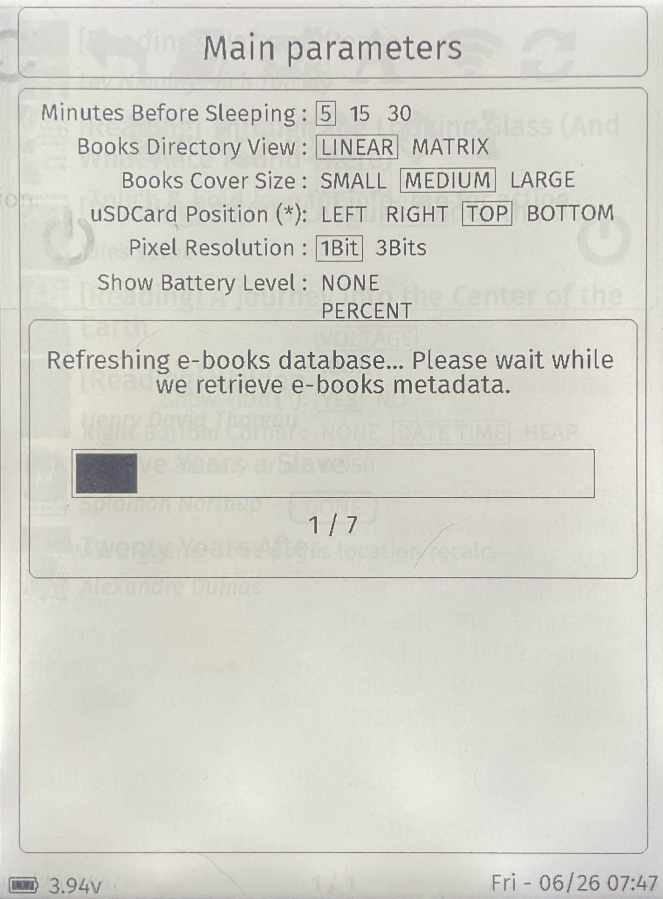
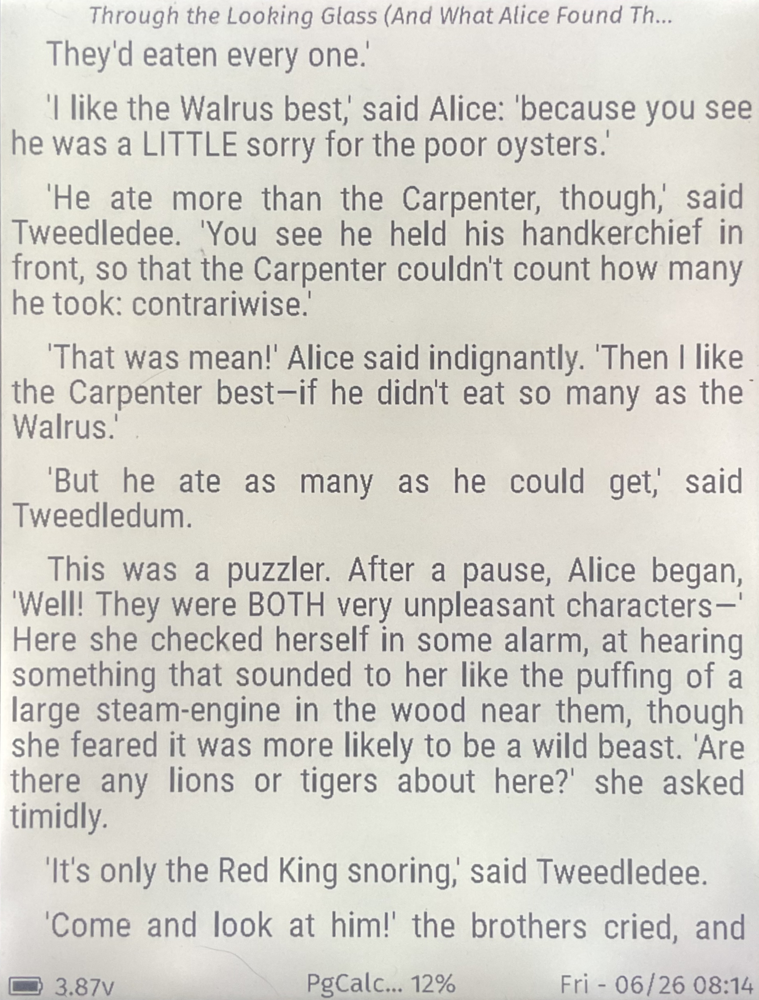
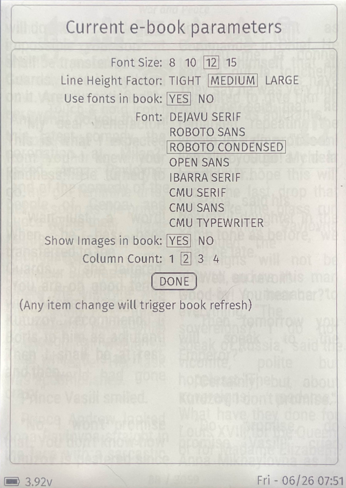
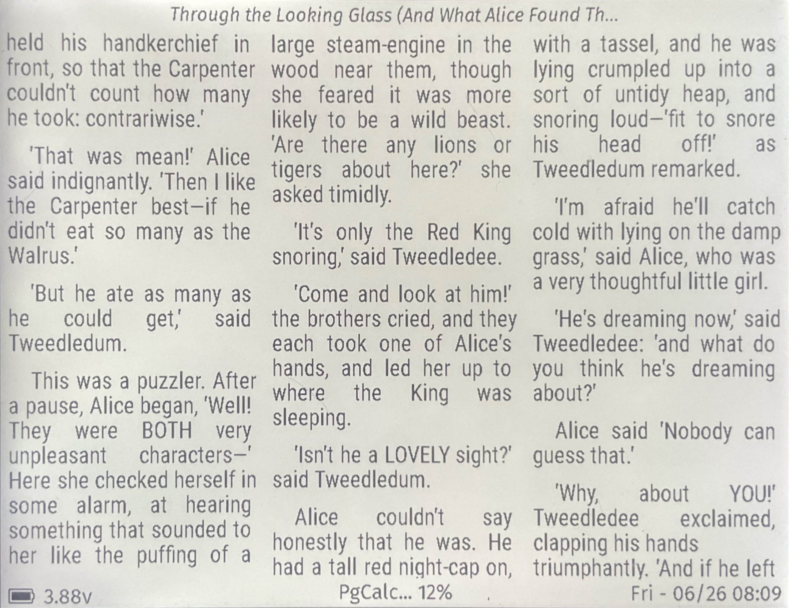

## EPub-Inkplate V3.0.0 Demo Pictures

The followings are pictures taken from an Inkplate-6FLICK running version 3.0.0 of the EPub-Inkplate application taylored for Inkplate devices. The demo is limited to the specific UI modifications made to version 3 so some of the functionalities of the application are not shown.

The pictures were taken using an iPad camera and geometrically modified to only keep the Inkplate screen as a corrected rectangle using the Gimp application under Linux. Beyond that, the pictures have not been modified, so, for some of them, you will see phantom images pertaining to the eInk display. As the application is refreshing the eInk after every 10 screen updates, the phantom images then disappear.

Beyond the UI modifications, the application was extensively updated to get a solid foundation for the future updates that are being planned. The code has been modernized to use some of the latest C++ capabilities available.

### 1. Artwork display on deep-sleep

The new app permits to display artworks that are located in the new `artworks/` folder on the SD card. 7 files are supplied with the distribution package and are randomly selected by the application when deep-sleep is required. You can put there your own images as long as they are JPEG images.

### 2. E-Books directory

The standard e-books linear directory as per all version of the application.

### 3. Main application menu

The menu shows the new UI approach to display menus, easier to select items on a tactile display.

### 4. Application settings

The form shows the new parameters: 

- The Books Cover Size: 3 sizes are available. The directory is refreshed after selecting a new size (See picture #5).
- The Battery Trim Factor: A linear adjustment factor to present a battery voltage closer to its real value.

### 5. e-books Database refresh

As some parameter has been modified, the directory is being refreshed. A new panel shows how well the refresh is advancing.

### 6. Medium size covers

As the refresh is completed, here is how the e-book list appears with medium size covers.

### 7. A single e-book page

Once a book is selected to be viewed, it is opened by the application and the page shown is where the user was reading the last time.

### 8. Current e-book parameters

The form shows the parameters for the e-book currently being read. Some of the new parameters are:

- Line Height Factor: Permits to have a different line height than the normal one.
- Column Count: Select the number of columns to use to display the e-book.

### 9. e-book page with large line height

### 10. A 2 columns page display

### 11. A 3 columns page display

